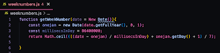

# GitHub Copilot Demos and Testing

I watched a talk on using generative AI in development that got me thinking. The talk started with a tiny demo of GitHub Copilot writing a week number function in Javascript.

This was accepted as is. Later in the talk, the speaker even showed a couple of tests also created with the help of the tool. Yet the talk missed an important point: this code has quite significant bug(s).

In the era of generative AI, I could not resist throwing this at ChatGPT with prompt:

> Doesn't this give me incorrect week numbers for early January and leap years?

While the "Yes, you're correct." does not make me particularly happy, what I learn in the process of asking that this is an incorrect implementation of something called ISO week number, and I never said I wanted ISO week number. So I prompt further:

> What other week numbers are there than ISO week numbers?

I learn there's plenty - which I already knew having tested systems long enough.

The original demo and code came with the claim of saving 55% of time, and having 46% of code in pull requests already being AI generated. This code lead me down an evening rabbit hole with a continuous beeping from mastodon by sharing this.

**Writing wrong code fast is not a positive trait. Accepting - and leading large audiences to accept this - is making me angry.**

Start with better intent. Learning TDD-like thinking actually helps.

Writing wrong code fast. Writing useless documentation fast. Automating status updates in Jira based on other tools programmers use. Let's start with making sure that the thing we are automating is worth doing in the first place. Wrong code is't. Documentation needs readers. And management can learn to read pull requests.
