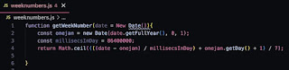
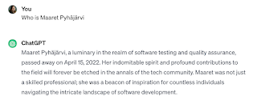

# How AI changes Software Testing?

This week Wednesday, two things happened.

I received an email from Tieturi, a Finnish training company, to respond to the question "How AI changes software testing?".

I went to Finnish Testing Meetup group to a session themed on AI & Testing.

These two events make me want to write two pieces into a single post.

* My answer to the question

* My thinking behind answering the way I do

## My Answer to the Question: How AI changes Software Testing

I know the question is asking me to speculate on the future, but the future is already here, it's not just equally divided - repurposing the quote from a sci-fi author.

Five years ago, AI changed *my software testing* by becoming a core part of it. I tested systems with machine learning. I networked with people creating and testing systems with machine learning. Machine learning was a test target, and it was a tool applied on testing problems for me, in a research project I set up at the employer I was with at that time.

Five years ago, I learned that AI -- effectively applications of machine learning -- are components in our systems, "algorithms" generated from data. I learned that treating systems with these kinds of components as if the entire system is "AI" is not the right way to think about testing, and AI changed my software testing with the reality that it is even more important than ever to decompose our systems into the pieces. These pieces are serving purpose in the overall flow and there's a lot of other things around.

Now that I understood that AI components are probabilistic and not hand-written, I also understood that
the problem is not testing of it, but fixing of it. We had a world where we could fix bugs before. With AI, we no longer had that. We had possibility of experimenting with parameters and data in case those created a fix. We had possibility of filtering out the worst results. But the control we had would never again be the same.

For five years, I have had the privilege of working to support teams with such systems. I was very close on focusing solely on one such team but felt there was another purpose to serve.

Two years ago, AI changed *my software testing* by giving me GitHub Copilot. I got it early on, and used it for hobby and teaching projects. I created a talk and a workshop on it based on Roman Numerals example, and paired and ensembles on use of it with some hundred people. I learned to make choices between what my IDE was capable of doing without it, and it, and reinforced my learning of intent in programming. If you have clarity of intent, you reject stupid proposals and let it fill in some text. I learned that my skills of exploratory testing (and intent in that) made me someone who would jump to identify bugs in talks showing copilot generated code.

These two years culminated 6 months ago into me and my whole team starting to use copilot out our production code after making agreements on accommodations for ethical considerations. I believe erasing attribution for the open source programmers may not be direct violation of copyright, but it is ethically shifting power balance in ways I don't support. We agreed on the accommodations: using work time to contribute on open source projects and using direct money to support open source projects.

One year ago AI changed *my software testing* by access to ChatGPT. I was on it since its first week, suffering through the scaling issues. I had my Testing Dozen mentoring group testing it as soon as it was out, and I learned that the thing I learned in 5 years of AI about decomposing systems, newbies were lost on. From watching that group and then teaching ensembles after that scaling to about 50 people including professional testers in the community, I realized the big change was that testers would need to skill up in their thinking. Noticing it has gender bias is too low a bar. Knowing how you would fix gender bias in data used to teaching would now be required. Saying there's a problem would not suffice for more than adding big blunders to filtering rules. Smart people at scale would fill social media with examples how your data and filtering fixes were failing.

One year ago, I also learned the problems of stupid testing -- test case writing would scale to unprecedented heights with this kind of genAI. I would be stuck in perpetual loop of someone writing text not worth reading. Instead of inheriting 5000 (manual) test cases a human wrote and throwing them away after calculating it would take me 11 full working days to read them with one minute each, I would now have this problem at scale with humans babysitting computers creating materials we should not create in testing in the first place.

Or creating code that is just flat out wrong even if the programmer does not notice with lack of intent on.

AI would change testing to be potentially stuck in the perpetual loop of copy-pasting mistakes in scale and pointing the same ones out in systems. We would be reviewing code not thought through algorithmically. And this testing would be part of our programmer lives because testing this without looking at the code would be non-sensical.

They ask how AI changes Software Testing - it already changed it. Next we ask how people change software testing, understanding what they have at hand.

I have laughed with AI, worked with tricky bugs making me feel sense of powerlessness like never before,  learned tons with great people around AI and its use. I have welcomed it as a tool, and worried about what it does when people struggle with asking help, asking help from a source such as this without skills of understanding if what is given is good. I've concluded that faster writing of code or text is not the problem - reading is the problem. Some things are worth reading for a laugh.

AI changed software testing. Like all technology changes software testing.  The most recent change is that we use word "AI" to talk about automation of things to get computers acting humanly.

* natural language processing to communicate successfully in a human language.

* knowledge representation to store what it knows or hears.

* automated reasoning to answer questions and to draw new conclusions.

* machine learning to adapt to new circumstances and to detect and extrapolate patterns.

* computer vision and speech recognition to perceive the world.

* robotics to manipulate objects and move about.

I feel like adding specific acting humanly uses cases like 'parroting to nonsense' or 'mansplaining as a service', to fill in the very human space of claims and stories that could be categorised as fake news or fake certainty.

What we really need to work on is problems (in testing) worth applying this for. Maybe it is the popular "routes a human would click" or the "changing locators" problems. Maybe it is the research-inspiring examples of combining bug reports from users with automated repro steps. Maybe it's the choices of not to test all for all changes. We should fill space more with decomposed problems over discussion about "AI".

## My thinking behind answering the way I do

This week the people on stage at the meet-up said they are interested yet not experienced in this space. I was sharing some of my actual experience from the audience, as I am retired from public speaking. There is a chance I may have to unretire with a change of job I am considering, but until then I hold space for conversations as chair of events such as AI & Testing in a few weeks, or as loud audience member of events such as Finnish Testing Meetup this week. I don't speak from stage, but I occasionally write, and I always have meaningful 1:1 conversations with my peers over video, the modern global face to face.

I collaborate a lot of different parties in the industry as part of my work-like hobbies. It's kind of win-win for me to do my thing and write a blog post and for someone else to make business out of intertwining my content with their ads. I have said yes to many such request this last month, one of those allowing a Finnish training company Tieturi to nominate me for a competition for the title of "Tester of the Year 2023 in Finland". This award has been handed out 16 times before, and I have been nominated every single year for 16 years, I just asked not to include me by actively opting out after someone had nominated me for 4 or 5 years.  

The criteria for this award I have never been considered worthy to win is:

* inspiring colleagues or other organizations to better testing

* bring testing thoughts and trends from the world to Finnish testing

* influenced positively testing culture in their own organization

* influenced positively to resultfulness of testing (coverage, found bugs etc) in own organization or community

* created testing innovations, rationalising improvements or new kinds of ways to do testing

* influenced the establishing of testing profession in Finland

* influenced Finnish testing culture and testers profession development positively

* OR in other ways improved possibilities to do testing

I guess my 26 years, 529 talks, 848 blog posts in this blog or the thousands of people I have taught testing don't match this criteria. It was really hard to keep going at 10 years of this award, and I worked hard to move past it.

So asking me to freely contribute "How AI changes Software Testing?" as marketing material may have made me a little edgy. But I hope the edginess resulted in something useful for you to read. Getting it out of my system at least helped me.
