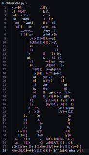
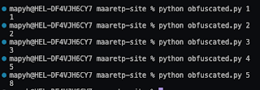
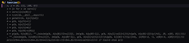

# A Bunnycode Case Study for AI in Testing

It's day 5 of 30 days of AI testing, and they ask for reading a case study or sharing your experience. I did sharing experience already on an earlier day, and in the whim of a moment, set up a teaching example. 

I google for obfuscated code in python to find https://pyobfusc.com/. I'm drawn to most reproducible, authored by mindiell and when I see the code, I'm sold. How would you test this? 

Pretty little rabbit, right? Reminds me of reading some code at work, work is just less intentional with obfuscation. And really do not have the time or energy to read that. I could test it as black box, learning that given a parameter of a number, it gives me a number:

 

As if I didn’t know what the rabbit implements or recognize the pattern in the output, I was thinking of just asking ChatGPT about it. However, I did not get that far. 

Instead, I wrote def function(): on my IDE while GitHub copilot is on, thinking I would have wrapped the program into a function. It reformatted it to something a bit more readable.

 

rompting some more in the context of code. 

Comment line “#This function” proposes “is obfuscated”. Duh. 

Comment line “#This function imp” proposes "lements the Fibonacci sequence using Binet’s formula.

At this point, I ask chatGPT how to test a function that implements the Fibonacci sequence using Binet’s formula. I get long text saying try values I already tried, but in code, and a hint to consider edge cases and performance. I try a few formats to ask for a value that would make a good performance benchmark, and lose patience. 

I google for performance benchmark to learn that this Binet’s formula is much faster than the recursive algorithm, and find performance benchmarks comparing the two. 

I think of finalizing my work today with inserting the bunny code into chatGPT and asking “what algorithm does this use” to get second language model generate likely answer as the Binet’s formula. Given the risk and importance of this testing at this time, I conclude it’s time to close my case. 

There are so many uses to figure out what it is I am testing (while being aware of what I can share with tool vendors when giving access to code) and this serves as a simulation of idea that you could ask about the pull request. This was the case I wanted to add to the world today.

I should write a real case study. After all, that was one of the accommodations we agreed with multiple levels above me in management when my team at work started GitHub Copilot tryouts some 6 months ago. I should publish this in action, with a real time. As soon as something generates me some time. 