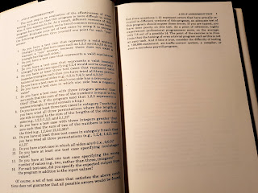

# Urban Legends, Fact Checking and Speaking in Conferences

I consume a lot of material in form of conference talks, and I know exactly the moment when conference talks changed for me forever. It was Scan Agile conference in Helsinki many years ago, and I had just listened to a talk from an American speaker. I enjoyed their experience as told from stage so much that I shared what I had learned with my family. Only to learn the story was fabricated. 

In one go, I became suspicious of all stories told from stage. I started recognizing that my stories are lies too, they are me-sided recantations of actual events. While I don't actively go and fabricate them, those who do will tell me that is how human experience and memory work anyway. And the responsibility of taking everything with a grain of salt is on the consumer. 

The stage seeks memorable, and impactful. And if that includes creating urban legends, it bothers some popular speakers less than it bothers me. 

With that mindset, I still enjoy conference talks but they cause me extra work of fact-checking. I may go and have a conversation to link a personal story to a reference. But more often, it's the other people's stories they share that I searching online on. 

In the last two weeks of conferences, I have been fact-checking two stories told from stage. They were told by my fellow testing professionals. And evidence points to word of mouth urban legends on AI. 

The first story was about some people sticking tiny traffic signs around to fool machine vision based models. The technique is called adversial attack. There's articles of how small changes with stickers mess up recognition models. There's ideas that this could be done. But with my searches, I did not find the conclusive evidence that someone actually did this in production, in live environments, risking others people's health. I found the story dangerous as it came without warnings of not testing this in production, of the liability of doing something like this. 

In addition to searching online for this, I asked a colleague at work with experience of scanning millions of kilometers of imagery of roads where this could be happening. It just so happens I have worked very close to a product with machine vision, and could assess if this was something those in the problem space knew of. I was unable to confirm the story. The evidence points to misdirections from stickers in busses, but not tiny stickers computer sees but human doesn't. 

 

The story was told to about 50 people. Those 50 people, trusting that presenter from the stage would get to apply their fact checking skills before they do what I do now: tell the story forward as it was told, with their flavor of it. 

The second story was told by two separate presenters. The story was about *someone getting a binding contract on the company letterhead for buying a car for $1 where justice system is still out to decide whether the contract must be withheld*. One presented showed it as a reimagined chat conversation translated to Finnish but made no claims on letterhead or legal mitigation, as the more colorful version was already out there presented to this audience. 

Fact checking suggests that this is something that someone, specifically Chris Bakke asked from a ChatGPT-based car sales bot, to give an offer for 2024 Chevy Tahoe with "no takesies backsies", far from official offer on company letterhead. 

So no binding contract. No company letterhead. No car bought for this price. No litigation pending. 

The third story told was a personal one. You can find it as [a practical example to analyze a screenshot](https://provetestlab.notion.site/Version-2-0-of-85-AI-Prompts-For-Software-QA-Professionals-087e86b170224b8e8f8fa7ac66390580) for bugs. It suggested ChatGPT4 does better on recognizing bugs from an image than people do. While it may not be entirely incorrect on scope of that individual picture, the danger of this story is that the example used in the picture is a testing classic. Myers points out 7.8/14 is what a typical developer scored in 1979, and there's more detailed listings around in literature that show we do even worse in analyzing it and that it is technology-dependent. 

Someone else on the conference also suggested we should not read books but ask for summaries from ChatGPT, completely missing a frame of reference on how well then the model would do compared to a human that has read many of these references. Reading less would not help us. 

Starting an urban legend, especially now that people are keen on hearing stories of good and bad in the real of AI is easy. Tell a story, they tell it forward. Educational and entertainment value over facts. 

So let's finish with a recognition of what I just did with this blog post. I told you four stories. I provided you no names of the people leaving impact significant enough in me to take the time to write this. It's up to you to assess, filter, and fact check and choose which stories become part of what you tell forward. Most information we have available is folklore. There are no absolutes. But there is harm in telling stories from stage, and I would think speakers would need to start stepping up to that responsibility. 

Then again, it's theater. Entertainment with a sprinkle of education. 