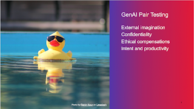

# GenAI Pair Testing

This week, I got to revisit my talk on Social Software Testing Approaches. The storyline is pretty much this: 

* I was feeling lonely as the only tester amongst 20 developers at a job I had 10 years ago. 

* I had a team of developers who tested but could only produce results expected from testing if they looked at my face sitting next to them, even if I said nothing. I learned about holding space. 

* I wanted to learn to work better on the same tasks. Ensemble programming became my gateway experience to extensive pair testing beyond people I vibe with, and learning to do strong style pairing was transformative. 

* People are intimidating, you feel vulnerable, but all of the learning that comes out is worth so much.

As I was going through the preparations for the talk, I realized something has essentially changed since I delivered that talk last time. We've been given an excuse to talk to a faceless, anonymous robot in form of generative AI chatbots. The success I had described as essential to strong-style pairing (expressing intent!) was now the key differentiator on who good more out of the tooling that was widely available. 

I created a single slide to start the conversation on something that we had been doing: pairing with the application, sometimes finding it hard to not humanize a thing that is a stochastic parrot, even if a continuously improving predictive text generator. Realizing that when pairing with genAI, I was always the navigator (brains) of the pair, and the tool was the driver (hands). Both of us would need to attend to our responsibilities but the principle "an idea from my head must go through someone else's hands" is a helpful framing.

I made few notes on things I at least would need to remember to tell people about this particular style of pairing. 

External imagination. Like with testing and applications, we do better when we look at the application while we think about what more we would need to do with the application, genAI acts as external imagination. We are better at criticizing something when we see it. With a testing mindset, we expect it to be average, less than perfect, and our job is to help it elevate. We are not seeking boring long clear sentences, we are seeking the message core. We search boundaries, arguing with the tool on different stances and assumptions. We recognize insufficiency and fix it with feedback, because average of the existing base of texts is not *our* goal. We feel free to criticize as it's not a person with feelings, taking possibly offense when we are delivering the message on the baby being ugly. We dare to ask things, in ways we wouldn't dare to ask from a colleague. We're comfortable wasting our own time, but uncomfortable taking up space of others days. 

Confidentiality.We need to remember that it does not hold our secrets. Anything and everything we ask is telemetry, and we are not in control of what conclusions someone else will draw on our inputs. When we have things we would need to say or share that we can't share outside our immediate circle, we really can't post all that for these genAI pairs. But for things that aren't confidential, it listens to more than your colleague in making its summaries and conclusions. And there is an option of not using the cloud-based services but hosting a model of your own from Hugging Face, where whatever you say never leaves your own environment. Just be aware. 

Ethical compensations. Using tools like this changes things. The code generation models being trained on open source code change the essential baseline of attribution that enables many people to find things that allow them the space of contributing to open source. These tools strip names of people and the sense of community around the solutions. I strongly believe we need to compensate. At my previous place we made three agreements on compensation: using our work time on open source; using our company money to support open source; and contributing to body of research not the change these tools bring about.  Another ethical dilemma to compensate for is energy consumption of training models - we need to reuse not recreate, as one round of training is said to take up energy equivalent of car trip to moon and back. While calling for reuse, I am more inclined to build forward the community-based reuse models such as Hugging Face over centralizing information to large commercial bodies with service conditions giving promises what they will do with out data. And being part of underrepresented group in tech, there's most definitely compensations needed on the bias embedded in the data to create world we could be happy with. 

Intent and productivity. Social software testing approaches have given me ample experiences of using tools like this with other people, and seeing them in action with genAI pairing. People who pair well with people, pair better with the tools. People who express intent in test-driven development well and clearly, get better code generated from these tools. The world may talk of prompt engineering but it seems to be expressing intent. Another note is on the reality of looking at productivity enhancements. People insist they are more productive, but a lot of the deeper investigations show that there is creative bookkeeping involved. Like fixing a bug takes 10 minutes AFTER you know exactly which line to change, and your pipelines just work without attending. You just happen to use a day in finding out the line to change, and another on care of the pipeline on whatever random happened on it being on your watch. 

These tools don't help me write test cases, write test automation and write bug reports. They help me write something of my intent and choosing which is rarely test case or automation, they help me summarize, understand, recall from notes, ideate actions and oracles, scope to today / tomorrow - this environment / the other - the dev / the tester, prioritize and filter, and inspire. They help me more when I think of testing activities not as planning - test case design - execution - reporting, but as intake - survey - setup - analysis - closure. Writing is rarely the problem. Avoiding writing and discovering information that exists or doesn't, that is more of a problem. Things written are a liability, someone needs to read them for writing them to be useful. 

Testing has always been about sampling, and it has always been risk-based. When we generate to support our microdecisions, we sample to control the quality of outputs. And when things are too important to be left for non-experts, we learn to refer them to experts. If and when we get observability in place, we can explore patterns after the fact, to correct and adjust. 

I still worry about the long term impacts of not having to think, but I believe criticizing and thinking is now more important than ever. The natural tendency of agreeing and going with the flow has existed before too. 

And yes, I too would prefer AI to take care of housekeeping and laundry, and let me do the arts, crafts and creative writing. Meanwhile, artificial intelligence is assisting intelligence. We could use some assisting day to day. 