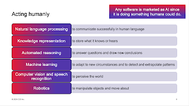
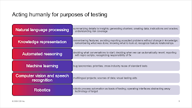
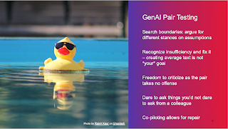
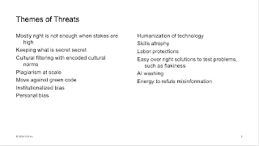

# AI is automation at scale of benefits

For the longest time, I have spent a small part of my attention on explaining to people that framing test automation as something that solves the risk of regression problem only is such a waste. You create some of your worst test automation by taking the scripted manual tests and automating those one by one. And it is not a problem to test the "same things" manually if you aren't finding problems with that manual thing after that you continuously need to retrace back on being the problems we already have accepted.

I reframed test automation to something that is

* Documenting
* Extending reach
* Alerting to attend
* Guiding to detail

That was already before this whole age of AI started. And now, looking at the age of AI, we are struggling with similar issues of framing. We want to overfit tool to a task and are being overprotective about our idea of classification.

At a previous project, I had an excellent example of model-based testing. Instead of writing scripts, we had a model of flows driving functionalities modeled into a page object. Not AI. But so much more intelligent and significantly better approximation of acting humanly to include in our ways of testing than the usual scripts alone.

Many people qualify a few categories of solutions as AI, making the point that it is a marketing fad that people in the industry would frame automation at scale as AI. In a narrower definition, we would look for technologies that are new and different: machine learning; large language models; retrieval augmented generation; computer vision and so forth.

A few years back reading a book "Artificial Intelligence, a Modern Approach", I picked up one of their definitions of AI:

> Acting humanly.

Mundane clicking is acting humanly. Mundane clicking by a UI automation script is not acting humanly alone, it removes some of the emergent intent we overlay as humans when we do mundane clicking. Including randomness and fun to increase chances of serendipity are very much human. So from this frame, of AI targeting acting humanly, we are looking at automation at scale of benefits.

The book lists six areas of acting humanly:

* Natural language processing

* Knowledge representation

* Automated reasoning

* Machine learning

* Computer vision and speech recognition

* Robotics

Watching tools bring in AI by renaming money as "AI unit", adding RAG-style LLM use as one of the consumables is quite a marketing smoke and screen founded on a type of market where people are likely to be willing to consume paid content to have more targeted responses makes some sense, even if I find it difficult to consider that AI. Creating the most silly monkey to click around in a research project and calling that AI makes some sense, even if I again find it difficult to consider that AI.

To make progress and sense, I have the idea that we would need to start caring less about protecting a classification and talking about the work we do.

What would **Acting humanly for purposes of testing** look like?

Right now it looks like having a colleague who never tires of your questions and misframings, providing you somewhat average, overconfident answers.

Then again, I have been a colleague like that on my good days, and a colleague with even more negative traits associated with me on my bad days. Good thing is the social context corrects our individual shortcomings.

Would it be possible to just think of AI as a way of saying that our target level of automation just scaled for benefits, and then solve the real problems, in collaboration.

Obviously I too listed the negatives I park:

There are things I still balance so heavily on the negatives like my support for plagiarism at scale, but instead of my choice being educating on those or hoping my avoidance of use sends the message, I'm trying out **compensations** and **offsetting impacts** with other actions. I prioritize learning to apply things more thoughtfully and being at the table when we decide on follow up actions.
