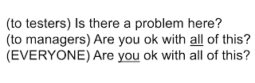
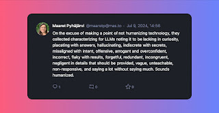

# Testing is amplifying fail signals

There's a phrase I picked up though Joep Schuurkes that points to a book by Gene Kim et al that I did not yet read, but did listen to a podcast episode on a podcast all this made me [discover and appreciate wider](https://kbjanderson.com/podcast/). 

> Amplifying fail signals.

Combine this with sampling a talk on YouTube where the speaker made the point of not being anti-AI and then proceeding to spend 45 minutes on amplifying fail signals with examples of problems of what AI can't do, characterizing it humanly with negatives only and landing back to something this crowd is known for, two key questions separating what a *tester* and *manager*. I have not liked this cut choice of centering testers as information providers instead of active agents part of making those decisions before, and I did not like it now with AI. 

Sometimes we amplify fail signals so much that no other signals are left. 

*I am well aware that amplifying fail signals is intended to be for signals that are hard to pick up. Like the fact that when you ask a question leading with "hi guys", not getting a response from me does not mean I would not have the answer or be unwilling to share with you, just that you make it extra effort to get by to doing the work excluding me. There are patterns we don't recognize as failure that require special amplification to be successful.* 

The whole agency in decisions, it would be hard to live in Finland with cases like Vastaamo (psychotherapy services security breech with very private information leaked) and not realize that when we fight in courts, the conversation is on responsibilities. Should the IT specialists have 1) created a paper trail that shows the company did not allocate resources to fix the problems 2) fixed the problems if they truly were on level of not changing default passwords and 3) considered the work assigned to them specifically is where their responsibility lies. Is this kind of a thing responsibility of the management, or does the expert play a role in the responsibilities too? Whether court assigned on not, I like to act as if I had responsibilities on things I am aware of, and I can choose to change the password away from default even when I can't get the hiring budget for someone who specializes in it in addition to myself. But things are easy when you're not being blamed for a mistake in court. Which for me is still pretty much always. 

The talk goes back to one question that has been flying around long enough that it should not need attribution: is there a problem here? This time around, it drops a second question: are you ok with all of this? 

With edits of emphasis on the latter question, it helps me frame things like I want to. Even if we (over)amplified fail signals and asked managers: are you ok with all of this?, we really need to ask ourselves in democratizing data and use of AI: are you ok with all of this?

I can talk as much as the next person on the threats but I tend to park them as a list to make choices on using my time elsewhere. I have had to decide on a personal level what to do with the things that I am not ok with, and decide that the really useful style of amplifying fail signals is to fix some of the fails resulting in different signals, compensate for others, and put a foot down ethically when it really is something I am not ok with, and start movements. 

The listing of threats I work with currently stands with this:

* **Mostly right** is not enough when stakes are high so we may want to keep good humans in the loop.

* **Keeping what is secret, secret** so we understand that use of AI is sharing information we need to be more intentional on

* **Cultural filtering** with encoded cultural norms so that someone else's standards don't lose someone else's history and culture

* **Plagiarism at scale** so that we remember what this is ethically even if not legally

* **Move against green code** so that we start considering perspectives beyond I can do it

* **Institutionalized bias** so that we understand how bias shows up in data

* **Personal bias** so that we understand reasons our inputs make us like results better

* **Humanization of technology** so that we remember it is only technology

* **Skills atrophy** so that we pay attention to necessary social changes

* **Labor protections** so that we are not creating conditions of world we don't want to live in

* **AI washing** so that we understand value within the buzzwords

* **Energy to refute misinformation** so that we pitch in to learning and educating

* **Accidental and Intentional data poisoning** so that we remember our actions today impact our future experiences and not everyone is out for good

* **Easy over right solutions to testing problems** so that we have the necessary conversations we've been mulling over that allow us to do something smart

So am I ok with all of this? Absolutely not. And because I am not, I will work on figuring out how to use it, not just as technical tool but in a social context, with guardrails and agreements in place. Since my time is limited, I choose to monitor the thread landscape, yet focus my actions on designing guardrails within testing to get the value we are out for in this all. 

We can try characterizing technology humanly from fail perspective, but that just leads us to seeing how many negatives we can apply on anything if we so choose. 

