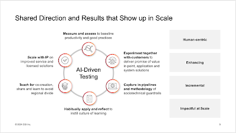

# Who Are You Paying to Learn AI with You?

Two years ago, Heini Ahven published a research paper (thesis) on AI in testing, concluding from her interviews that there are two particular hurdles for AI in testing: Data and Customer to pay for it. While in two years we have shifted away from needing data and primarily discussing use of generative models now,  the essential challenge of Customer to pay for it remains. Customers are making choices of who they bet on to pay to learn AI with them. 

It would seem to me that these things are good reasons to bet on us:

* We have a track record of having created customer specific systems with AI in them

* We have a track record of having new products with AI in them, most notably in modernization of legacy systems, but generally too many to list

* We publicly say (and can back it up) that we have already invested 1M into AI in the last year, and built quite a platform of knowledge with it

* We know software development, and we know testing. And we know these in scale. 

That's the high level. Yet I think that reframing the question from do we have solutions to who are you paying to learn AI with you is the way to go. And personally I think that you would do well learning AI with me and my crowd. 

* We have looked at large numbers of testing tools with AI in them, and can help you sort out positioning of those tools
* We have used tools with AI in creating test artifacts, and can help you sort out sociotechnical guardrails of use of these tools so that you can steer your learning
* We're happy to pick up a tool you want to learn with even if we haven't yet, and amplify your learning with success in mind 

There is a lot going on in the scale I get to pull from. I chose 6 activities, 4 values that are core to the approach I work with. 

We need to know where we are to make sense of where we are heading. We were expecting improvement and agreeing how improvement can be recognized is key.

We experimented already, and we scale to experiment with more customers. Any solution in this space has learning at heart, and keeping learning at heart steers to benefits. 

We collected sociotechnical guardrails for different kinds of applications of AI in testing. A lot of what we have been learning we can feed into new organizations, and improve with ongoing learning that benefits us all. 

We rely on building new habits that are good habits, to instill and sustain a culture of learning. This usually means we need to work with people in working through the change rather than input material. 

What we learn, we teach on. Sharing is a way of continuously seeking improvement. 

Some of this we package and make available in scale that helps anyone. These are new tools and services emerging. We recognize attribution is also IP, and we recognize scale will have a mix of different kinds of IP. 

In these six activities, we value four things: 

* Our approach is human-centric and we are learning best ways to have people in the loop

* We seek enhancing to better

* Our expectation is incremental, with controlled investments that can expect results

* By focusing on many customers while carefully hearing each customers specific challenges, we seek to make helpful impact in testing field in scale

This said, the question remains: who are you paying to learn AI with you, and could be us? 

**The author is Director, Consulting Expert at CGI Finland, focusing on AI-driven application testing. She usually writes about her work that isn't specific to CGI and felt like making an exception today. She is seeking primarily Finnish customers to join in increasing use of AI in testing, and believes open calls for collaboration are preferable to approach when seeking early adopters. Expectation for her new position at CGI is that she meets customers 130 times per year, and you scheduling a short conversation on how she could help would be mutually beneficial while unusual approach. She can be reached at maaret.pyhajarvi@cgi.com.**  