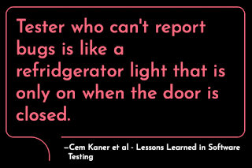

# Contemporary Bug Advocacy

A few weeks back in Mastodon, Bret Pettichord dusted up a conversation about something we talked about a lot in testing field years ago, Bug Advocacy. Bug advocacy was something Cem Kaner discussed a lot, and a word that I was struggling with translating to Finnish. It is a brilliant concept in English but does not translate. Just not. 

Bug advocacy is this idea that there is work we must do to get the results of testing wrapped in their most useful package. A lot of the great stuff on BBST Bug Advocacy course leads one to think it is a bug reporting course, but no, it is a bug research course. A brilliant one at that. Bug advocacy is the idea that just saying it did not work for you does little. It actually has more of a negative impact. Do your research. Report the easiest route to the bug. Include the necessary logs. Make the case for someone wanting to invest time in reading the bug report, even under constraints of time and stress. 

Bug advocacy was foundational for me as a learning tester 25 years ago. It was essential at time of publishing Lessons Learned in Software Testing. It was essential when Cem Kaner created the BBST training materials. And it is sometimes like a lost art these days. In other words, it is something people like me learned and practices so long, that we don't remember to teach it forward. 

At the same time, I find myself broadcasting public notes in Mastodon and LinkedIn on theme that I would call Contemporary Bug Advocacy - an essential part of Contemporary Exploratory Testing. Like the quote from Kaner's and Pettichord's book says, we kind of need to do better than fridge lights that do all their work while no one is using the results. 

Inspired by the last two weeks of testing with my team, I collected a listing of tactics I have employed in contemporary bug advocacy. 

* **Drive by Data**. I "reported" a bug by creating data in a shared test environment that made a bug visible. The bug vanished in a day.  No report, no conversation. Totally intentional. 

* **Power of Crowd**. I organized an ensemble testing session. Bugs we all experienced vanished by end of the day. I have used this technique in the past to get complete API redesign needs by smart use of the right crowd. 

* **Pull request with a fix**. I fixed a bug, and sent the fix for review for the developer. Unsurprisingly, a fix can be more welcome than a task to fix something. 

* **Silent fix**. I just fix it so that we don't have to talk about it. People notice changes with their routines of looking at what is going on in the code. 

* **Pairing on fix**. I refused to report, and asked to pair on the fix for me to learn. Well, for me to teach too. Has been brilliant way of ramping up knowledge of problems dealing with root causes rather than repeated symptoms. 

* **Holding space for fix to happen**. A colleague sat next to me while I had not done a simple thing, making it clear they were available to help me but would not push me to pairing. 

* **Timely one liner in Jira**. I wrote title only bug report in Jira. That was all the developer needed to realize they could fix something, and the magic was this all happened within the day of the bug being created while they were still in context. 

* **Whisper reporting**. I mentioned a bug without reporting it. Developers look great when they don't have bug reports on them. I like the idea of best work winning when we care about the work over credit. Getting things fixed is work, claiming credit with report is sometimes necessary but often a smell. 

* **Failing test**. Add a failing test to report a bug, and shift work from there. Great for practicing very precise reporting. 

* **Actual bug report**. Writing great summary, minimal steps to repro and making clear your expected and actual results. Trust it comes around, or enhance your odds by other tactics. 

* **Discuss with product owner**. Your bug is more important when layered with other people's status. I apply this preferably before the report for less friction. 

* **Discuss with developer**. Showing you care about colleagues priorities and needs enhances a collaboration.    

* **Praise and accolades**. Focus your messaging on the progress of vanishing, not emerging. Show the great work your developer colleagues are doing. So much effort and so little recognition, use some of your energy in balancing to good. 

* **Sharing your testing story**. Fast-forward your learning and make it common learning. A story of struggles and insights is good. A shared experience is even better. 

* **Time**. Know when to report and how. Timing matters. Prioritise their time. 

All of these tactics are ways to consider how to reduce friction for the developer. Advocate. Enable. Help. Do better than shine light when the door is closed. 

I call this contemporary because writing a bug report is simple. It is basic. But adding layers of tactics to it, that is far from simple. It is not a recipe but a pack of recipes. And you need to figure out what to apply when. 

I found nine problems yesterday. I applied four different tactics on those nine problems. And I do that because I care about the results. Results of testing is information we have acted upon. Getting the right things fixed, and getting the sense of accomplishment and pride for our shared work in building a product.