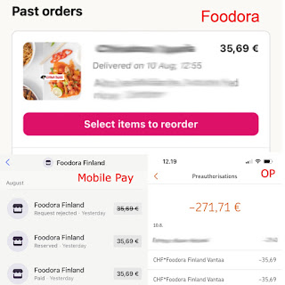

# Which of us did not understand, again?

A few years back, a friend in testing got on a stage and shared a personal story of bug advocacy. She found and reported a bug, and the reporting ticket kept pinging back and forth as "does not reproduce" up to a point when the two of them were put on a spot no one should ever be in - a boss with power of letting you go, and an ultimatum where it's one of you stuck in that loop. If the problem can be reproduced in front of the boss, the tester stays. If it cannot, the developer stays. The problem was reproduced, and the story illustrates things can escalate.

I think about this story whenever I find myself in an argument with a developer about a bug that I think I am experiencing. When we disagree, it almost always means one of us is missing information. I have had this argument professionally enough to know that sometimes it is me missing information. But a lot of times it isn't, even when I am told I am.

## Something went wrong

Last Saturday I ordered food with Foodora delivery app. I have done so before. I was already using the app less frequently, choosing another option over it due to previous two experiences of using it, but I gave it a go.

I ordered food once. I confirmed the purchase with the bank twice. And I confirmed the purchase with mobile pay three times. This is not how the purchase flow is supposed to work. But this is how the purchase flow has been for me with my last three uses. It's not a temporary glitch. With three times of having seen this, I have a good idea of what it is in my flow of use that reveals the problem. Yet I am unwilling to test in production, with my own money. After all, the result for the user is that today, 5 days later the money has been invoiced from my account once (correct), but still remain reserved so that it is unavailable for me to use (incorrect).

I also know my experience in the foodora app. The user interface flow never completed with confirmation. Yet I got my food, I paid for my food, and forcibly loaned money for the bank in their reservations queue.

I offered the service desk person that I could work with them for free to isolate the problem. They told me they don't have that kind of contacts within their company, and they could only tell me to wait to see if I get invoiced once or twice, and that their system only shows only invoice going out.

I have experienced reservations of money for a failed transaction before. I just don't experience it with every time I use the application. Or in a way where the application never finishes the users flow yet delivers me the food. So I suspect there is a problem here.

## Speaking about problems

I decided to use the experience as a talking point on LinkedIn. My message of what I wanted to say was muddled with multiple messages. I wanted to say:

* I am still happy to help Foodora figure out the bug because I think I can isolate my actions better than an average person, with 27 years of testing experience. Not asking to be paid.

* Paying for people for testing, isolating problems being part of it, would be good.

* Users need advocates and holding double bookings, especially in scale, is unacceptable, even when they get the money back in a week or two.

* When users suffer the consequence, we only care in scale. When the company suffers the consequence, we call it security vulnerability and care immediately.

* Users option - my option - is to not use this service. They would not know why my business goes elsewhere.

Lovely developers jumped in to help.

The first one wanted to help me with not saying bad things about Foodora in public, enough to go and snitch tag my employer. I got a lovely Sunday evening of worrying if a multinational corporation would let me go on my trial period because I shared an experience, until I stopped spiraling and realized I work with smart people who would do no such thing. His point was that in having so many messages and not my context, he did not appreciate tone of my post resulting from comparison of how differently we treat individuals and companies.

The second one wanted to help me like they help users. He explained preauthorization process - which I also am aware of, and even did some research on related to this case - and that it is designed to ensure the company gets their money. He insisted, and probably is still insisting that it is not a bug that I don't have access to 35,69 € of my own money 5 days later. I agree that it would be a worse problem if I ended up with a negative balance due to reservation missing. And I agree we prioritize the company getting their money, even if the user is forced to live with extra reservations.

What we don't agree on is my experience on the app that causes the double - triple transactions. I am pretty sure it is an interoperability problem and a difficult one to test because of the specific conditions in my flow of use, unlikely to be available without setup in an integrated test environment.

I have been a part of enough financial systems integrations to have learned two things:

* Production-like test environments don't exist for all financial integrations

* We can't test the exact user flows if we don't have the users kind of environment

Financial integrations tend to be, at least in Finland, heavily in dominant market positions and you can't exactly choose who you integrate with if you want to move money.

I tried making a final point:

> The company whose app I used to make my purchase is responsible for choices of the contracting chain.

Theoretically, they could choose to use financial service provider that designs the transaction flow differently. Realistically there are no options, and becoming an option would be hard. But if quality issues with double reservations were a problem in scale, they could seek solutions with options other than shouting down the chain.

End result of this is that Foodora lost my business until I forgive and forget. Since this is my second rodeo, I know it took me something in the neighborhood of a year last time. In that time, I would choose to pay with a different flow, or someone catches the glitch they have for now. Not that we would know of it.

I wish all the best for the development team at Foodora, with great production-like environments, feedback reaching them from their call center, and a lovely developer who will notice and fix the problem even without the two others. And thanks for fixing the security bug I reported where I got free food. I wish it was the same sense of urgency when your users are experiencing the trouble in whatever sociotechnical system you have going on. It might even include my colleagues, I would not know.

At least it was not that one of us would be fired at the spot.
