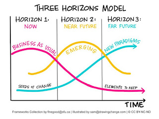
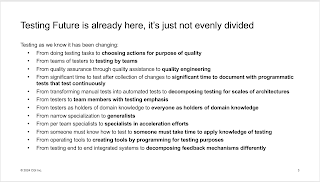

# It took me two decades to get to quality engineering

I have carefully curated a coined description of me on Mastodon:

🇫🇮Tester of products and organizations. Regretful Manager. Exploratory tester, (Polyglot) Programmer, Speaker, Author, Conference Designer. She/Her. maaret@iki.fi

The order matters. Each choice matters. And I am on the verge of changing the word my experiences center around *tester* to *quality engineer*. 

20 years ago, I was working in an organization that called the group I joined **quality engineering**. It was important to some people, it was not important to me. Showing up as me meant by personality that I was always living a bit in the future and I put significant effort in grounding my professional skills to now, empirical information, into seeing the difference of asking for something and actually having what you had asked for. **Testing** lives in the NOW, and a lot of people don't live in the now. 

It still takes me effort to focus on the now, when impacts I am seeking for are in the future. But teams need people who bring in different perspectives. And the perspective grounded on now and empirical information, it is hard to come by. Models that help me be intentional of the horizon I am working in, notice where others are working in, and making choices to be the complementary force have lead my professional choices, even when I don't explain why or how I think about things. In practice, I described this a lot some years back in materials I was creating about being a test manager, where you would have entirely different items to work with in case your project manager counterpart was optimist vs. pessimist. The job of working to fill the negative space was hard to share and teach, and it is a worthwhile investment to find some people to your teams that can do it, no matter what position you end up assigning them. 

When the world talked of quality assurance, I emphasized testing. When the world moved to quality assistance, I recognized more of the sentiment and still emphasized testing. Over the years, I stuck with testing, only adding the piece you can see in my mastodon bio. I a tester of products and organizations. This thing we do and know as testing that lives in the now is just as needed for products and organizations. 

Some weeks ago, I finally managed to make the connection though. Testing lives in the now, and what we have now may be bad quality. It may be lack of technical excellence. It may be unhappy people, bad practices, and subpar outcomes. When I enter a case of bad quality, I don't accept the bad quality. I don't accept the job of pointing out pizza boxes on living room floor, I take it upon myself to improve the habitability of work, and the experience of quality for different stakeholders. I have called this **contemporary exploratory testing** when I take the center of the practice but I require more than people who would traditionally do exploratory testing. I require automation. I require decision-making. And I require social software testing approaches. I require focusing on the now, to move towards future. Quality is the future, it's the target, it's the goal. It is the good enough to our present state. It's the raising bar, the productivity impacts to the whole development. That mindset that I frame into contemporary exploratory testing, other people like Anne-Marie Charrett frame into **quality engineering**. 

Quality engineering is forward facing from a platform of testing, in the now. 

With testing, we become generalists on amplifying all failure signals of things that might go wrong. With quality engineering, we join the path of fixing things.

It's hard to get what we have in testing sometimes, because we are moving and learning. And while the testing future is already here, it's really not evenly divided. Testing to quality engineering is a part of that future, and I finally made the connection after all these years. 

