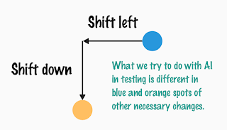

# Prepare to shift down

While the world of testing conferences is discussing shift left - a really important movement in how we make the efforts count instead of creating failure demand, we are noticing another shift: shift down.

For years, we have been discussing the idea that sustainable success in programmatic testing space requires you to decompose testing differently. Great automation for testing purposes is rarely built from automating what you considered end to end flows a human experiences. Great automation optimizes for speed and accuracy of feedback, granularity in both time - immediately available for the developer who made an impacting change - and location. No speculation on the source of the problem saves up a whole lot of effort.

As I talked about these two shifts today as part of a talk in applying AI of today in testing as a foundational concept in terms of how I believe we should first shift left and down and a personal suspicion that we might like what AI is doing for us after the shifts, am also realizing positioning organizations at these two locations helps make sense of the kinds of tools and workflow ideas they are automating from.

What is this shift down that we talk about? Shift left is a common place term and I prefer not having left or right but single commit delivery making things continuous. One can dream. But shift down, that is not as commonly discussed.

Shift down is this idea that test-driven development is great, yet limited by the intent of the individual developer. A lot of developers are good and getting better daily at expressing and capturing that intent, and having that intent is hugely beneficial in routinely accepting / rejecting generated code from modern tools and choosing to stay on controls. From a sample set of projects most certainly not built with TDD and with unknown level of unit testing, we have seen a report recounting that 77% of bugs that escaped after all our efforts to production could be in hindsight reproduced with a unit test, meaning there is a lot more potential for doing good work of testing on the unit testing level. I like to play with the word exploratory unit testing, which is kind of a way of stretching the intent of today with learning in the context of the code, to figure out some of this 77%.

For a few crafters I have had the pleasure to work with, Test-Driven Development and Exploratory Unit Testing could be interchangeable. For others, the latter encourages us to take time to figure out the gap, especially with regards to legacy code where those who came before us left us less than complete set of tests to capture their intent.

Shifting down pushes conversations to unit tests; component tests; subsystem tests; and guides us to design for decomposed feedback. We've been on that shift as long as the other one.
