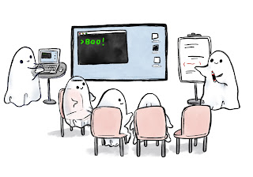

# Ensemble Testing — How to Enable Better Habits and Skills

Five years ago, I was sitting in a conference front row feeling puzzled. I was listening to Woody Zuill on Ensemble (Mob) Programming and the idea he presented felt too extreme to be good:

> Whole team working on the same thing using one computer.

I had to try it and it transformed me from a non-programming tester to polyglot programmer I had always been since age of 12. To help other people get started, I started Ensemble Programming Guidebook. But the most significant transformation came from what I started calling Ensemble Testing.

## Ensemble Testing

Ensemble Testing is to testing activities what Ensemble Programming is to all activities. While I can easily recommend Ensemble Programming 40 hours a week, if you would do Ensemble Testing 40 hours a week, you would soon find yourself grown into Ensemble Programming.
Ensemble Testing is ensembling on testing activities:

* Cleaning up test automation code

* Creating test automation code on any or many layers

* Exploring an application while writing code

* Exploring an application without writing code

Before when testers got together to test and learn about testing, we would work in same space, everyone with our own computers or a minimum of a computer per pair. Ensemble Testing gave us a vocabulary to say that one computer or set of computers with control together as a group would be an option. And that while we might do less, we might learn more. Usually in ensemble testing we don’t uncover so many issues, but we learn a lot. 

And we learn to work better together over time!

## A Facilitating Teacher’s Golden Egg

As I discovered Ensemble Testing, I started using it for all my hands-on exploratory testing courses. As a teacher trying to enable movement in habits and skills for a group of 10–16 students, ensembling took my ability to teach to next level. I would always see what the students could do (not just what they said they could do), I could have the students teach each other providing great leveling of next steps to learn, and I could take control myself to teach hands-on how to apply a particular idea.

I would find myself saying “Let me navigate for a while” and showing how I would test it. I would ask questions on the intent, asking people to give words to what they were trying to do. I would have them write it down on a whiteboard so that they could anchor their learning. And I would watch people move to the keyboard, and know how to do a thing they did not know to the same level on a previous round.

In particular, I learned that when there are things you do not know you do not know (unknown unknowns), ensembling is the way to reveal them.
I moved my courses from exploratory testing without automation to very specific courses on automation, and regardless of what would come up, I could rely on the group’s collective power intertwined with my knowledge on solving the problems. I have no fear.

## Skills and Habits

Skills are about actionable knowledge: being able to do something, in a smart way — the right tool for the right job. Habits are about consistency: being intentional not accidental about our results.

I learned people are often at their best behavior in groups. We want to please our peers, be it kindness or innovation.
Best results from Ensemble Testing come over time. Not just one training, just one session but doing your testing work in a group setting every now and then. Mixing up unexpected people. Building bridges. Transforming practices and organizations.

If you have not yet tried, please do. If you have, tell me what your experience has been like with #EnsembleTesting.