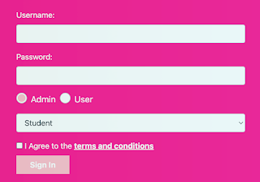

# Taking Testing Courses with Login

When we talk about testing (programming) courses we've taken, I notice a longing feeling in me when I ask about the other's most recent experience. They usually speak of the tool ("Playwright!", "Robot Framework with Selenium and Requests Library!", "Selenium in Java!") whereas where I keep hoping they would talk about is what got tested and how well. From that feeling of mine, a question forms: 

> What did the course use as target of testing in teaching you? 

For a while now, I have centered my courses around targets of testing, and I have quite a collection. I feel what you learn depends on the target you test. And all too many courses leave me unsatisfied with the students with their certificates of completion, since what they really teach is operating a tool, not testing. Even for operating a tool, the target of testing determines the lessons you will be forced to focus on. 

An overused example I find is a login page. Overused, yet undereducated. 

In its simplest form, it is this idea of two text fields and a button. Username, password, login. Some courses make it simple and have lovely IDs for each of the fields. Some courses start of making locators on the login page complicated so clicking them takes a bit of puzzle solving. In the end, you manage to create test automation for successful and unsuccessful login, and enjoy the power of programming at your fingertips - now you can try *all the combinations* you can think of, and write them down once into a list. 

I've watched hundreds of programmed testing newbies with shine in their eyes having done this for their first time. It's great, but it is an illustration of the tool, it's not what I would expect you to do when hired to do "testing". 

Sometimes they don't come in the simplest form. On a testing course targets, the added stuff scream education. Like this one. 

From a general experience of having seen too many logins, here's things I don't expect to see in a login and it's missing things that I might expect to see if a login flow gets embellished for real reasons. If you're take on automating something like this is that you can automate it, not that it has stuff that never should be there in the first place, you are not the tester I am looking for. 

Let's elaborate the bugs - or things that should make you #curious like Elizabeth Zagroba taught on her talk at NewCrafts just recently. You should be curious on: 

* Why is there a radio button to log in as admin vs. user, and why is Admin the default? There are some but very few cases where the user would have to know and asking that in a login form like this is unusual at best, but also only the minority users who are both would naturally have a selection like this. For things where I could stretch my imagination to see this as useful, the default would be User. The *judgmental me says this is there to illustrate how to programmatically select a text box*. 

* Why is there dropdown menu? Is that like a role? While I incline to think this too is *there to illustrate how to programmatically select from list* I also defer my judgement to the moment of login in. Maybe this is relevant. Well, was not. This is either half of an aspired implementation or there for demo purposes. And it's missing label explaining it, unlike the other fields. 

* Why is there terms and conditions to tick? I can already feel the weight of the mild annoyance of having to tick this every single time, with changing conditions hidden in there, and you promising your [first born child](https://archive.f-secure.com/weblog/archives/00002749) is yet another Wednesday some week. The *judgmental me says this is here to show functional problem of not requiring ticking it when testing*. And the judgmental me is not wrong, login works just fine without what appears to be compulsory acceptance of terms, this time with default off to communicate higher level of committing when I log in. 

**The second level judgement I pass upon people through this is that testers end up overvaluing being able to click when they should focus on needing to click and waste everyone's time with that and this is a trap**. I could use this to rule out testers except overcoming this level of shallowness can be taught in such a short time that we shouldn't gatekeeper on this level of detail. 

I don't want to have the conversation of not automating this either. Of course we automate this. In the time I am writing this, I could already have written a parametrized test with username and password as input that then clicks the button. However, I'd most likely not care to write that piece of code. 

Login in a concept of having authentication and authorization to do stuff. Login is not interesting in its own right, it is interesting as a way of knowing I have or don't have access to stuff. Think about that for a moment. If your login page redirects you to an application like this one did, is login successful? I can only hope it was not on the course I did not take but got inspired on to write this. 

I filled in the info, and got redirected on a e-store application. However, application URL and another browser, I get to use the very same application without logging in. I let our a deep sigh, worried for the outcome of the course for the students.

Truth be told, before I got to check this I already noted the [complete absence of logout functionality](https://visible-quality.blogspot.com/2021/07/the-most-overused-test-example-login.html). That too hinted that the login may be an app of its own for testing purposes only. Well, it does illustrate combinations you can so easily cover with programmatic tests. What a waste.  
What work in projects around login looks like, really? We can hope it looks like taking something like Keycloak (an open source solution in this space), styling a login page to look like your application, avoiding the thousands of ways you can do login wrong. You'll still face some challenges but successful and failing login aren't the level you're expected to work on. 

What you would work on with most of your programmatic testing is the idea that nothing in the application should work if you aren't authorized. You would be more likely to automate login by calling an API endpoint giving you a token you'd carry through the rest of your tests on the actual application functionality. You'd hide your login and roles into fixtures and setups, rather than create login tests. 

The earlier post I linked above is based on a whole talk I did some years back on the things that were broken in our login beyond login. 

Learn to click programmatically, by all means. You will need it. But don't think that what you were taught on that course was how to test login. Even if they said they did, they did not. I don't know about this particular one, but I have sampled enough to know the level of oversimplification students walk away with. And it leads me to thinking we really really would need to do better in educating testers. 