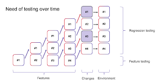

# How to make testing fun and enjoyable?

I have believed and experienced that testing is fun and enjoyable for 27 years. I have had that experience enough to talk about my primary heuristic from stage:

**Never be bored.**

This confuses people, especially when their idea of testing is repetition growing over time. 

ou keep replenishing the test results. Sort of same results. Except that while the tests may be the same, you don't have to be. You can vary things, and return to common baseline when the variation takes you to surprising information. Every change, every changer in the moment is different. And it's like a puzzle figuring out how to create a spider web of programmatic tests that tells you enough while not all, and yet look at each change with the curiosity of 'what might go wrong here'. 

If I feel bored, I introduce variation. I change the user I log in with. I change the colleague I pair with. I change the order in which I test in. I write test automation that does not fit our existing patterns of how we automate. I write detailed public blog posts while I test unlike normally. I experiment with separating programmatic tests that always run into suites where I run each suite every second day to save up replenishment resources. Well, the list of variations is kind of endless. 

I love testing. And I have been testing today for a new system under test (for me). 

In order to be able to test the way I love testing, I have to be able to have a solid foundation of programmatic tests that we grow gradually as output of our testing, capturing the pieces of learning worth keeping around. Today, I want to recognize a few things that I need to keep testing fun and enjoyable. 

* **Agency**. You don't give me a test case to automate. You give me a feature to test, and out of that I will automate some test cases. But thinking you plan and I execute takes the fun out of my testing. Even the more junior folks do better starting with WHY not HOW. 

* **Smart constraints**. You don't tell me that programmatic tests need to mimic written step by step test cases. That makes me use my time in updating two documentation sets for same purpose, and doing busywork is not fun. 

* **Test environment**. You don't deny me access to exploring of an old version while I design and collect ideas for how we should test changes for the new version. External imagination - the product without the change - makes the task more productive, and it's fun to do good work. There needs to be enough of these to go around for us all, every day. 

Notice how my fun and enjoyment isn't asking for *documentation* or *answers to all things about the product*. Not having those around is sometimes different kind of fun, even if I prefer us starting with a better agreement, you can be sure I will discover things outside it. It also does not include great people and friendly developers, because today I choose to believe that people are good and want to do good. Us discovering exactly how many jokes going around that requires is part of the variation. 

A colleague inspired this post by wishing that we had common templates and a unified front on what test documentation looks like. Figuring out how I could ever do that, when I do decent plans and strategies but not to a template should be fun. While it's fun and enjoyable, it is less impactful for the good results I would want out of my testing. Plans are more often ways for me to think the big picture than the most relevant deliverable. 

That's my shortlist (today), what's yours? 