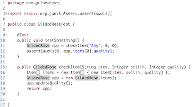
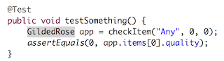
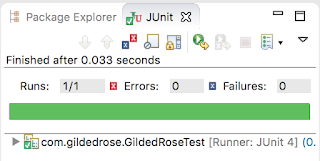
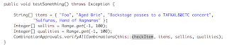

# Exploring Gilded Rose

There is a lot of talk around testing — who will do it, when it needs to happen, boxes it needs to fit in — yet not enough on the actual testing. This is the first article in the series of looking at software to test, and figuring out how to test it. This article is based on the experiences I’ve had watching people test as I coach and teach them using these examples.

## Introducing Gilded Rose

Gilded Rose is a refactoring Kata (practice) created by Emily Bache. The idea with Gilded Rose is simple. There’s an inn somewhere that has an inventory system implemented. They would want it extended for new requirements but that won’t be all straightforward. Don’t break anything that used to work!

I’m a tester, so I don’t naturally come to the problem as it has been given, but I come with the idea that after someone changes it I may have to test it. How would I do that?

## Priming With Information Sources and Tools

At work, things don’t come to you with the full range of sources and tools readily handed in. For doing the exercise, I no longer drop people in cold to “just figure it out” but I give them a few starting points.

* **Requirements**. Gilded Rose comes with a [requirements specification](https://github.com/emilybache/GildedRose-Refactoring-Kata/blob/master/GildedRoseRequirements.txt). Would that be of use?

* **Code**. It “works in production” now and you can look at the implementation. If [Java](https://github.com/emilybache/GildedRose-Refactoring-Kata/blob/master/Java/src/main/java/com/gildedrose/GildedRose.java) isn’t your cup of tea even if I use it while I teach this, Emily has been nice to provide it with tons of other languages.

* **Unit test**. The [one unit test](https://github.com/emilybache/GildedRose-Refactoring-Kata/blob/master/Java/src/test/java/com/gildedrose/GildedRoseTest.java) gives a starting point of how to execute the code so that you don’t need to figure that out.
IDE with visual code coverage. Code and unit test in an environment where you can start working on it, with a code coverage tool. I use Eclipse with Code Coverage as I just like the visual nature of it showing green, yellow and red for the branches.

* **Ideas of the domain**. You have past experiences of what makes sense for a shop and inventory management system. You have ideas of what inputs are meaningful, and what could be confusing. Everything you’ve learned about what makes software worthwhile is with you.

To make the exercise slightly more tester friendly and approachable in coaching people who never work with code, I extracted a method out of the original unit test.

If you want to try things out before spoilers, pause here and go do the exercise. Figure out what your test cases for it look like and why they are the way they are.

## Getting to Work — How Would I Test this?

We’re approaching the exercise with exploratory testing, and all of our options are open. What makes this exercise particularly exploratory is that I will rule out the option of going away to your cubicle to write test cases based on the specification without running a single test. I expect you to design your tests as you go and allow you to learn rather sooner than later.

Unlike for me right now writing this article after having done the exercise, you are now at a time you know the least. You know there’s two information sources and either *specification* or *code* could be your starting point. If you are a tester by trade, you are likely to lean towards the specification and if you are a developer by trade, you are likely to lean towards the code and coverage tools.

As the exploratory tester, you are on the driver seat. You get to choose which way you go. And any mix is possible. There is no recipe. But there is options.

## Just Try It

You could just forget about the specification for now, as well as not read the code that implements this, and start playing with values you can enter into the CheckItem-method. It takes three inputs:

* a name (*String item*)

* a number of days we sell the item (*Integer sellin*)

* a number indicating how valuable it is (*Integer quality*)

If we didn’t look at the specification, deducting this much info out of the interface is unlikely. We would just see it takes text and two numbers. But that is enough to play with it! This brings you to the problem with least structure, highest chance of getting confused and highest chance of learning something outside the spec and the code.

You could look at the problem with the simple ideas around the inputs. What if the input is really really long? What if the number is really really big? Oo, negative numbers? Special characters? All the things forbidden? Hey, there’s numbers that are special: what if your input is 00100, is that 100 or something different?

## Read the Specification

Exploratory testing does not mean you have to jump in without considering any of the sources. It means you are intentional about what you choose, and you combine things in ways that keep you engaged as well as ensure you do a good job tracking coverage and meaningfullness of your work. Reading the specification gives you one way tracking coverage.

The specification is full of claims. Some of them are clear. Some will turn out not so clear when you’re testing and seeing what the application does. Some lines are single claims, some are have multiple claims in them. Some lines stand on their own, others depend on other lines of text. Not all lines are meaningful at all.

Which one do you choose to start from? How do you know? Actually, you don’t know. So you sample something and hope to have made a selection that leads you to understanding rather than confusion. And that if it leads you to confusion, you get out of there with later samples.

## Read the Code

You could also choose to read the code. You could choose to introduce some tests that enable you to step the logic through in a debugger so that maybe you could see some patterns in how it is implemented. Maybe you just read it without executing so much. Read line by line, or read paying attention to some aspects like variable names or values the code checks against.

Code is the ultimate truth, what is not in the code that now “works in production” isn’t working in production. The spec and the code can be in sync or not, but if they disagree, the code wins until it gets changed.

## Think about the environment

The program you’re supposed to test is probably intended for some use by some people somewhere. That somewhere most likely isn’t the test machine you’re using now, and the end user interface most likely isn’t going to be the method you have your hands on now.

What would change in the way you look at the application of the environment was different? Would someone try running it concurrently? Would it need to speak to an external system? Could it be limited to run with miniscule amount of memory, or in an environment that does not allow Java Virtual Machine to be running?

## The First Test

There is no absolute choice for the first test, and having tested this with a good crowd of people both individually and in mobs, some people still make a different choice for the first test in the setup we test in.

For me, the first test is to see we can actually test. Running the test that has been given to us as an example. The test that reveals our ability to run any consequent tests.

There has been days of going into doing the exercise where this test fails, because I accidentally cleaned up more than I should after the previous run through the exercise.

Generally, this test results in a green bar.

As we are exploratory testing, we learn that the interface provided is good for us to go further. We learn that the tool reports us with green when a test is given that passes. We might even read the test to figure out that it says that when we start with item named “Any”, no days to sell it and quality of zero, the quality isn’t changing anywhere.

## The Second Test

With the second test, we arrive at the significant divergence of choices.

* the freeform value exploration

* the specification

* the code through measurable coverage

* the context of use

The real choice is actually to realize they are all different dimensions and for properly testing this, some work on all might need to happen. Some tracking of coverage on all of them would need to happen. Some discipline in not abstracting results of one to fully cover the results of another would need to happen.

What I often see with the choice of the second test is that some people choose to just pay attention to the code, and end up missing out on all the problems the specification leads you to uncover. Some people choose to pay attention only to the specification and report problems that aren’t really problems and fail to cover the code. And some people just don’t feel like they are empowered to add anything beoynd the given artifacts, which is detrimental to their ability to uncover yet another category of problems.

## Reading the Spec While Aiming for 100% Branch Coverage

Let’s assume we intentionally, not accidentally, chose to approach this code and code coverage first, with the help of the specification.

[Here’s tests from one group](https://gist.github.com/maaretp/e7dafe02b662ab809fbca2f76f8d4110) to get to 100% branch coverage. 18 tests. Took two hours in an ensemble.

At first they tried giving good names, but knowing the least to begin with, the names were not really good. Halfway through they got tired of trying to think of names and just gave up thinking and trying to understand other things and focused on getting through the coverage of specification and code.

In every single test their assert was on *quality*, and they never see a requirement around how *sellin*-number would behave in case of legendary items.

Power of the group lead them to pay attention to the specification and they found the discrepancies there:

* The lack of input validation implied by many requirements

* The shorthand of naming items in the specification in comparison to full names used in the code

* The fuzziness around limits the rules defined that behavior would change at

By the time they were done, they had worked significantly. Yet they called done before it was time. No cleaning up the names, no looking for rules they might have missed.

## Tools Ease The Exploration

To contract to the 18 handpicked tests over 2 hour intensive work, I’ll show you a few minute example of just covering the code with ApprovalTests-library.

This tool includes a possibility to pass a group of values and automatically generate combinations of those values. The generated tests are pushed into a text file where we can visually verify and approve them. Within the minutes version, I would use the principle of them all being correct because this is legacy code that *Works in Production*. Within minutes, I generated 41616 tests to get to 100% branch coverage, and to run them again to make sure nothing breaks it takes 1.028 seconds to run. The code to do that is four lines and I go with the ultimate lazy of not even hand-picking relevant integer values but using all between -1 and 100.

If you miss the [copy-pasteable example of this](https://gist.github.com/maaretp/2ec5eb9e38b9d9b1758f98e0bdb016ed), I put in a gist. You may notice I needed to do one change to the original method so that the returning object would have a *toString()* to write to file. What was object type GildedRose in the first example, is no object type Items in the latter as it already had the necessary *toString()* defined.

With the 41616 tests, I have now a list of things I can verify with specification. Obviously I would sample heavily over checking them all. But with then visible, I can run into problems serendipitously. I can notice that for

> [Sulfuras, Hand of Ragnaros, 27, 23] => Sulfuras, Hand of Ragnaros, 27, 23

the second value, sellin, isn’t in fact changing. I could visually and conceptually compare it to another item

> [Foo, 1, 10] => Foo, 0, 9

Seeing that for all others but the legendary item Sulfuras, as speficied, “never has to be sold” in requirements means the sellin date won’t be changing.

## Summing up to some fun pitfalls

For a little exercise like this, it has surprising dimensions. To end this article, I wanted to share lessons learned with one newbie tester who found out there was a lot to learn.

They did not get bit by missing the first test, because they were lucky enough to have it in a safe and good green starting point.
They started creating their tests from the end of the specification, where many claims depend on each other. They assumed they spotted an easy claim to verify which I find a fascinating judgement call of what is easy and what is difficult. Defining a test around that claim lead them to learn things that were not true, and double the time to finish the exercise to include unlearning things they had started to firmly believe in.

The lessons were:

* First test was a poor choice leading to long-term confusion, we could either choose differently or pay attention to what we really know more actively.

* Any coverage will do, some here some there and testing is done! That is true, but tracking how much done are you is a big part of testing. Even the code coverage can fool you because the number shows line coverage and the colors show branch coverage. Calling it done on line coverage left out lines leading to new branches.

* Naming coverage dimensions isn’t a thing everyone does, they didn’t. Conceptualizing code, specification, environment and risk coverage is a necessary thinking model.

* Code coverage can be achieved without proper asserts and gives a very false sense of security. You don’t even need to assert values of quality for the 16 tests above to have them still run to 100% branch coverage.
Problems against specification were all assumed distinct problems, no grouping around the fact that there was full areas of “I expect input validation” that were not implemented anywhere.

* Specification having shorthand like saying “Sulfuras” instead of “Sulfuras, the Hand of Ragnarok” isn’t a major problem with the specification even if it bit them in the exercise. Best of specifications are helpful, yet incomplete. Best of testers using specifications don’t need them to be complete to do complete testing.

* When results did not match the specification, quickly jumping to conclusion that we are testing a buggy software which wasn’t the case. The models to pinpoint whether problem could be in *my tests that I have control over* were not in place. We practiced many rounds of “is there another test we could do that would give us a second data point to verify we understood the requirement”.

* One test one requirement isn’t a thing. They are a messy network of dependencies.

There is no easy recipe for testing any application. Stop to think. Approach from different angles. Check and double-check. And don’t hide in your corner, maximise your chances of getting to the right information by working with the others.
