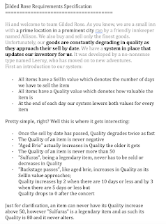
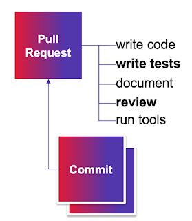

# Gilded Rose for Exploratory Testing

I have been teaching testing long enough to have accumulated quite a number of experiental learning exercises. That is, you learn testing by testing. Sometimes what I teach is agency and tracking your changing plans. Sometimes what I teach is coverage. Sometimes what I teach is versatility of observations. Sometimes I teach documenting with automation. 

In 2021, a theme for me was scale. I had a lot of useful material, including exercises and ideas on how to facilitate them, and I was - well still am - just one human. If any of the stuff I had spent time honing would be useful for others in scale, I needed to figure out how to do that. 

Between Nov 30th 2021 and March 12th 2022, I worked on capturing one particular exercise into an Instructors Manual for Gilded Rose for Exploratory Testing (pdf). Leaving that on my drive definitely did not ease up discovery and my focus shifted, to experimenting with how I would teach testing newbies in a program I called Testing Dozen, to AI-assisted programmed tests and to leading product development. Versatile interests and limited time, what can you do. 

As I was prepping a slide deck for a talk on Regression Testing this work that I had prepped with help of some really smart people allowing me to watch them test since you can only have first experience once and then you borrow others, well, this work came to mind. 

The core of this work that I went for was numbers. I had two approaches to regression testing of a piece of code. The numbers say that it takes 5x more time to create 16 tests than it takes to create 166 tests. And that's not all folks. The 16 tests miss one essential scenario because more time would have been needed to catch that. 

The two approaches are quite essentially different though. 

The first one producing 16 tests in this particular documented instance is what we usually do as testers. We take a specification and we analyze that. It has been a primary way I use Gilded Rose in teaching, because starting with the spec and not the code, you will learn things about the program you don't learn from code. Things related to reasonable expectations of how a thing should have been implemented, and what the requirements say clearly and not clearly. For teaching purposes, I have quite enjoyed the fact that I have ended up writing down 15 things people often fail with in trying to complete the exercise. 

I used this spec-based style also one summer in choosing a summer employee to work with us on test automation. I spent 20 minutes with each candidate, and I a reasonable pool of candidates (less than 20). Working on this exercise reveals a lot about comfort level with code, chunking a problem and understanding the basic idea of what you might be doing with testing. 

The second one producing 166 tests in this particular documented instance is founded on two insights: 

* Simplified oracle: forget the spec and lock the code - 'works in production' is one way of thinking about correct, as in somebody else's problem

* Data driving the logic: you can parametrize inputs and benefit from combinations in getting through the logic

While it is fast, it is also blind. But it allows for after locking comparison to spec that would lead to those lovely exploratory insights I am also after, and in a more effective way. 

Being aware of different strategies for exploration is a good thing. And this particular exercise is a good one to drive that lesson in a reasonable learning timeframe. It teaches designing tests for coverage: code, spec and risk. And done from a keynote stage, drives well home the message of exploratory testing **not** being manual testing nor end to end testing. 

I often teach **Exploratory Unit Testing** which is kind of what good intent for test-driven development requires. I often teach **Contemporary Exploratory Testing** which is kind of the idea that automation is documentation, reach and it's failure an invitation to explore further, and not that bubble people draw on top of the testing pyramid. And for purposes of today, this is **Regression Testing** because the functionality is already there and 'works in production' by somebody else's definition. It hasn't changed forever, and I for one have tested it with hundreds of people. Even regression testing finds new insights, but the likelihood of us going back and fixing them is lower if we already know we managed to live with those. And that is an essential dynamic. In addition to knowing how much you want to invest in coverage of correctness. 

Finally, this all is a lead in to work I am now on: AI-assisted programmed tests. The less we want to invest in coverage of correctness and just go with locking tests, the more we can generate. The more we can capture behaviors with good descriptions, the more the tests serve as useful documentation. But this area is muddled and full of overpromise. A perfect candidate for exploration. A theme of this fall, building on the last year, and the year before that. 

Since I am a consultant now, and I sell half of my time to take things forward in some organizations, if you find that capturing things in your pipelines with AI could be an improvement theme you want to see through, that's what I am about to go into. Your organization could benefit from the collaboration and drive. I still work with limited time, and ability to make choices on how that limited time gets used within flexible constraints and great support of other people around me. 