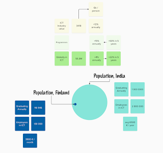
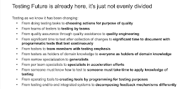

# Fascination of Scale

A lot of people are worried about future of employment. My little bubble includes people who have been searching for their next employment in IT for a while, and feeling deflated. Similarly, my bubble includes people who gave up on IT, women in particular, and chose to do something else.  

Some days it feels like threats to employment are everywhere but in particular in the effort we use in being threatened over finding ways to direct that energy elsewhere. People in my little bubble have three major sources of existential threat:

* Testing is moving from testers to developers

* Work is moving from local to global

* AI will replace us all, or people using AI will replace people without AI

That's a lot for anyone to think about. So today, I wanted to frame my thoughts in a blog post around three simplified numbers.

* Number of programmers doubles in 5 years

* 50% of jobs change, 5% of jobs replaced by automation

There's a lot of 5's there, and a comforting message. Keeping up with the changes keeps around 95% of the jobs, and with the rate of growth, more jobs are being created than is going away.  

Out of curiosity, I wanted to dig in a little deeper. In a game of scale, we can either imagine there is always something worthwhile for us, or we can imagine that finding something worthwhile for us is prohibitively difficult. I tend to believe that we have problems with discovery and matchmaking, and we have problems with supporting change and growth, and part of the reasons for those is focus in individual (entities) over networks. But again, back to digging. I live in a fairly small country, Finland. And understanding anything would start with understanding your own bubble in relation to others.

Finland has population of 5.6M people. As per random searching of information online, we have 117k people graduating annually, and 130k people currently employed in ICT, with an average salary of 3900 €/month. Another random point of comparison I had to dig out is that it seems usage statistics of Selenium suggest 0.5% use in relation to population for Selenium, regardless of the fact that most of my friends here block all statistics from being sent. With one of me and 5.6M of others close to me, being worried about running out of work has not become a concern. The experience I live with it we continuously want to do more than what we have time for, and a significant productivity improvement helping us solve a few more of those persisting issues would be quite welcome.

To make sense of scale, I selected a country of many of my colleagues in the industry. The scale in which things work in India makes it easy to understand why my socials are full of friends from that corner of the world. India has a population of 1.4B people. I could not even grasp that as a number without doing a bit of area calculation math, and drawing those areas as circles. I saw claims that 1M people graduate annually, and that there are 2.8M people working in ICT in India. Average salary counts to 6500 € / year. Selenium usage to population is 0.01%. That all is an entirely different scale.

My search for numbers continued on global. 55.3M people in ICT, with 4% annual growth, 22% over 5 years. So if the claim I picked up some years ago in Agile Technical Conference counts *programmers*, it would appear that programmers are growing faster than the industry at large - which would probably make some sense. ICT-industry segment value $341B would suggest that per person slice of that value for each employed is $6k/year

With all the numbers, this brings us back from worrying about being without jobs to figuring out the continuous work we do in changing our jobs. Changing our jobs to share the work and value. To evolve the work and value. To move at pace we can work with.

There's a change in testing that has been ongoing a while.

Paying attention not just to "what are my tasks" but to what is the value I'm contributing and evolving that further is a part of the work towards productivity on everyone's plate.
