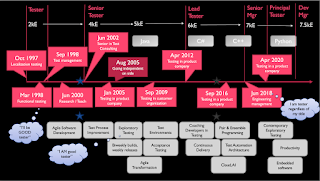

# To 2004 and Back

Year 2004 was 20 years ago. Today I want to write about that year, for a few reasons.

* It's the first year in which I have systematically saved up my talks on a drive

* It's the year when I started doing joined talks with Erkki Pöyhönen and learned to protect access to materials by using Creative Commons Attribution -license

* I have just finished taking my 2004 to my digital legacy project, meaning my slides from that year are no longer on my drive but available with Creative Commons Attribution -license on GitHub.  

To put 2004 in context, I was a fairly new senior tester then. I became a senior because I became a consultant. There is no chance in hell I was actually a senior then. But I did wonders with the appreciation and encouragement of the title.

My topics in 2004 were Test automation, Test Planning and Strategies, Test Process Improvement, and Agile Testing. Most of my material back then was in Finnish. I believed that we learn best on our native language. I was drawing from what was discussed in the world that I was aware of, and clearly I was aware of Cem Kaner.

Looking at my materials from then, I notice few things:

* Most of my effort went into explaining people here what people elsewhere say about testing. I saw my role as a speaker as someone who would help navigate the body of knowledge, not in creating that body of knowledge.

* The materials are still relevant and that is concerning. It's concerning because same knowledge needs still exist and not enough has changed.

* I would not deliver any of the talks that I did then with the knowledge and understanding I have now. My talk on test automation was on setting up a project around it, which I now believe is more of a way of avoiding it than doing it. Many people do it with a project like that, and it's a source of why they fail. My talk on concepts in planning and process make sense but carry very little practical relevance to anything other than acquisition of vocabulary.

* My real work reflected in those slides is attributed to ConformiQ, my then employer. I did significant work in going through Finnish companies assessing their testing processes, and creating a benchmark. That data would be really interesting reflection on what testing looked like in tens of companies in Finland back then, but it's proprietary except for the memories I hold that have since then impacted what I teach (and learn more on).

I talked about Will Testing Be Automated in the Future and while I did not even answer the question in my first version of the talk in writing, second one came with my words written down:

* Automation will play a role in testing, especially when we see automation as something applicable wider than in controlling the program and asserting things.

* Only when it is useful - moving from marketing promises to real substantial benefits

* Automation is part of good testing strategy

* Manual and automated aren't two ways of executing the same process, but it's a transformation of the process

None of this is not true, but it is also missing the point. It's what I, knowing now what I did not know then, call feigned positivism. Words sounding like support, but are really a positive way of being automation aversive. It's easy to recognize feigned positivism when you have changed your mind, but it's harder to spot live.

Being able to go back and reflect is why I started this blog back in its day. I expected to be wrong, a lot. And I expected that practicing being wrong is a way of reinforcing a learning mindset.

That one still holds. 2004 was fun, but it was only one beginning.
