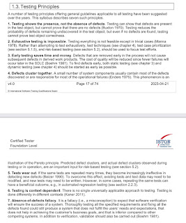
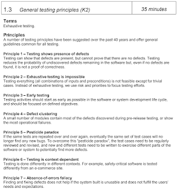
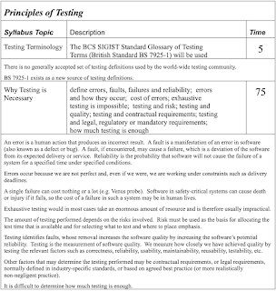

# Memory Lane 2005: ISTQB Foundation Syllabus, Principles of Testing

Some people create great visuals. One of those that I appreciated today was to turn 7 principles of testing into a path around number 7, by Islem Srih. As my eyes were tracking through the image, a sense of familiarity hit me. This is the list of 7 I curated for ISTQB Foundation Syllabus 1st edition in 2005. The one I still joke about holding copyright to, since I never signed off my rights. ISTQB did ask, I did not respond.

Also, it is a list that points to other people's work. Back then, as a researcher, I was collating not reimagining. Things I consider worth my time has changed since, and I would not contribute to ISTQB syllabi anymore.

Taking the trip back memory lane, I had to look at what I started with to build the 7 principles. I recognize editions since have changed labels - thing I called *pesticide paradox* to honor Boris Beizer's work is now "tests wear out".  I'm pretty sure I would have called Dijkstra's on the absence-not-presence principle as he is the originator of that idea, and I find it impossible to believe I would have penciled in [Kaner 2011] for something that is very obviously [Kaner 2001]. It is incorrect in the latest published syllabus. Back then I knew who said what, and had nothing to say myself as I imagined it was all clear already. Little did I know...

The 7 principles that made the cut were ones where we did not have much of arguments.

I have the 2005 originals that I was no longer able to find online easily. I can confirm I did not mess up the references, because I did not put in the references. Now that I look at this, the agreement was not to put in references unless they were recommended reading to complete the syllabus.

I also went back to look at principles I started working from to get to these 7. The older set of principles is from ISEB Foundation.

Comparing the two

ISTQB:

* Presence not absence

* Exhaustive is impossible

* Early testing

* Defects cluster

* Pesticide paradox

* Context-driven

* Absence of errors fallacy

ISEB:

* Exhaustive testing is usually impractical

* Testing is risk-based and risk must be used to allocate time

* Removal of faults potentially improves reliability

* Testing is measurement of quality

* Requirements may determine the testing performed

* Difficult to know how much is enough

It was clear we did not agree on the latter. While these may be principles that are much better than X normally sees as per one of the comments on the post that inspired me to take this memory lane trip, I am no longer convinced they are truly the principles worth sharing. But they do make rounds. I am also not convinced the additions and explanations improved them, at least on their generalized nature.

In hindsight, I can see what I did there. Grounded the syllabus a bit more on things in research. Some of which I don't think we've properly done to this day (early testing for example - jury is still out; clustering of defects feels more like a folklore than principle; pesticide paradox more of an encouragement to explore than tests actually becoming ineffective).

Perhaps revisiting what is truly true would now be good. Now that I no longer think my greatest contribution to testing is to know what everyone else says and not say anything myself.
