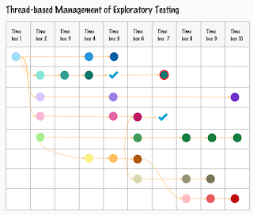

# Threads, Sessions and Two Kinds of Tasks

It all started with a call I joined early in a morning. I had been asked to introduce what I do for work for a larger group of people, and the messages started flowing in: 

"The sound is very low". "Something is wrong with your microphone". 

If this was the first time, I would not have known what was going on. Nothing was essentially different. The same equipment that works fine most of these day now would not. And at an inconvenient time. And it was *on me*, *my omission*. I could have rebooted the machine after the Selenium project leadership committee call I had been on, but I forgot, at a most inconvenient time. 

You see, this bug had been bugging me for months. It had bugged me on two different Mac computers, and I had been aware of its general conditions to reproduce for a few weeks now, but I had parked the thread of doing something about, other than working around it with a reboot. I was hoping that parking it long enough, it would go away without me doing anything. But no such luck for last six months. 

With so many things to test, I parked the one that I was paid for on the investigation and reporting work. 

You see, taking forward the work of getting rid of that bug, it's a thread of work. It's multiple steps. For reasons within my understanding, the companies - let alone open source projects - don't see the problems just because we experience them. There's real work, testing work, to turn a random experience like that into a bug report that could even stand a chance of getting fixed. 

I knew the general conditions. The general conditions consisted of a weekly repetitive pattern in my life. When I would go to Software Freedom Conservancy's installation of BigBlueButton and have a lovely call on topics of advancing Selenium project's governance and support, any calls after that on teams or zoom would lose 80% of the volume. 

With the embarrassment of the call fresh on my mind, I made a choice on next steps in the thread of this work. Insisting it is not my work, I used a minute to complain about it on Mastodon and received some advice. Realizing my minute to complain turned into a whole conversation of many minutes and I lost control over my use of time for the curiosity of it, I made a choice on opportunity cost. I could use time on explaining why the advice would not make sense for me. Or I could use time and turn the general conditions to specific conditions, and actually report the bug. I won't believe in the good of the world enough to think it will be fixed with just reporting, but at least I am living a little closer to good choices on opportunity cost. 

You may guess it, the thread of work unfolds. What I think it going to be simply writing down the steps turns into a more of an investigation. The first version of the report I write without submitting mentions I use Safari, and its precise version, and also including details of my environment otherwise. It's specific enough that these instructions give me the reproduction of the problem on two different computers. It's adorned with pictures to show I am not just imagining it and expressing frustration on something I did not even investigate. I did after all, over the last 6 months. 

Looking at the report, I realize saying it happens on Safari, I have questions. What about the other browsers? Is it all browsers, or did I hit a sample of browsers giving a different experience of quality? To my surprise, it does not reproduce on Chrome or Firefox. You guessed it again, the rabbit hole deepens. 

I dash up python + playwright and it's been a few months since I did that. I set up a project and write up a test script to reproduce the problem on webkit that ships with Playwright. My idea is twofold. I would not mind reporting with a script that helps see it. But I am mostly curious on whether this bug reproduces on that webkit browser version that approximates safari but isn't it. And it does not. It does reproduce on selenium though, but I can't exactly ship my machine for the project and their pipeline does not include real browsers on Mac anyway. Well, I assume it don't which may be incorrect. 

I get the report in, and I have a fascinating case of a bug that might be in BigBlueButton (open source project) or Safari (Apple), and there's no way I am going to storm the latter for figuring out ways of reporting there. I cut my losses of time, and revel in my gains of learning. The likelihood of anyone setting up a cross-systems test for a scenario like this is low so it's not exactly a testament for importance of cross-browser automation, but it is a nudge and encouragement to keep with Safari because the others don't. 

And a work day later, I am rewarded with another Safari only bug, this time in our company CRM system where save button is not in sight in Safari. Lucky me. Another thread to park. 

---

Whether I work with the application I am testing or an application I using, I have come to learn that explaining the work is riddled with difficulties. *Testing* sounds so simple. The long story above on testing just one kind of scenario is not simple. It's not that it's hard, it's just a flow of doing something and making decisions, and driving towards an idea of completion of a thread of work,

My story there had two threads: 

* What I do to live with the bug to increase odds of it going away

* What I learn from the bug since I am investing time and energy into it

This blog post is part of the latter thread. 

So imagine I had a task in Jira or whatever tool of choice your project puts you on. Your task says to make the bug go away. All these things are subtasks, and some of those you discover as you do things. But you don't need this level of explanation in the tools unless you are in a particular environment. 

Your task is a thread. It's actually multiple tasks. And thread is a way for you to label things that are born inspired from the thing you set out to do in the first place, to talk about the work in a more clear way. And frame it in discovery and learning. 

No matter what focus you put on this task, with the dependencies it has it won't be completed within four hours. I heard someone again suggesting that is the granularity of expected task breakdown in a tool. Quite a documentation investment, and opportunity cost suggests that maybe you could do something else with the time. At least think about it. 

I have been teaching people that there are two kinds of tasks: 

* expansive - the work continues until it's done

* time-boxed - the work is done when the time on it is done

Testing can be done in the time-boxed style. It is testing that I test something for 4 hours. It is still testing that I test it for 40 hours. Time-boxed style is the foundation for managing testing with sessions. 

There is a more lightweight way of managing testing than sessions through. That way is managing testing with threads. Tracking threads, their completion, their importance, the need of using budget on them is how I work with most of my exploratory testing. The sessions are charters are not 1:1 but I have a charter for a thread, and I am careful at modeling learning as new threads. 

You may want to try out visualizing the work you have at hand. Sometimes people see what your head holds better with a picture. 

Learning to track, visualize and explain threads, sessions and the two kinds of tasks (expansive and time boxes) has been a bug part of what has helped me get the trust in testing. Too many daily go by with doing 'testing yesterday, and continuing testing today' as the report of work. 

Let's see when I can report that people on Safari won't need a reboot after using BigBlueButton. I changed something already - taking the calls on Chrome now. So we can call it someone else's problem, and the world is full of them. I make them mine for organizations that pay me, it's kind of the work. 