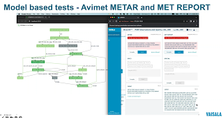

# Model-Based Testing in Python

Some of the best things about being a tester but also a manager is that I have more direct control over some of the choices we make. A year ago I took part in deciding that my main team will have no testers, while my secondary team had two testers. Then I learned secondary team did some test automation not worth having around and fixed that by hiring Ru Cindrea, co-founder of Altom, to help the secondary team. She refactored all of the secondary team's automation (with great success I might add). She took over testing an embedded product the secondary team had ownership on (with great success again). And finally, I moved her to my primary team to contribute on a new concept I wanted since I joined Vaisala 3,5 years ago: applying model-based testing. This all has happened in a timeframe of one year.

Some weeks back, I asked her to create a presentation on what we have on model-based testing and what that it about, and she did that. There is nothing secret in this type of testing, and I was thinking readers of this blog might also benefit from a glimpse into the concept and experience.

The team has plenty of other automated tests, traditional hand-crafted scripts in various scopes of the test target. These tests though, they are in scope of the whole system. The whole system means two different products with a dependency. The programmatic interfaces include a web user interface, a remote control interface to a simulator tool, and an interface to the operating system services the system runs on. This basically means a few python libraries for purposes of this testing, for each interface. And a plan to add more interfaces for control and visibility at different points of observation of the system.

In explaining why of model-based testing, Ru used an example of a process of how we give control and support for people observing weather conditions with the product to create standard reports. In the context we work with, there are reports that someone is creating on a cadence, and these reports then get distributed globally to be part of a system of weather information. Since there's an elaborate network that relies on cadence, the product has features to remind about different things that need to happen.

Choosing some states as screenshots of what a user sees, showing why model-based testing became a go-to approach for us makes sense. Traditionally we would analyse to draw these arrows, and then hand-craft test scenarios that would go through each arrow, and maybe even combinations of a few of the most important ones. Often designing those scripts was tedious work, and not all of us were visually representing them. We may even have relied on luck on what ended up as the scripts, and noting some of the paths we were missing through the exploratory testing sessions where we let go of the preconceived idea of the paths.

The illustration of screenshots is just a lead in to the model. The model itself is a finite state model with nodes and vertices, and we used AltWalker (that uses GraphWalker) on creating the model.

The model is just a representation of paths, and while visual, it is also available as a structured text file. Tests are generated based on the model to cover paths through the model, or to walk through the model even indefinitely.

For the application to respond, we needed some code. For the webUI part, we use selenium, but instead of building tests, we build something akin to POM (page object model) with functions to map with the actions (arrows) and checks (boxes) in the model.

For use of Selenium, we have three main reasons. One is that Playwright that we have used otherwise on UI tests in this product does not play with AltWalker (for now, I am sure it is pending to change) due to some dependency conflicts. The other that I quite prefer, is that Selenium WebDriver is the only driver for real browsers to the level of what our users use. It gives us access to real Safari, real and specific versions of Chrome and Firefox, instead of an approximation that works nicely for most application-level testing stuff we do with playwright. The third reasons is that while Ru learned Playwright in some days to no longer find it new, she has decade on Selenium and writes this stuff by heart. The same days of effort suffices for the others on playwright to learn enough of Selenium to work on these tests.

We had other python libraries too, but obviously I am more comfortable sharing simple web page actions than showing details of how we do remote control of complex sensor networks and airport might have.

In the end of Ru's presentation, she included a video of a test run with the visual showing ramping up the coverage. We watched boxes Turing from grey to green, our application doing things as per the model, and I was thinking about how I keep doing exploratory testing sometimes by looking at the application run, and allowing myself to pick up cues from what I see.  For purposes of this article, I did not include the video but a screenshot from it.

In the end of the short illustration, Ru summed up what we have gained with model-based testing.

It's been significantly useful in reliability testing we have needed to do, in pinpointing performance-oriented reliability issues. The reliability of the tests has been a non-issue.

A system like this runs for years without reboots, and we need a way of testing that includes production-like behaviors with sufficient randomness. A model can run until it's covered. Or a model can run indefinitely until it's stopped.

The obvious question from people is if we can generate the model from the code. Theoretically perhaps in a not distant future. But do we rather draw and think, or try to understand if a ready drawing really represents what we wanted it to represent. And if we don't create a different model, aren't we at risk of accepting all the mistakes we made and thus not serving the purpose we seek for testing it?

We hope the approach will enable us to get a second organization acceptance testing our systems to consume test automation with its visual approach, and avoid duplication in organizational handoff, and to increase trust without having to rebuild the testing knowledge to same levels as with an iteratively working software development team would have.

While the sample is one model, we already have two. We will have more. And we will have combinations of feature models creating even more paths we no longer need to manually design for.

I'm optimistic. Ru can tell what it is like to create this, and she still speaks at conferences while I do not. I'm happy to introduce her in case you can't find her directly.
