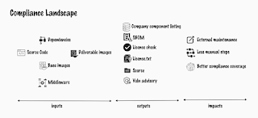

# Compliance is Chore, not Core

It's my Summer of Compliance. Well, that's what I call the work I kicked off and expected to support even when I switch jobs in the middle. I have held a role of doing chores in my team, and driving towards automating some of those chores. Compliance is a chore and we'd love if it was a minimized to invisible, while producing the necessary results. 

There is, well, for me, three compliance chores. 

There's the compliance to company process, process meaning this is required of development in this company. Let's leave that compliance for another summer. 

Then there's the two I am on for this summer, open source license compliance and security vulnerability handling. Since a lot of the latter is from managing the supply chain of other people's software, these two kind of go hand in hand. 

You write a few line of code of your own. You call a library someone else created. You combine it with an operating system image and other necessary dependencies. And all of a sudden, you realize you are distributing 2000 pieces from someone else. 

Dealing with the things others created for compliance is really a chore, not core to the work you're trying to get done. But licenses need attending to and use requires something of you. And even if you didn't write it, you are responsible for distributing other people's security holes. 

Making things better starts with understanding what you got. And I got three kinds of things: 

1. Application-like dependencies. These are things that aren't ours but essentially make up the bones of what is our application. It's great to know that if your application gets distributed as multiple images, each image is a licensing boundary. So within each image with application layer, you want to group things with copyleft (infectious license) awareness. 

2. Middleware-like dependencies. These are things that your system relies on, but are applications of their own. In my case, things like rabbitMQ or keycloak. Use 'em, configure but that's it. But do distribute and deploy, so compliance needs exists. 

3. Operating system -like dependencies. Nothing runs without a layer in between. We have agreements on licensing boundary between this and whatever sits on top. 

So that gives us boundaries horizontally, but also vertically in a more limited degree. 

Figuring out this, we can describe our compliance landscape.

The only format this group in particular redistributes software is executables (the olden way) and images (the new way). Understanding that. these get built up was part of the work to do. We identified inputs, outputs we would need and impacts we seek on us having to create those outputs. 

I use the landscape picture to color code our options. Our current one "scripts" takes source code and dependencies as input, ignores base images and builds a license check list and license.txt - with a few manual compliance checks on knowing what you seek in the patterns of license change. It's not hard work, but it's tedious. Fails for us on two of the impacts -- we do chore work to create and maintain the scripts, unable to focus on core; requires manual work every single time. 

We're toying with two open source options: ORT (Open Source Review Toolkit) that shows promise to replace our scripts, and possibly extend to image based scans as its open source project. Does not really come best wrapped as service. Syft+Grype+GoTemplates that seems to some of the tricks, but leaves things open in the outputs realm. 

And then we're toying with an open source service offering, where money does buy you a solution, with FOSSA. 

I use the word toying as an uncommittal way of discussing a problem I have come to understand in last weeks. 

Running a compliance scan for base images, there is significant differences in numbers of components identified with Syft vs. Docker SBOM vs. Docker Scout vs. self-proclaimed at the source. There's quality assessment tool for SBOMs that does checking for many other things but not correctness showing significant other differences. And that is just the quality of the SBOM piece of the puzzle. 

We started off with the wrong question. It is no longer a question if we are "able to generate SBOMs" but instead we are asking: 

* should we care that different tools provide different listing for same inputs, as in, are we *really* responsible for quality or just the good faith effort 

* how we should make those available next to you our releases 
* how we scale this in an organization where compliance is chore not core 

This 'summer of compliance' is forcing me to know more of this than I am comfortable with. When quality matters, it becomes more difficult. *If* it matters. 