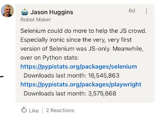
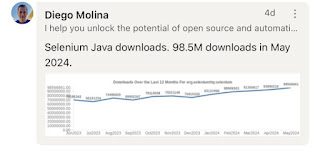

# Two Years with Selenium Project Leadership Committee

Today I am learning that I am not great - even uncomfortable - using voice of an organization. And for two years, I have held a small part of voice of an organization, being a member of the Selenium Project Leadership Committee. I have been holding space and facilitating volunteer organizations for over three decades, and just from my choice of words you note that I don't say I have been leading or running or managing even those probably would be fair words for other people to assign watching the work I do.

Volunteer organizations are special. It is far from obvious that they stay around and active for two decades, like Selenium project has. It is far from obvious they survive the changes of leadership, but for an organization to outlive people's attention span, it is necessary. It is also far from obvious that they manage to navigate the complex landscape of individual and corporate users, their hopes and expectations, other collaborators on solving similar problems, and create just enough but not too much governance to have that voice of an organization.

If I was comfortable using voice of an organization, I would not be nervous speaking in Selenium Conference 2024 today with Diego Molina and Puja Jagani on 'State of Union' keynote. Similarly, I might find it in me to write a post in the official Selenium Blog since I even have admin accesses to Selenium repos on GitHub. But it's just so much easier to avoid all the collaboration and write in my own voice and avoid the voice of an organization that I always hold in then back of my mind - or my heart.

In 2018 Selenium Conference India I was invited to keynote, and I chose to speak about Intersection of Automation and Exploratory Testing. Back then I did not know I would end up combining the paths under the flag of Contemporary Exploratory Testing and I most definitely did not know that the organizers inviting me to keynote would bring me to an intersection where my path aligned with the Selenium Project.

In 2018 I keynoted. A little later, I volunteered with program committee reviewing proposals, again invited by the people already in. And in 2022, I ended up with Selenium Project Leadership Committee (PLC), again on an invite. 20 years of Selenium now in 2024 marks 2 years in PLC for me.

Today I am wondering what do I have to show for it. And like I always do when I start that line of thinking, I write it down. With my voice.

![Selenium Governance Landscape]](selenium_governance.png)

Making sense to what PLC (project leadership committee) is in relation to TLC (technical leadership committee) wasn't an easy one to figure out. There's the code, packaging that to releases and the related documentation and messaging, and all of that is lead by TLC. If there is no software, there is no software project. Software that does not change is dead, and in two years I have reinforced the understanding that Selenium is not dead, or dying. It's alive, well, and taking next steps in fairly complex world of cross-browser standards-based agreements to then implement something everyone, not just the project's immediate web driver implementations use. Selenium project is the pioneer and collaborator in building up the modern web.

The first thing I have to show for two years of Selenium PLC is to understand that what Selenium is. That is many things. It is multiple components to this entire ecosystem. It's working for standards to unite browsers. It's community of people who find this interesting enough to do this as a hobby, volunteering, unpaid. It's where we grow and learn together. It's taking pride in inspiring other solutions in browser automation space whether they are built on top of Selenium or if there's other choices than trying to get real browsers continue on their path of differentiation but still allow for automating real browsers with a unified web driver library.

What have I been doing in the project then, other than making sense of it?

* Realizing there is a lot of emails people want to send to "Selenium". There's a lot of requests on privacy and security assessments that organizations using Selenium think they can just ask "the company" - where there is no company. There's a lot of proposals for collaboration, especially in marketing. And there's donations / sponsoring - because even a volunteer project needs money to pay for its tools and services.

* Fighting against becoming the "project assistant". Getting people to get together, someone needs to schedule it. Calendars as self-service aren't a thing everywhere in the busy tech world. After fighting enough personal demons, I did end up putting up a calendar invite and taking up the habit of posting on slack after every conversation to share what the conversation was about. Seems that bit is something I have enough routine to run with.

* Picking and choosing what/how I want to contribute: I wanted to move from face to face conferences and online broadcasts to online conversations, and set up Selenium Open Space Conference for it. I loved the versatility of sessions, and particularly the one person showing up with his own open source project he would walk different people through in various sessions. I also loved learning about how Pallavi Sharma ended up publishing three books on Selenium, and what goes on in the background of authoring books.

* Picking and choosing what/how I want to contribute: setting up micro sponsorship model and starting steps towards full financial transparency. I will need other two years to complete the full financial transparency, but that is something I believe in heavily. I want it to be normal to say that Selenium project holds $500k on Software Freedom Conservancy. You can dig out that info from their annual reports. But I also want to say that in addition to what is held there, it would all be visible on Open Collective. We have raised $1,684.49 since we started off with the Selenium community money, and there's many steps to take to move host of that money to be Selenium/BrowserAutomation Inc with every transaction transparently visible.

* Fiscal hosting ended up being something I specialize in. We have five people in PLC, where two of them do double duty with TLC, and every one of us holds paying job with relevant levels of responsibility in different companies. Within the two years we had also two more people in PLC, Bill McGee and Corina Pip, brilliant folks we now hold space to become free from other engagements to rejoin our efforts, after some fiscal hosting / governance stuff is better sorted. Knowing where you are is start of sorting it out.

* Setting up Selenium in Mastodon. We could really use someone taking care of Selenium in Social Media overall, but I did create a placeholder for content even if my content-producing with voice of organization is sporadic at best.

* Introducing a new class of sponsors, where companies sponsor with allocating people to contribute significant work time to project and be recognized for it. Not like I did this alone, but working in a user organization rather than vendor organization, I just happen to be able to hold space for something like this by positioning.

* Dealing with people. Some of that is overwhelming, but at the same time necessary. People have ideas, and sometimes the ideas need aligning. Mostly I listen but I would also step in to mediate. And have been known to do so.

If there is a future I have an impact on for Selenium,  it will be:

* Diverse Community Centric and focused on Collaboration.

* Fiscally transparent and easy to access for taking stuff forward.

* Worthwhile for users and contributors - individual and corporate.

Some days - most days - I feel completely insufficient with the amount of time I can volunteer. But it adds up. And it will add up more. The scale in which it matters never ceases to amaze me. 2.5M unique monthly users. Real polyglot support with bindings for python, java, .NET, javascript, ruby, php... 16M Python downloads. 98.5M Java downloads.

It takes a village, and I am showing up with you all, inviting you along.
