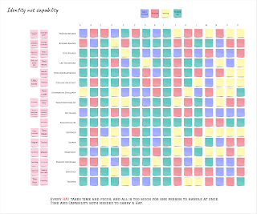

# Secret sauce to great testing is to change the managers

I had many intentions going into 2023, but sorting out testing in my product team was not one of them. After all, I had been the designated testing specialist for all of 2022. We had a lovely developer-tester collaboration going on, and had made agreement on not hiring a tester for the team, at all. Little did I know back then.

The product was not one team, it was three teams. I was well versed on one, aware (and unhappy with) another, and oblivious to third. By end of this year, I see the three teams will succeed together, as they would have failed together not paying attention to the neighbours.

Looking at the three teams, I started with a setup where two teams had no testers, and one team had two testers. I was far from happy with the team with two testers. They created a lot of documentation, and read a lot of documentation, still not knowing the right things. They avoided collaboration. They built test automation by first writing detailed scenarios in jira tickets, and then creating a roadmap of those tickets for an entire year. You may not be surprised that I had them delete the entire roadmap after completing the first ticket from that queue.

So I made some emergent changes - after all, now I was the manager with the power.

I found a brilliant system expert in the team I had been unaware of, and repositioned them to the designated testing position I had held the previous year with assumption of complete career retraining. Best choice ever. The magic of seeing problems emerged without me having to do all of that alone.

I tried asking for better testing with the two testers I had, and watching the behaviors unfold I realized I had a manager problem. I removed two managers from between me and the tester that had potential, and have been delightedly observing how they know excel in what I call contemporary exploratory testing. They explore, they read (developer owned) automation, add to shared scope of automation what they learned should be in by exploring, and have conversations with the developers instead of writing them messages in Jira.

I brought in two people from a testing consultancy I have high respect for, Altom. I know they know what I know of good testing, and I can't say that of most test consultancies. First consultant I brought in helped me by refactoring the useless test automation created by those scenarios in jira tickets instead of good information targeting thinking. We created ways of remotely controlling the end to end system, and grew that from one team to two teams. We introduced model based testing for reliability purposes, and really hit something that enabled success through a lot of pain this year. A month ago, I brought in a second person from Altom, and I am already delighted to see them stepping up to cross team system test responsibilities clarification while hands-on testing.

So in total, I started off with idea of two traditional testers I'd rather remove, and ended up with four contemporary exploratory testers who test well, automate well on many scopes and levels, and collaborate well. In exchange, I let go a developer manager with bad ideas of testing (forcing idea of *manual testing with test cases* I had hard time getting away from) and a test lead following the advice others gave over advice I gave.

We get so much more information to react on, in so much more actionable way this way. I may be biased as I dislike the test case based approaches to the core, but I am very proud of the unique perspectives these four bring in.

Looks like our secret sauce to great testing was to change the managers. Your recipe may vary.

Across two teams, I facilitated a tester hat workshop. Tester is something we all are. But specialist testers often seek for the gaps the others leave behind. Wanting to think you are something does not yet mean you are skilled as that. Testing is many hats, and being a product and domain expert capturing that knowledge in executable format is something worth investing in to survive with products that stay around longer than we do.
