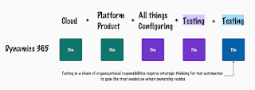

# Learning to Test in Dynamics 365 Projects

How do you become an expert in something you did not know yet? By learning about it. You have a foundation of knowledge you probably acquired on other products, and if the foundation is large enough, you will be bound to see similarities. This is how I feel about being thrown at my first Dynamics 365 project. 

Learning in public - explaining how my learning evolves and how my thinking evolves - gives me a chance of learning from people who know things I did not. And it provides the odd chance that my learning is something of use to someone else. 

## What's this about?

Dynamics 365 is one of the (many) platforms. You may have, like me, experienced SAP. Or Salesforce. Or Guidewire. Or Odoo. And you can continue the listing. What these essentially are things enabling reuse. I personally like to call them platform products. There is a lot of common functionality for all their users. Yet there is even more own data, configurations, integrations and changes so that the resulting system looks different, is used different, and most definitely holds up information and processes of highly different organizations. They are the epitome of modern reuse. If you could buy a product and use the product everyone else uses too, maybe you did not have to build your very own system. Meanwhile, tailoring enough means that the theory of reuse meets practice in this thing we lovingly call testing, where the rubber meets the road and good plans go to meet empirical evidence to ensure our business still runs with all the plans in place. 

This particular one is a product platform in cloud done by Microsoft. Organization count 1. It is usually configured, integrated and extended by integration partner. Organization count 2. In integrations, there may be a load of other systems as data sources and data targets. Organization count 2+N. In the start of the chain is the organization that assigned responsibilities for all the other organizations, the owner of the system/service, the customer with their users. Organization count 3+N, and responsibilities of ownership. 

## Your usual testing vocabulary isn't helping me

Calling some of this testing acceptance testing isn't really helping me. And particularly, calling some of this unit testing isn't helping me, almost the opposite. Surely if we configure functionality (or decide to not configure it, and working with defaults), it makes sense to verify that the behavior I get is the behavior I want. Most often that testing through needs to happen with at least a partial integrated system, and it may really well be just partial. This drives the design I would need testing vocabulary to reflect towards testing components/services, integrations, and flows across components, services and integrations. Instead of shifting left, here I need shifting down. I need to understand the smaller scope I can verify a functionality in. And if I succeed in that, the feedback granularity for the organization that is expected to react to the feedback is better. 

Theoretically speaking, it would be great if these platform products shipped with tests for the defaults. They rarely do. If they did, I could test with defaults, adapt and extend those tests to test with my configurations, and build a systematic feedback that tells the chain of responsibilities. 

However, I usually end up in these projects from the ownership organization perspective. For me to know if our business flows work, I approach this with the idea of testing core business flows with the application, targeting it with the knowledge of changes. It tends to be better if the chain works, and a chaos ensues if the system is significantly broken. 

## That Test Automation thing?

This comes along quite naturally. You have rolling updates (where you may not be able to delay the update at all), and you have quarterly updates (where staying without updating is not possible as an approach, for good reasons). But this means you have pretty much continuous responsibility for testing in the organization of ownership. 

Some people rely on staying close to defaults, and approach this with taking the risk that if the product platform does not work with defaults, it gets rolled back and fixed by the product platform organization. The closer to defaults, the more likely you are to be able to play with timings so that the first wave of installers got whatever was on your way. There's risk, but the risk may be manageable close to defaults. 

Yet usually we are not close to defaults. The further away from defaults we shift, the more there is functionality the product platform organization is unaware of, unable to test for, and thus responsibility for it surviving change is allocated later in the chain. 

You would usually invest in test automation for this. It could be component level, for things where you go furthest from the defaults. It could be process level, to catch things on the basic flows. Or it could be an intricate web of both of these. Plus the test automation that tells you when to point blame towards the product platform. 

In the whole chain, assigning the responsibilities to strategically design the necessary automation is on the organization of ownership. This is where the low code tools find their most lucrative points of entry. 

However, the "no code" approaches are just a visual programming language. If it diffs poorly, it is poorly maintainable. It's a balance, and a belief system. I don't think acceptance testers recording automation tests is the way to go. Shifting down for designing per component / service feedback is the way to go. Visibility of these tests is the way to go. 

## Technologies, architectures - it all maps to common web / cloud

Scratching this just a little deeper, I come to realize I have very basic web / cloud things in scale. 

Web pages can be automated with Selenium, Playwright - well, any of the web driver libraries and related testing frameworks. The "scary" parts shadow DOMs, dynamic id's and deeply nested components could perhaps use help of a tool that hides some of that locator complexity. But if it's complex enough, hiding it also means taking away power to maintain it. 

REST APIs can be automated with any of the language specific libraries. 

Why did I want a commercial tool I would have to learn? Or why would I choose to teach that commercial tool to my fellow testers over teaching them the basics of programming for test automation purposes that I know even business testers are capable of learning? 

Let's say the jury is most out in this space. I'll write more when that makes sense to me.

## The First Experience - A Users Experience

My first touches to these projects come from having used systems with this - without really realizing I had. Connecting the realization to use examples, I also have examples of missing functionalities on Safari, being forced to use incognito mode and cleaning caches to be able to get some of these tools to work. 

The real question is that since the users experience has directed me to not use Safari, would we care to use all browsers? And what drives the browser differences - I'll learn. 

## The Lingo

Finally, in addition to testing vocabulary, there is the product lingo. D365FO, D365CE, feature names, change listings, scope of each project. I find myself classifying: product platform vs. configuration to make sense of it. 

Turns out there is D365RF - the common test automation keywords for robot framework. 

**Is this how you take on new testing assignments too?**

With a baseline thinking written down, I'll let you know how much more I know in a few weeks. 