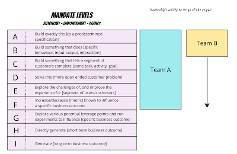
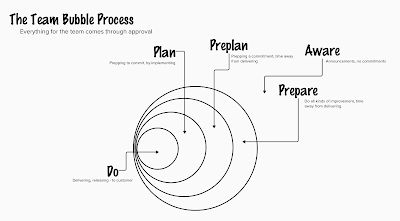

# Planning in Bubbles

We have all experienced the "process" idea to work we are doing. Someone identifies work and gives it label, and uses some words to describe what this work is. That someone introduces the work they had in mind for the rest of us in software development team, and then we discuss what the work entails.

Asking for something small and clear, you probably get clearer responses. But asking for something small and clear, you are also asked for vision, and what is around those small and clear things that we should be aware of.

Some teams take in tasks, where work that wasn't asked for comes in as next task. Others carry more of a responsibility by taking in problems, discovering the problem and solution space, and carry somewhat more ownership.

For a long time, I have been working with managers who like to bring tasks not problems.  And I have grown tired of being a tester (or developer) in a team where someone thinks they get to chew things for me.

A year ago - time before managering - I used John Cutler's Mandate Levels model as ways of describing the two teams I was interfacing then, and how essentially they had different mandates.

In a year of managering, team B now works on mandates A-C, and team A now works only on A-E, no matter how much I would like us to move all the way to F.

With the larger mandate level and success of hitting good forward taking steps in measuring cost per pull request (and qualitatively assessing direction of steps), team A has not needed or wanted Jira. We gave up on it 1,5 years ago, cut cost of change to a fifth, and did fine until we did not. Three months ago I had no other choice but to confess to myself that with a new role and somewhat less hands-on testing on my days, we had accrued quality debt - unfinished work - in scales we needed Jira to manage it. Managing about half of it in Jira resulted in 90 tickets, and we still continued the encouragement of not needing a ticket to do a right thing.

Three months later, we are a few items short of again having a baseline to work on.

With the troubles accrued, I have theories of what causes that, and I call that theory the modeling gap. The request of a problem coming in leaves so much open for interpretation, that without extra care, we leave tails of unfinished work. So I need a way of limiting Work in Progress, and a way of changing the terms of modeling to language of majority (the team) for language of minority (product owner).
I am now trying out an approach I call The Team Bubble Process. It is a way of visualising work ongoing with my large mandate team where instead of intaking tasks, we describe (and prioritise) tasks we have as a team for a planning period. We don't need the usual step by step process, but we need to show what work is in doing, and what is in preparing to do.

The first bubble is doing - coding, testing, documenting, something that will see the customer and change what the product does for the customer. All other work is in support of this work.

The second bubble is planning, but we like to do planning by spiking. Plan a little, try a little. Plan a little, try more. It's very concrete planning. Not the project plans, but more like something you do when you pair or ensemble.

The third bubble is preplanning, and this is planning that feeds doing the right things. We are heavily tilted towards planning too much too early, which is why we want to call this preplanning. It usually needs revisiting when we are really available to start thinking about it. It's usually the work where people in support of the team want to collaborate on getting their thoughts sorted, typically about roadmap, designs and architectures.

The fourth bubble is preparing. It's yet another form of planning, now the kind of planning that is so far from doing that done wrong can be detrimental. Done well, can be really helpful in supporting the team. Work of prepare often produces things that the team would consider outside the bubbles, just to be aware.

I have now two sets of two-weeks modelled.

For first we visualized 8 to Do, and completed 4, continue on 4; 4 to Plan, and continue on all yet never starting 1; 1 to Preplan we, and never started it; 11 to Prepare, completed 3, continue on 4 and never started 4.

For second we visualized 14 to Do, 14 to Plan, 6 to Preplan, and 9 to Prepare.

What we already learned is that we have people who hope their responsibility and collaboration with team on something they think they'd like to prepare (but too early) will do work outside the bubbles and not be keen on sharing the team agenda. It will be fascinating to see if this helps us, but at least it is better than pretending Jira "epics" and "stories" are useful way of modeling our work.
