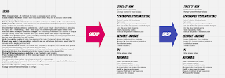

# Making Releases Routine

Last year I experienced something I had not experienced for a while: a four month stabilisation period. A core of the work of testing-related transformations I had been doing with three different organizations was to bring down release timeframes, from these months long versions to less than an hour. Needless to say, I considered the four month stabilisation period a personal fail.

Just so that you don't think that you need to explain me that failing is ok, I am quite comfortable with failing. I like to think back to a phrase popularised by Bezos 'working on bigger failures right now' - a reminder that too safe means you won't find space to innovate. Failing is an opportunity for learning, and inevitable when experimenting in proportion to successes.

In a retrospecting session with the team, we inspected our ways and concluded that taking many steps away from a good known baseline with insufficient untimely testing, this is what you would get. This would best be fixed by making releases routine.

There is a fairly simple recipe to that:

* Start from a known good baseline

* Make changes that allow for the change you want for your users

* Test the changes in a timely fashion

* Release a new known good baseline

The simple recipe is far from easy. Change is not easy to understand. And it is particularly difficult if you only see the change in small scale (code line) and not in system (dependencies). And it is particularly difficult if you only see the system but not the small scale. In many teams developers have been pushed too small, and testers have not been pushed small enough. This leads to delayed feedback because the testing done in timely fashion misses results in testing that starts to lag behind from changes.

In addition to results gap on information we need and information we have and its time dimension, the recipe continues with release steps. Some include all of the results gap in release tests because testing can't learn to be timely, muddling the waters of how long it takes to do a release. But even when feature and release testing are properly separated, there can be many steps.

In our team's efforts of making releases routine, I just randomly decided this morning that today is a good day for release. We have a common agreement that we would do release AT LEAST once a month, but if practice is what we need, more is better. For various reasons, I had been feature testing changes as they come. I have two dedicated testers who were already two weeks behind on testing, and if I learned something from last year's failing, it's that junior testers have less developed sense of timing of feedback, partially rooted in the fact that skills in action need rehearsing at slower pace. Kind of like learning to drive a car, slow down while turning the wheel and looking around are hard to do at the same time! I was less than an hour away from completing feature testing at time of deciding for the release.

I completed testing - reviewed the last day of changes, planned tests I wanted, and tested those. All that was remaining then was the release.

It took me two hours more to get the release wrapped up. I listed the work I needed to do:

* **Write release notes** - 26 individual changes to message worth saying

* **Create release checklist** - while I know it by heart, others may find it useful to tick off what needs doing to say its done

* **Select / design title level tests for test execution** (evidence in addition to TA - test automation)

* **Split epics to this release** - other release so that epics reflect completed scope over aspirational scope. and can be closed for the release

* **Document per epic acceptance criteria**, esp. out of scope things - documentation is an output not input, but if I was testing, it was a daily output not something to catch up at release time

* **Add Jira tasks into epics to match changes** - this is totally unnecessary but I do that to keep a manager at bay, close them routinely since you already tested them at pull request stage

* **Link title level tests to epics** - again something normally done daily as testing progresses, but this time was left outside the daily routine

* **Verify traceability matrix of epics** ('requirements') to tests ('evidence') shows right status

* **Execute any tests in test execution** - optimally one we call release testing and would take 15 minutes on the staging environment

* **Open Source license check** - run license tool, compare to accepted OSS licenses and update licenses.txt to be compliant with attribution style licenses

* **Lock release version** - Select release commit hash and lock exact version with a pull request

* **Review Artifactory Xray** statistics for docker image licenses and vulnerabilities

* **Review TA** (test automation) statistics to see it's staying and growing

* **Press Release-button in Jira** so that issues get tagged - or work around reasons why you couldn't do just that

* **Run promotion** that makes the release and confirm the package

* **Install to staging environment** - this is something from 3 minute run a pipeline to 30 minutes do it like a customer does it

* **Announce the release** - letting others know is usually useful

* **Change version for next release** in configs

This took me about 2 hours. I skipped the install to staging though. And I have a significant routine in all these tasks. What I do in a few hours, the experience shows it takes about a week when moved forward and about a day for me in answering questions. Not a great process.

There are things that could be done to start a new release, in conjunction with Change version for next release:

* Create release checklist

* There are things that should become continuous on that list:

* Select / design title level tests

* Split epics

* Document per epic acceptance criteria

* Add Jira tasks into epics to match changes

* Link title level tests to epics

* Verify traceability matrix

* Execute any tests in test execution

* There's things that could happen on a cadence that have nothing to do with releases:

* Review Artifactory Xray statistics

* Review TA (test automation) statistics

And if we made these changes, the list would look a lot more reasonable:

* Write release notes

* Execute ONE test in test execution

* Open Source license check

* Lock release version

* Press Release-button in Jira

* Run promotion that makes the release

* Install to staging environment

* Announce the release

* Change version for next release

And finally, looking at that list - there is no reason why all but the meaningful release notes message can't happen on ONE BUTTON.

I like to think of this type of task analysis visually:

This all leaves us with two challenges: extending the release promotion pipeline to all the chores and the real challenge: timely resultful testing by people who aren't me. Understanding that delta has proven a real challenge now that I am not a tester (with 26 years of experience coined into contemporary exploratory testing) and a significant chunk of my time is on my other role: being a manager.
