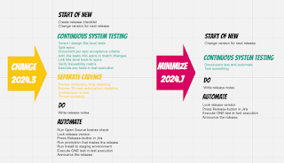
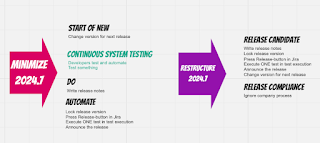

# Done with Making These Releases Routine

I blogged earlier on the experience of task analysis of what we do with releases, and shared that work for others to reflect on.

Since then, we have moved from 2024.3 release to 2024.7 release, and achieved routine. Which is lovely in the sense of me changing jobs, which then tests if the routine can be held without me present. 

In the earlier analysis, I did two things. 

* Categorized the actions

* Proposed actions of low value to drop

Since then, I have learned that some of the things I would have dropped can't be, as they are so built in. Others that I would keep around, I have so little routine / traction from anyone other than me and since they are compliance oriented, I could drop them too without impacting the end result. 

Taking a snapshot of changes I have experimented through, for 2024.3 release I chose to focus on building up two areas of competence. I coached the team's tester very much on the continuous system testing, and learned that many of the responsibilities we allocate for continuous system testing are actually patching of product ownership in terms of creating compliance track record. 

The image of same categories but actual work done for 2024.3 versus 2024.7 shows the change. No more cleaning up other people's mess in Jira. No more manual compliance to insufficiently managed "requirements" to show systematic approach that only exists with significant extra patching. The automation run is the tests done, and anything else while invisible is welcome without the track of it. Use time on doing testing, over creating compliance records. 

While the same structure shows how much work one can throw out of a traditional release process, restructuring what remains does a better job describing the change. The thing we keep is the idea that master is ready for release any time, and developers test it. Nothing manual must go in between. This has been the key change that testers have struggled with on continuous releases. There is no space for their testing, and there is all the space for their testing. 

 

In the end, creating a release candidate and seeing it got deployed could be fully automatic. Anything release compliance related can be done in continuous fashion, chosen to be dropped or at least heavily lightened, and essentially driven by better backlog management. 

With this release, 30 minutes I call my work done. From 4 months of "releasing" to 30 minutes. 

If only the release would reach further than our demo environment, I would not feel as much like I wasted a few years of my life as I am moving to a new job. But some things are still outside my scope of power and influence. 