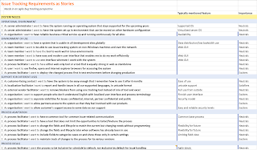

# I want a system just like that

LinkedIn decided today that the theme I must read multiple posts on is on *requirements* and how customer organizations just need to be better with those. I am not entirely disagreeing, but I am a great fan of a few quotes:

Scope does not creep; Understanding grows. - Jeff Patton

If it's your decision to make, it's design. If it's not, it's a requirement. - Alistair Cockburn

At a non-profit I have been volunteering with, we purchased a content management system as tailored out of the box solution, and whenever something has not been configured right, we go with claims of it being obvious it should work.

Same attitude is all around my LinkedIn: You would not be happy with a car that does not do things cars do, expect you would never be reasonably expecting features of the best of Ferrari with the price of of the cheapest of Toyota. Yet in something as abstract as software, that seems to be exactly what people are expecting.

"I want a system just like that" is a common request in consulting. Which reminded me on work I started some decades ago, wanting a system just like that. And today I wanted to relive that memory.

When I fell into testing (like you fall in love, hat tip to Ash Coleman Hynie for that expressive insight) close to 30 years ago, my first gig was with Microsoft. They had a defect / issue management tool that I still recall positively three decades later, even if the details of why exactly that was so great have long been forgotten. It was time before web, and the tool was just fit for purpose and its search capabilities as well as classifications were exceptional. Or so I recall.

Some years later working at university as a teacher / researcher, teaching bug advocacy and realizing some folks still managed their defects in emails and excels, I set up students to recreate me the system. "I want system just like that".

I had screenshots I found from thesis written in Finland. I wrote down requirements specifications. But I also set up an experiment just because I could. I did not give the project just to one group of students, but I got two groups. I set up the two groups to use different methodology frameworks: one on Rational Unified Process with all the IBM provided process guidelines, and one on Extreme Programming. I served as the customer for both teams, with the expected customer responsibilities.

A year later, I had two systems. From one I had a requirement specification I was convinced described the "system just like that" and a fairly bad implementation of it that ended up having only "mandatory" requirements fulfilled and thus sparking no joy. From the other I had a system that was not at all "system just like that", but it was actually better and adaptation to web world. Neither of the systems ended up in use for me. But the student groups taught me an invaluable lessons. I may not know what I want even when I know what I want.  

Fast forward some years later, working in a different organization, I was handed a replacement project. We had been using a commercial tool for defect / issue management that was at its end of life, and we needed to change to something else. Armed with the earlier work I had on requirements, I put some effort in interviewing and organizing requirements to assess ready systems against in format of user stories, [collating 281 user stories](https://docs.google.com/spreadsheets/d/0B07e3JZGe_haRDFFZVA2V3JZbWM/edit?usp=sharing&ouid=101823823993297284478&resourcekey=0-o9L_Dr19dF3pBdQfEQ04Cg&rtpof=true&sd=true).

There's elaborate sheets on comparing tools against these user stories but since tools live, it's outdated while the stories themselves have a more of a longevity available in them.

Even with the requirements spec that I have, and the story listing that I have, I don't believe in "I want a system just like that" fixed price things. Unless you truly buy something as is and ready, there's room for interpretation. Create a contract that incentivizes mutual success like ones with risk/reward allocation of financials. You want to change the game.

When you go to a bar and you ask for a beer, you get a beer. You don't get a beer in a thistle. Frozen solid. With a tennis ball in it. With poison in it. With one week wait time while you're there. And so many other things.

There's plenty of understanding to grow. Start from a good place, but don't pretend the good place is what constitutes success. Success comes from communication and collaboration, and deepening that understanding on both sides of the table. Or maybe removing the sides.
