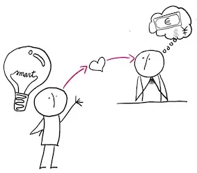
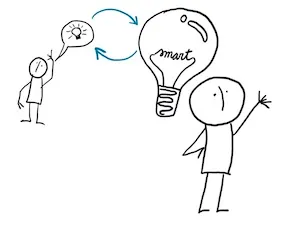

# Turning Ideas into Code

Recently, I’ve been asked to visualize our software process. Whenever I see visualizations of what we’re supposingly doing or supposed to do, they make me cringe. Yet, I find myself not able to do any better. This article is one attempt to bring clarity to how I think about software process.

## Developer-Centric Ways of Working

As much as people like to draw ownership of products into a product management organization, I see the true ownership lies within the developers. If they don’t, successfully, create a pull request that implements a change, the users will not see change. The core of the process is turning ideas into code.

No matter what else we agree that goes on, it all flows through here. Smart ideas, into smart code by people able to do that transformation.

There’s three clear points of failure we often create processes around:

* What if the ideas are not smart? What if the ideas are not worth spending time on?

* What if the people doing the transformation don’t have ideas of high quality, in context and are missing relevant perspectives?

* What if people turning ideas into code could do things faster having help?

Clearly, smart people can learn to have smarter ideas. Looking at what they do and what is the impact of it, they can change. Externalizing the looking often has adverse effects to motivation and ability to hit the mark on delivering, eventually, something of value.

## Heart for the Customer

A smart developer would not be very smart if they did not care why they are building the software. There’s someone, somewhere willing to trade money for having something they’re building. We can recognize that the relationship is complex and requiring more attention, especially in scale than a developer can put there, but behind all software is a need it is supposed to fullfil.

Some people talk about being customer obsessed, but obsession sounds like a negative thing. I believe we need to have our hearts set out to hear, to understand and to care. From this relationship of us caring, we also find inherent motivation. Addressing a real need and a right need is motivating. Filters and proxies dampen the motivation, while listeners help manage the relationship.

## Being Smart Takes a Village

Looking at the way of working as developer centric, we also soon come to realize that a developer, as smart as they may be, don’t need and don’t want to be alone. Making changes through pull requests that end up delivered to millions of computers out there is a heavy burden being left alone. So we have a principle of always having at least two pairs of eyes on every change.

A lot of times the process focuses on how the others are intended to contribute in the process of turning ideas into code — improving the ideas about to be turned into code, or already turned to code needing adjustment. The product owners, the designers, the testers, all work particular perspectives of improving the ideas.

## A Transformative Way of Thinking

Looking at software product creation this way, every developer welcomes help in understanding what is the right thing to build and how we together could learn about it more effectively.

Lets face it: only through making a change through means of coding and delivering it all the way to the hands of the users things change. We can analyze, plan and prepare all we want, but unless that helps a smart developer have smarter ideas, we are probably not improving the impact we make with software development.

Let’s address the weak points: ideas become smart by working together and learning; people are smarter in diverse groups; the work we do can be shared in many ways.

How am I supposed to describe this in process model?