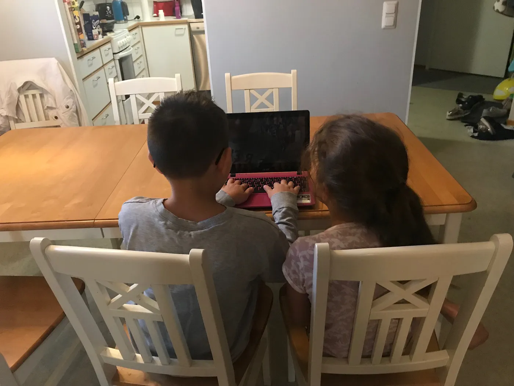
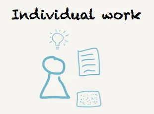
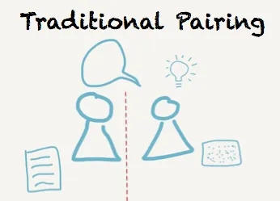
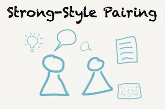
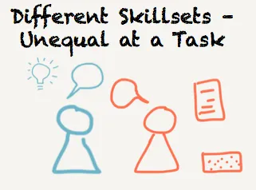
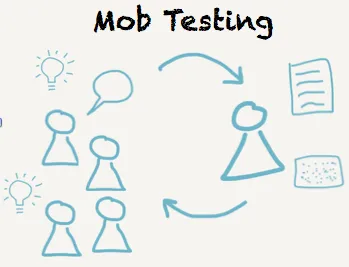

# Styles of Pair Testing

You must have heard about pair programming and it’s testing sibling, pair testing. What you might not have realized that there are two significantly different styles of pairing. We call one traditional and the other strong-style. The selection of style becomes particularly relevant when there are background and skill differences in the pair — let’s make educated choices and learn about both styles!

# Individual Work

Let’s first think of testing as individual work. Core to the work is the a skilled tester, with ideas of what to do to uncover information. They use the keyboard to drive the computer, and as ideas emerge and evolve, write down notes in a tool of their choice. There’s just one person for all the activities around the task, and no need for changing roles other than within the tester’s head.

## Traditional Pairing

In traditional pairing, we introduce a second person and split the work to do. We introduce roles and rotation, either on task or on timer. The work is split so that whoever is on the keyboard is in control of the testing session. The one on the keyboard has the ideas, and focuses on tactical implementation of those. The other one thinks more strategically, and makes notes. We often suggest that the one on the keyboard must think out loud to allow the pair into the insights of what goes on in the testers head. After all, very small portion of testing happens at the keyboard and can be visually followed.

The problem with this style of pairing is that the one without the keyboard is continuously decoding what they are observing from the other’s testing, building assumptions. It is hard to see what exactly is going on and this easily creates a bit of a disconnect in the pair. At worst, the disconnect shows as the watcher zoning out and not paying attention. Regularly, it shows as the notes not matching the testing that was done.

## Strong-Style Pairing

In strong-style pairing, we split the work differently. The one who is not on the keyboard is now the one with the idea. They must vocalize the idea for the one on the keyboard. The one on the keyboard asks for clarifications and can challenge the direction, suggest ideas and ask questions. However, decision power is on the one without the keyboard. Notes are also taken on the same computer, representing ideas and initiated by the one not on the keyboard. As they are typed in and reviewed, they become a shared representation of the idea.

The benefit of this style of pairing is that the one without the keyboard must vocalize all their ideas. This style creates a stronger connection in the pair. Speaking about what *you* want to happen on the keyboard is a skill of its own, and it takes a bit of practice to get used to. The person on the keyboard sets the pace in which things happen within the pair.

## Different Skillsets, Unequal at a Task

Strong-style pairing becomes particularly useful and necessary when pairing amongst different skillset so that your level of skills and knowledge is very unequal at a task. The difference could come from having product and domain expertise, while the other one would usually test another product. Or it could come from pairing a tester with a programmer. With traditional pairing, the one with more knowledge on the task at hand would be on the keyboard. The skills difference makes following what goes on harder in general.

With strong-style pairing the one with more knowledge is hands off keyboard, and the less knowledgable sets the pace of how fast they can absorb the pieces of the task.

# Ensemble Testing — Pairing on Turned Up

Strong-style pairing is also the foundation of ensemble testing (and ensemble programming). In this style of working, you have group of people working on one task, taking turns on the computer. Ideas come from the crowd not on the computer. This is about getting the best out of everyone into the work we are doing. Everyone takes turns at the keyboard, and if you have someone unequal at task, the ensemble helps out navigating at an appropriate level of abstraction.

There’s a lot more on the dynamics of pairing and ensembling. Check out the Ensemble Programming Guidebook I’m writing, it is available on https://ensembleprogramming.xyz.

For me adjusting to strong-style is what made pairing turn from frustration to learning fun and something I’d volunteer for. Similarly, ensembling was the gateway to pairing making me comfortable in a group before being alone with each of my team mates. I encourage you to experiment with what works with you.