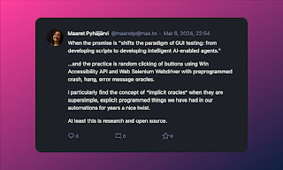
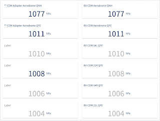
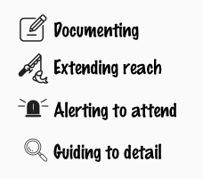

# A sample of attended testing

Today prompted by day 6 of 30 days of AI testing, I tried a tool: Testar. My reasons for giving it a go are many:

* Tanja Vos as project leader for the research that generated this would get my attention

* I set up a research project at previous employer on AI in / for testing, and this tool's some generation was one of that project's outcomes

* The day 6 challenge said I should

* Open source over commercial for hobbyist learning attention all the way

I read the code, read the website, and tried the tool. The tool did not crash but survived over an hour "testing" our software with the standards of testing I learned some large software contractors still expect from testers, so I could say it did well. I would not go to as far as "beat manual testing" like the videos on the site did.

The tool was not the point for me though. While the tool run clicking 50 scenarios with 50 actions and what seems to be a lot more than 50 clicks I intertwined unattended testing (the tool doing what the tool does) and attended testing, and I was watching a user interface the tool did not watch for fascinating patterns.

In my test now I have two systems that depend on each other, and two ways of integrating the two systems for a sample value of pressure. And I have a view that allows me to look at the two ways side by side.

As Testar was doing it's best to conclude eventually **Test verdict for this sequence: No problem detected**, I was watching the impact of running a tool such as this on the integration with the second system.

I noted some patterns:

* The values on the left were blinking between no data available and expected values, whereas the values on the right were not. I would expect blinking.

* The values on the left were changed with delay compared to the values on the right. I would expect no difference in time of availability.

* The bling-sounds of trying something with a warning was connected with the patterns I was observing, and directed me to make visual comparisons sampled across the hour of Testar running.

This is yet another example of why there is no *manual testing* and *automated testing*. With contemporary exploratory testing, this is a sample of attended testing with relevant results, while simultaneously doing unattended testing with no problem detected.

This was not the first time we use generated test cases, but the types of programmatic oracles general enough to note crash, hang, error, those we have had around for quite a while. As soon as we realized it's about programmatic tests, not automated testing. Programmatic tests provide some of their greatest value in attended modes of running them.

For me as a contemporary exploratory tester, automation gives four things:

Running Testar, I have now 50 scenarios of clicking with 50 actions with screenshots on my disk. That alone serves as documenting in ways I could theoretically benefit from if anyone asked me how we tested things. It would most definitely replace the testing that I cut from 30 days investment to 2 days investment last year, and replace one tester.

Testar gave me quick clicking on another system while my real interest was on the other one. Like many forms of automation, time and numbers are how we extend reach.

Testar did not tell me to look at things, but our applications sound alerting did. Looking at the screenshots, I saw a state I would not expect, and went back to investigate it manually. That too was helpful, sampling what I care to attend.

The last piece, guiding to detail I usually get when I don't rely on auto clickers, but actually have to understand to write a programmatic test.
