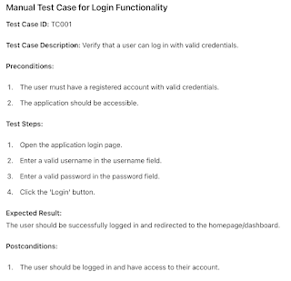
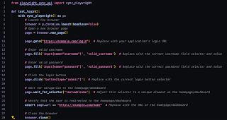

# Why is it bad practice to write your programmatic tests like your manual tests?

There must a lot of articles on *why it is a bad practice to write your programmatic tests like your manual tests* but finding one you would recommend in the moment just did not happen when the question emerged today. So here's one reference to the basic stuff we keep having a conversation on, with less finesse than the entire conversation around the internets has. 

So why not this - you got your manual test case: 

And then you transform it to your programmatic test case: 

Here's the usual recommendations:

**Structure beyond test cases**. We would generally expect to see structure in code beyond just test cases. 
You should use variables. That would move your URL, your selectors and maybe even your inputs to variables and they would be called from the script. 

* You should capture actions on a higher level of abstraction. That would mean that you'd have method for login with all these steps, and your test case would call login(username, password) and would be probably called test_login_with_valid_credentials()

* Your variables and actions would probably be in a separate file from your test case, a page object organized to model what you see in that web page or part of it that you're modeling. When things change, you'd change the page object rather than each test case. 

* Your tests probably have parts that should happen before the test and after the test. Some languages call this setup and teardown, some put these in fixtures. You are supposed to design fixtures so that they make your tests clear and independent. 

* You will have things you do on many pages, and shared ways of doing those on all pages. Find a place for commons in your structure. Like you might always make sure there is no text "error" anywhere on pages while you test. 

* The usual recommendations for structure within test include patterns like AAA (Arrange - Act - Assert) that suggests you focus first in setting things up you need in your test, then do the thing and then verify the things you want to verify, and avoid mixing the three up in your order of actions. 

**Separation of data**. We would generally expect that data would be separated from the test case and even from the page object. Especially if it is complicated. And while it should be separated, you should still manage to describe your tests so that their name makes sense when test fails without looking at the data.

* Parametrize. Name data, input the data, use same test case to become many test cases. 

**Naming is modeling*. Your manual test cases may not be the model you want for your automation. Usually you decompose things differently to avoid repetition in programmatic tests and you give names to parts to model the repetition. 

**Focus test on an architecture layer**. 

* API-based login over UI-based login. We would generally expect there to be an authentication endpoint that does not require you to click buttons, and you'd do login for all your non-login tests requiring logged in user with an API. When things are easier to do without UI, we'd generally expect you to design steps that are different from your manual test cases that expect you to operate things like a user. 

* Mocking API calls to control UI. We would generally expect you to test very little with the whole integrated end to end system over a longer period of time. We would expect that instead of using real APIs, we would expect you to test the UI layer with fake data that you can control to see texts. Like if you had a weather app that knows night and day, you would want to be able to fake night or nightless day without doing all the setup we do for stuff like that when we test manually. 

**Imperative vs. declarative**. You should probably learn the difference and know that people feel strongly about both. 

There's a lot people say about this, but maybe this will get you started. Even if I did not take time to show you with examples how each of these changes the manual and programmatic tests we started from. 