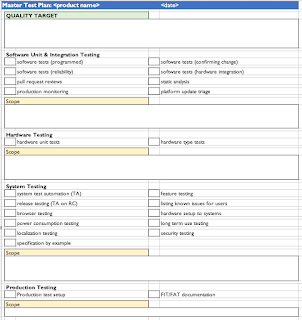
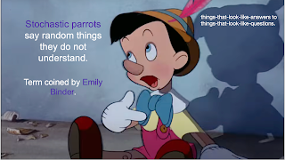

# Well, did AI improve writing test plans?

Over 27 years of testing, I've read my fair share of test plans, and contributed quite a chunk. I've created templates to support people in writing it slightly better, and I've provided examples. And I have confessed that since it's the performance of planning not the writing of the plan that matters, some of the formats that support me in going my best work in planning like the one-page-master-test-plan have created some of the worst plans I have seen from others.

Test plans aren't written, they are socialized. Part of socializing is owning the plan, and another part is bringing everyone along for the ride while we live by the plan.

Some people need a list of risk we are concerned for. I love the form of planning where we list risks, and map that to testing activities to mitigate those risks. And I love making documents so short that people may actually read them.

In these few years of LLMs being around, obviously I have had to both try generating test plans and watch others try to ask me to review plans where LLM has been more of less helpful.

Overall, we are bad at writing plans. We are bad at making plans. We are really bad at updating plans when things change. And they always change.

I wanted to make a note on did AI change it already?

* People who were not great at writing plans before are not great in a different way. When confronted with feedback, they now have the Pinocchio to blame for it. Someone else did it - the LLM. If the average of the world does this, how can I make the point of not being happy with it. And I can be less happy with the responsibility avoidance.

* People who need to write plans that were not really even needed except for the process are now more efficient in producing the documentation. If they did not know to track TFIRPUSS (quality perspectives) in their plans, at least they are not missing that when they ask the tool. The difference still comes from the performance of continuous planning and organizing for the actions, rather than the act of writing the plan.

* Detailed test ideas for those with least ideas are already better in per-feature plans. Both those who were not so great are doing slightly better with generated ideas and those who were great become greater because they compete with Pinocchio.

I am worried my future - like my past - is in reviewing subpar plans, but now with externalized responsibility. Maintaining ownership matters. Pinocchio is not a real boy, we're just at the start of the story.

