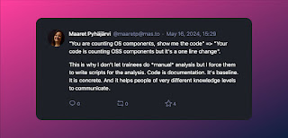
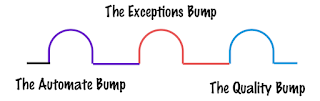

# Programming is for the juniors

It's the time of the year when I learn the most, because I have responsibility over a summer trainee. With Four years in Vaisala, it's four summer trainees, and my commitment to follow through with the summer of success means I will coach and guide even when I will soon be employed by another company. With a bit of guidance, we bring out the remarkable in people, and there will not be seniors if we don't grow them from juniors. Because, let face it, it's not like they come ready to do the work from *any* of the schools and training institutions. Work, and growing in tasks and responsibilities you can take up, that is where you learn. And then teaching others is what solidifies if you learned.

This summer, I took special care in setting up a position that was a true junior one. While it might be something that someone with more experience gets done faster, the junior pay allows for them to struggle, to learn, to grow and still contribute. The work we do is one where success is most likely defined by *not leaving code behind for others to maintain* in any relevant scale, but reusing the good things open source community has to offer us in the space of open source compliance, licenses and vulnerabilities. I have dubbed this the "summer of compliance", perhaps because I'm the person who giggles my way through a [lovely talk on malicious compliance](https://www.youtube.com/watch?v=9weGi0csBZM) considering something akin to that a real solution when we have corporate approaches to compliance, and forget learning why these things matter in the first place.

If the likely success is defined by leaving no code, why did I insist of searching for a programmer for this position? Why did I not allow people to do things a manual way, but guided with expectations from getting started that we write code.

In the world of concepts and abstractions, code is concrete. Code grounds our conversation. If you as a developer disagree with your code, your code in execution wins that argument. Even when we love saying things like "it's not supposed to do THAT". Watch the behavior and you're not discussing a theory but something you have.

Sometimes the mistakes when reviewing the detailed steps of the work reveal things like this - a subtle difference on what is OS (operating system) and OSS (open source software), for someone who is entirely new to this space and how the effort put to writing the wrong code was a small step to fix, whereas the wasted effort with manually having done similar analysis would have really wasted more effort for the mistake.

Watching the conversation unfold, I recognize we have already moved through there bumps on our road of the programming way.

The first one was the argument on "I could learn this first by doing it manually". You can learn it by doing it with programming too, and I still remember how easy it is to let that bump ahead become the excuse that keeps you on the path of *one more manually done adjustment*, never reaching the scale. With our little analysis work, the first step to analyze components on one image felt like we could have done it manually. But the fact that getting 20 was 5 minutes of work, that we got from pushing ourselves through the automate bump.

We also run into two other bumps on our road. The next one with scale is realization that what works for 5 may not work for 6, 11, 12, 17, and 20. The thing you built that works fine for one, even for the second will teach you surprising things in scale. Not because of performance. But because data generated that you are relying on is not always the same. For the exceptions bump, you extend the logic to deal with real world outside what you immediately imagined.
Testers love the exceptions bump so much that they often get stuck on it, and miss more relevant aspects of quality.

The third bump on our week is the quality bump, and oh my, the conversation of that one, that's not an easy one. So you run a scanner, and it detects X. You run second scanner, and does not detect X. Which one is correct? It could be correct as is (different tools, different expectations), but also it could be false positive (it wasn't one for anyone to find anyway) or false negative (it should be found).  What if there is Y to detect that none does, how would you know that then? And in the end, how far do you need to go in quality of your component identification so that you can say that you did enough not to anymore be considered legally liable?

The realizations that popular scanners have significant percentages difference in what they find, and that if legal was an attack vector against your company, that your tools quality matter for it, it's definitely sinking into the deep end with the quality bump.

I am sure our summer trainee did not expect how big of apart asking why and what then is of the work. But I'm sure the experience differs from a young person's first job in the service industry. And it makes me think of those times for myself nostalgically, appreciating that there's an intersection on how our paths cross through time.

Back to click-bait-y title - programming really is for the juniors. It is for us all, and we would do well on not letting the bumpy road stop us from ever going that way. Your first hello world is programming, and there's a lifetime of learning still available.
