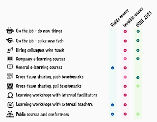

# The Power of Framing

Sometimes, we write on topics we have not researched, but still have things to say on. This is how I frame this post: I am not an expert in framing. There is admirable levels of eloquence, excellent teaching materials I have seen, but my practice of this is one of a learner.

Me setting the stage of the post is framing. You put a perspective around a thing, that allows you to see the thing. It might be that you are framing to see things in a similar light, or you might use framing to change the narrative on a topic. Today I had two examples in mind that I wanted to make a public note of.

## Example 1: "I'm a bad direct report" --> "I'm an employee with entrepreneurial touch"

In a conversation about managing up - managing your manager - we ended up talking about understanding what is important to you, and that what you seek may differ from what others seek. I expressed importance of agency, the sense that I am on the controls of my work and expectations for my work are things I negotiate, rather than take as givens. When someone violates my agency, I react strongly.

This lead to someone else sharing how they consider themselves "bad direct report" and have chosen entrepreneurship where traits like established structures and rules, obeying without the why, questioning why, asking questions for deeper understanding, and built in drive for the better are helpful and welcome.

I recognised the sentiment and similarity to how I think, yet noted my choices have turned very different. I have chosen to join organizations and swim against the stream. As reaction to the story, I realized I frame the same story as "I am an employee with entrepreneurial touch", and "rebel at work", who can move mountains for organizations if they appreciate the likes of me.

I did not even think of this as framing, I just shared how I have placed a frame on something that I could choose to frame, very realistically that I am many bosses nightmare. I don't obey, I seek goals and I motivate routines through playing fairly with others as I don't think I am entitled to break flows other people rely on, without taking them along for the change ride.

## Example 2: "This company has not given me training for 2 years" --> "Learning matters"

Another sample of framing was inspired by noticing a frame of describing a true experience: "This company has not given me training for 2 years". To see the frame, we note the definition of training.

Training in this case is not taking the compulsory e-learning courses where even a manager is required to check you have completed the training.

Training is not taking online courses that have an immediate impact on the work ongoing.

Training is money out of companies' pocket to send me somewhere I could not go with my salary. It is a salary surplus.

To frame this for myself, I drew a picture 2 months ago, that I then shared on social media.

If I frame training to learning, I can see a variety of options. I can see that while the visible money on my learning may not match my expectations, my experience of being allowed to use invisible money (doing work slower) has definitely been an investment to my learning.

The picture includes a few "Done is 2023" ticks with visible money, as I got to go to EuroSTAR and HUSTEF (as keynote speaker, company paying my daily allowance). That's not where I learned though. I learned the most in 2023 from push benchmarks, meaning I shared how we work / what our problem is, and got guidance on things other people tried - the community approach.

The same learning framing affords me agency. Instead of "no training given", I can assess "learning I made space for, with support/roadblocks".

Framing changes how I feel about the same true experience. And how I feel about it changes what I can do.
