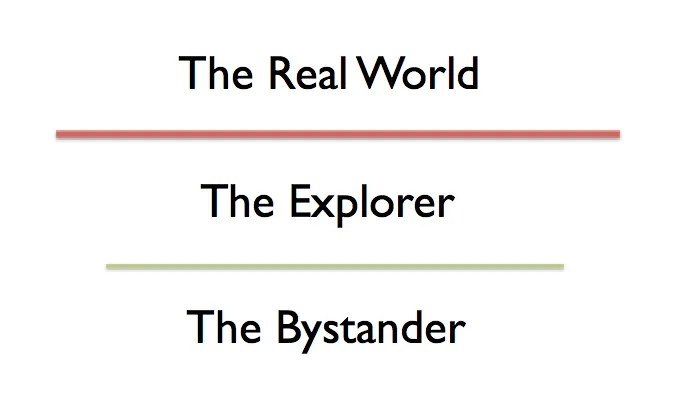
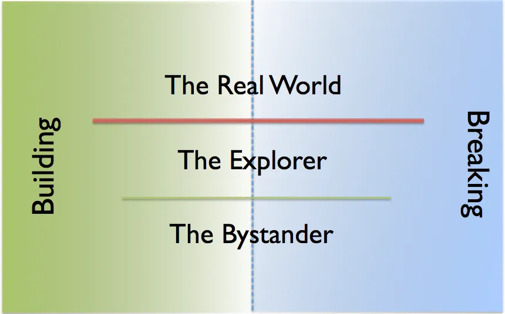

# What is Exploratory Testing?

It has been 35 years since Cem Kaner coined the term to describe a style of skilled multidisciplinary testing common in Silicon Valley. I’ve walked the path of exploratory testing for 25 years and it has been a foundational practice in becoming the testing professional I am today. Let’s look at what it is, to understand why it still matters — more than ever.

## Living Life on Defaults

Teaching programming to a group of children, we look at the little program we’ve created following a recipe. The little turtle we have learned to refer to as tortoise and give commands to draws a square, just as we’ve told it to. We’re ready to look for something more interesting, to unleash the power of programming, allowing the computer to do things we would not do. The children have no concept of this, yet.
We identify attributes with the square. We find things that could be different, things we later will call variables: number of sides, length of a side, color of the line, and eventually, we look at the line to characterize its width. We realize it is not very thick, but we also realize that there is nothing in our code telling how thick the line should be. Jumping to the conclusion of a hidden default value usually takes only a moment.

We learn that the first step to changing the default is to reveal the default.

A lot of our life, just as a lot of software building we do, makes us move on defaults. We let life happen on defaults, when we could take control and optimize for what we find important. This is an insight that I recently found through proxy, Scott Hanselman talking about wisdom his wife shares on one of the Hanselminutes podcast episodes.

Even in life, and in our work, we move with defaults. And the first step to changing the default is to reveal the default.

What does this have to do with Exploratory Testing?

## The Bridge Between What Comes Easy and The Real World

At work, we were building a new major functionality to replace the old, and I had a history with the old. The old had a developer known to frustrate the likes of me, testers, for breaking things left and right with every change. They would commit their code and pass it on without testing it. They would then start testing it, and often by the time I had tried if it works (and it didn’t), all they had to say is that they know. The functionality was also complex, so I could have lived through this groundhog day more that I care to admit.

I was particularly frustrated. The other tester assigned to the work approached the work with automation, and had a habit of explaining in meetings how they had 100% of the functionality automated. Reading their code, I knew they had 3 scenarios automated, and it was far from sufficient. The bar for 100% was low. The bar for 100% was their defaults: what they were aware that the functionality needed to do.

Armed with their defaults, they looked at the functionality like a bystander. Whatever was coming their way, they would take it, and turn it into automation. But where does the work come from? The first three cases came from the programmer dealing with the bulk of the new functionality.

There were two main options for recognizing more:

* Exploratory testing: Finding new perspectives beyond what was already in the table that could show things were not what they should be

* The Real World: Finding out what users would say

The programmer was heavily opting for the Real World, after all, they had already seen that tester assigned to work was 100% done and everything they shared as knowledge was automated.

The missing piece in the puzzle was someone, with the Explorer mindset that could find out more of the real world, before and while production.
Adding perspectives that were not addressed, charters to explore, was not complicated. Some of them would result in changes without testing anything, as the questions revealed problems. Others we would insist could not cause problems, and yet when spending time exploring with the functionality, would have unexpected side effects.

In hindsight, without exploratory testing in between the bystander perspective and the real world, the real world would not have received what we generally expect to deliver. The work here in between, modeling and actively learning about the real world, is what I think of as exploratory testing.

## Exploratory Testing, Exploratory Development

We often come to realize all testing is exploratory to a degree. Similarly, we realize all programming is exploratory to a degree. Why then we have an approach, exploratory testing, when we don’t have the named practice on the programming side?

What we seem to be missing is that testing and debugging is the name we’ve given to the simplest exploratory loop in programming. We test to learn about the program. Exploratory testing says we test to learn about the program, and about the testing we should be doing. It says we move from the bystander role to an active contributor.

Both on building and breaking (illusions) perspectives, we want to move smart people from moving with defaults, being bystanders in their projects, to active people making choices. Exploratory testing is, and has been a way of moving testing away from defaults.
