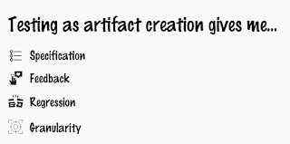
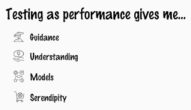
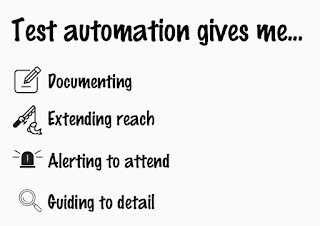

# Testing gives me 3x4

You know how you sometimes try to explain testing, and you do some of your better work in explaining it as response something that is clearly not the thing. This happened to me, but it has been long enough since, and what time gives me is integration of ideas. So this post is about showing you the three lists that now help me explain testing.

Speaking of testing to developers, I go for the list of what developer-style test automation, especially done test-driven style, gives me. It gives me a specification that describes my intent as developer. It gives me feedback if I am making progress to my specification. Well, it also gives me a concrete artifact to grow as I am learning, an intersection of specification and feedback. Since I can keep the tests around, their executable nature gives me protection for regression, helping me track my past intent. And when my tests fail, they give me granularity on the exact omission that is causing the fail. At least if I did those well. 

The lists helps me recall why would I want to make space for test-driven development, or capturing past intent in unit / api level approval tests of behaviors someone else had intent for, even if I am not using energy to track back to those. 

When I look at this list, I think back to a Kevlin Henney classic reminder: 

> "A majority of production failures (77%) can be reproduced by a unit test."  

The quote reminds me of two things: 

* While majority can be reproduced, we get to these numbers in hindsight looking at the escapes we did not find with unit tests before production.

* The need of hindsight and the remaining significant portion indicate there is more. 

What we're missing is usually framed not in feedback, but in discovery. I tend to call that discovery exploratory testing, some others tend to call it learning. If I wanted to have a list of what this style of testing, one that frames testing as performance with the product and components as external imagination, I again have a list of four things it gives me. It gives me *guidance*, like a vector of possible directions but one that still requires applying judgment. It gives me *understanding*, seeing how things connect and what it brings in as stakeholder experience. User, customer, support, troubleshooting, developer... All relevant stakeholders. It gives me *models* on what we have and how it's put together, what is easy and what is hard to get right. And it gives me *serendipity*, lucky accidents that make me exclaim: "I had no idea these things would not work in combination". 

 

[I wrote about these two in detail in 2016.](https://www.ministryoftesting.com/articles/exploratory-testing-an-api)

The two lists are still as helpful to me as they were when I created them, but a third list has emerged for me since from my work with contemporary exploratory testing**. I find that the ideas of spec-feedback-regression-granularity miss out on things we could do on artifact creation in frame of exploratory testing, and have been cultivating and repeating a third list. 

In frame of contemporary exploratory testing, programmatic tests (test automation) gives me more. It gives me *documenting* the insights as I am learning them, and it gives me that spec-feedback-regression-granularity loop. It's one of the models, one that I can keep around for further benefit. It gives me *extending reach*, be it testing things in scope I already have automated again and again, or be it taking me to repetition I would not do without programmatic tests for new unique scenarios, or even getting me to a starting place where I can start exploring for new routes, making space for that serendipity. It gives me *alerting to attend* when a test fails, alerting me that someone forgot to tell me something so that I can go and learn, or that there's a change that breaks something we care for. It keeps my mind free for deeper, wider, more, trusting the tingly line red over a past green. And finally, it gives me *guiding to detail*. I know so much more about how things are implemented, how elements are loaded, when they emerge, and what are the prerequisites I could easily skip if I didn't have the magnifying element programmatic tests bring in. 

 

All of my tests don't have to stay around in pipelines. Especially when extending reach, I am likely to create programmatic tests that I discard. Ones that collect data for a full day, seeking for a particular trend.

Where I previously explained testing with two lists of four, I now need three lists of four. And like my lists were created as a response, you may choose to create your own lists as response. Whatever helps you - or in this case me - explain that the idea you don't need manual testing at all relies on the idea that creating your automation is framed as a contemporary exploratory testing process. Writing those programmatic tests is still, even in genAI era, an awfully manual process of learning about how to frame our intent. 