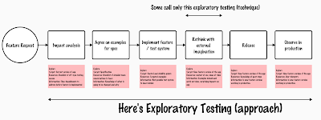
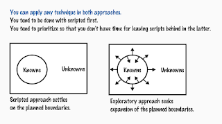

# Explaining Exploratory Testing

In this last week, a realization hit me. Exploratory testing, coined by Cem Kaner and the most natural frame in which testers would work and do good work in, just turned 40 years old this year. It has been around longer than I have, and yet we don't agree or understand it fully.

When first observed to be labeled 40 years ago, it meant the exceptionally different way of testing that cost and results -aware companies in Silicon Valley were doing testing. It was multidisciplinary, and it generally avoided test cases that the rest of the non-exploratory testing companies were obsessed with.

We learned it was founded on agency, the idea that when two things belong together, we don't separate them. And a lot of people separate them, by having different people do different parts of what is essentially the same task, and having a separation in time to protect thinking / learning time of testers. We learned that opportunity cost was essential because we could choose to do things differently with the same limited time we had available.

Some people run with the concept and framed it with testing vs checking. Checking was their choice of word to say that for the exact same reason exploratory testing was framed as an observation of Silicon Valley product companies doing something different, we needed to wrap the other by contrast. Ever since I realized that checking is an output of exploring, I have not cared much for this distinction. And when it became the main tool for correcting people, I stepped away from it more actively.

We can still observe that not all companies do exploratory testing. And looking deeper, we can see that some companies do exploratory testing as a technique, kind of as it is framed in a lot of writing that is based on how Lisa Crispin and Janet Gregory describe it. Others do it as an approach, and that is how I tend to describe it.

For sake of illustration, I sketched a typical social agreement of how I work with an agile team.

My work as tester starts already before the team gets together to look at a feature in a story kickoff. I usually work with product owners on impact analysis, exploring the sufficiency of our test environments, possible dependencies that would need to be in place, the availability of right skills and competencies for success, the other features that will be impacted, and so on. With impact analysis, I usually use the previous version of the application as my external imagination while thinking of what we'd need to address. That is very much exploratory testing.
When we then prioritize this feature and have a story kickoff, I join the team in exploring what examples would be the minimal set for us to understand what is in scope and out of scope. With my best efforts as a seasoned tester, I seem to get to about 70% success of identifying claims of relevance with my teams. We usually write these down as acceptance criteria (updating whatever was there already from impact analysis), and as examples we would like to see in test automation.

While implementing, we also implement test system. The unit tests, other tests, the reviews of the tests, the new capabilities the other tests rely on if a feature is touching areas where some automation capabilities are missing. If you wonder what I might mean by an automation capability, a good example is a library allowing for certain kinds of commonly available functions, like simulation.

Even though I was exploring throughout the implementation, I do take a breather moment and just look at the thing we created as my external imagination, trying to think of stakeholders, and their feedback. I might even drag them in, and strengthen my external imagination from just the application that speaks to me, to actual people looking at the application with me.

Then, I will still look at things with my team once more, seeing if we can just press button to release or if we want to double check something. I aim to minimize anything I would have to do while releasing, but at the same time, I make sure one of us is exploring the experience with the new feature included.

Finally, I follow through. Sometimes I follow immediately. Sometimes I follow in a month, three months and six months. I deal with the long tail of learning by exploring what use in production is like. In mature organizations, I do much of this from logs and access to customer facing issue trackers. In not so mature organizations, I drink coffee with people who meet real users.

Within the social agreement in a team, I have an exceptional level of agency: I am allowed to break the social contract at any time when I recognize something important. I discuss what I plan on doing, and sometimes we have a conversation. Some of my activities feed into the feature we are on now, other times on the features we are about to think about after this one. My exceptional level of agency allows me to choose what I do and which order, making agreements in who does what. Then again, I work in a very social context where dailys allow us to redistribute work, not from a backlog of tasks of one.

If in any stage of the process people talk about test cases, that's as output. Sometimes we need to leave those behind for standards that don't quite get exploratory testing. And in most cases we hear "test case" and we just transform it into a programmatic test. While it does only limited part of the testing, it does enough of evidence as long as it is framed in exploratory testing mindset.

For me, exploratory testing is an approach. I explore, target, with resources, for information throughout. When it is a technique, it's that rethink with external imagination part of the social agreement.

In its core, exploratory testing starts with the idea that while there are knowns (or targeted requirements we think we know we want), there's movement in continuous learning.

choose between writing automation and using the application, a lot of people in exploratory testing would choose the latter. And when I speak of **contemporary exploratory testing** including automation, I discuss a frame in which we actively change things so that we don't need to do choices between the two, but we can merge the two. Modern tools, modern teamwork and short cycles in agile development all enable that. Our ideas of what exploratory testing is and isn't are still sometimes getting in the way.
