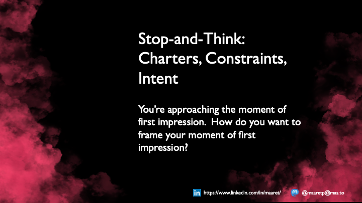
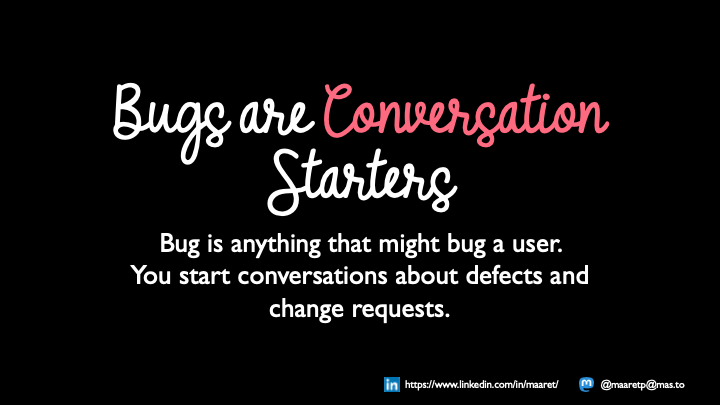
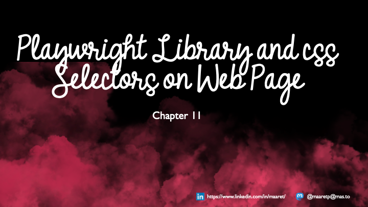
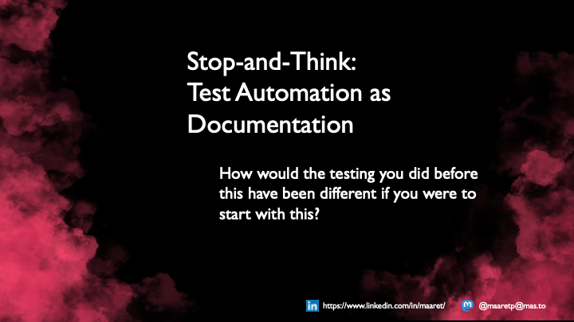
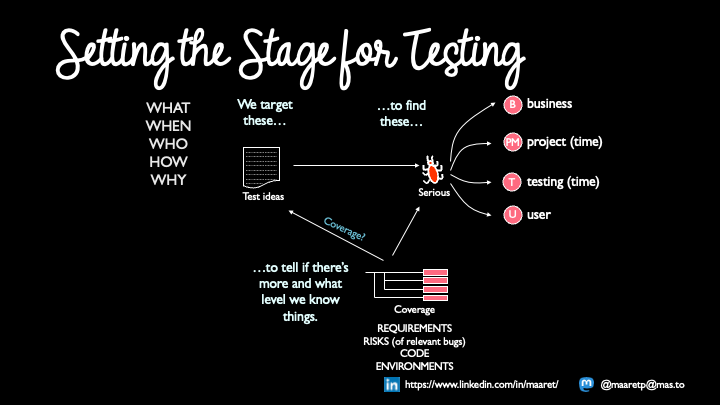
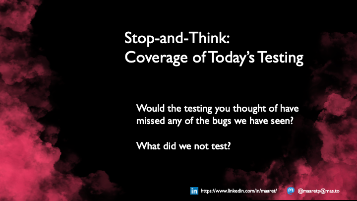
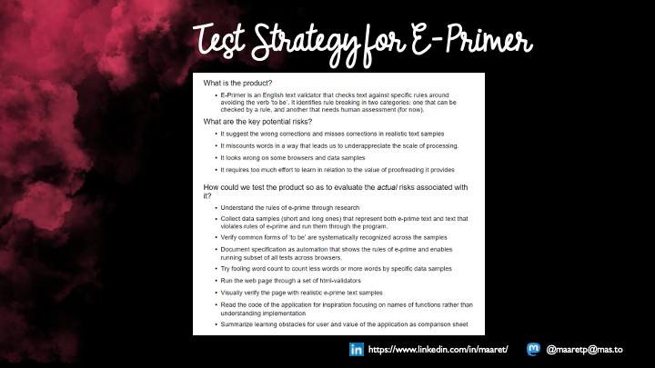

# Exploratory Testing Foundations

*Published: Sept 20th 2021*
*Updated: Aug 4th 2024* 

* Keywords: testing, exploratorytesting, testautomation, course

With so much to say and share on Exploratory Testing, what would you need to know to get started? This question lead us to summarizing basic theory on exploratory testing around one test target, and to creation of Exploratory Testing Foundations course material presented in this chapter. The course, slides and accompanying content description that together make up Exploratory Testing Foundations by Maaret Pyhäjärvi and is licensed under [CC BY 4.0](http://creativecommons.org/licenses/by/4.0/) and is made available at [Exploratory Testing Academy](https://www.exploratorytestingacademy.com). Also consider [supporting me on Ko-Fi](https://ko-fi.com/maaretp).

To create the course, Maaret Pyhäjärvi paired to test the application under test with the brilliant Irja Straus (Croatia), Parveen Khan (United Kingdom), Julia Durán Muñoz (Spain) and Mirja Pyhäjärvi (Finland). The application and lessons were tried with many ensemble testing groups to finally come to be summarized as part of the course. We particularly want to appreciate two open space communities in creation of this content: [Socrates UK](https://socratesuk.org) and [Friends of Good Software](https://frogsconf.nl). Both served as places to try out hands-on testing of the application to see the dynamics under various constraints.

Pair testing and ensemble testing are social software testing approaches. In a pair, we have two people testing. In an ensemble, we have a group of at least three people. Both forms of social software testing enable us to test and learn together, and give us a better feel of the results testing of the application can produce. With tens of sessions with this little application, no two sessions have produced exactly the same results but each session has produced useful results that can be used to build on, should we seek good coverage over our target of testing.

The course and this section sets out to teach foundational concepts of contemporary exploratory testing:

* It is an approach to testing in which we optimize value of our testing.

* It is about systematically combining information from available sources to do the best work possible for the context at hand, not merely guessing errors.

* It is multidisciplinary and allows us to take perspectives (using 'constraints') one after the other or simultaneously on the discretion of the person doing testing.

* It includes use of test automation both for documenting and as a means to do things otherwise out of our reach.

* It leads us to thoughtful test coverage, where most meaningful sense of coverage is on missing less important information (e.g. bugs).

* It reveals that a simple application that appears to 'work' has meaningful layers to isolate information on.

We know there is more to teach on exploratory testing than this one course includes. We will create separate similar yet different sets on different types of applications and constraints that make sense with each of those examples. We will also address Exploratory testing the Noun - organizational frame of testing - on later courses. This one focuses on Exploratory testing the Verb - doing really good work optimizing value of testing through learning while testing. We give half of this course to the constraint of test automation as documentation, as we believe that this is a core aspect of contemporary exploratory testing. You can't automate well without exploring. You can't explore well without automating.

## Introduction to Exploratory Testing Foundations


Welcome to Exploratory Testing Foundations –course. This course intertwines a simple application to test with basic theory of how to do exploratory testing to give you a foundation to build on.

Exploratory testing is an approach to testing that centers learning. Test design and test execution form an inseparable pair where the application and feature we are testing is our external imagination. It takes domain knowledge, requirements and specifications, and testing knowledge as input and produces information and a better tester as an output. It also encourages us to at least consider documentation and test automation as a form of documentation.

We think of this course as an antidote to the idea that test cases tell you how to test a feature and that is where a new tester would start. That type of test cases are only a small subset. You are expected to find defects, where the system does not work as we specified but not stop there. Finding change requests, things that would make things better for users is included. And instead of using most of your work time on documentation, we're inviting you to consider lighter and executable formats of documenting.

This is what we fit into two days with one application. Theory and application go hand in hand. When taught in classroom, we will also reflect course experiences to work experiences and share war stories of testing in projects where applicable.

In it's current format, the course takes two days in a classroom to deliver with many different passes. We are working to build a video course on the scope of the course, to enable people to learn this in scale as we are unable to make space for classroom guidance for everyone - we prioritize working as testers in projects over being teachers of testing. Thus the course material is openly available to use as is, or to freely adapt to scope of your choosing. We have delivered it in 99 minute segments combining various constraints learning it takes a minimum of three sessions to go through the ensemble testing to cover the application without theory slides.

Exploratory Testing Foundations by Maaret Pyhäjärvi is licensed under CC BY 4.0. To view a copy of this license, visit <http://creativecommons.org/licenses/by/4.0/>


Exploratory testing is optimizing value of testing. Let's think about that for a moment.

Value of testing comes from the value of information. Value exists in relation to cost. Cost can be direct cost - what is the bookkeeping cost of doing something, or it can be opportunity cost - what is the value of something we did not do because we did what we did instead. When you seek to optimize value of testing, you seek to be aware of value of things you do and things you could do, and make good choices.

Thinking in terms of optimizing value helps us dispel some of the common misconceptions around exploratory testing:

* It isn't manual, it's attended. Automation can call you to attend. Attended controls unattended choices. 

* It isn't about error guessing. It is systematic optimization of all sources with continuous learning to do best possible testing with the time you have available, considering both short- and long-term value.

* It isn't about feeding applications bad data to see weird error messages. In fact, we often don't care for the problems related to these and playing with them isn't optimizing the value of testing.


Exploratory Testing centers learning. The application we test is our external imagination. While we test, we learn about the application and about ourselves. We optimize the value of our work continuously. Instead of following a plan we created at a time we knew the least, we create plans, learn, adjust, even completely revise as we learn. Our ideas of the plan are best when we know the most, at the end of our testing.

To emphasize learning, we emphasize agency – the responsibility of the person doing testing to do the work to their best ability, and to grow with the testing they do.

We remember we learn

* by researching the domain – the business, the legal, the financial

* by passing on information from those who worked on the problem before us  - the stakeholders, the requirements and specifications

* by using the application and thinking while using it

* by critically evaluating the application as we use it

* by focusing our attention to both how it could work and how it could fail

* by reflecting new information against what we know from the past

* by experimenting with approaches outside our usual repertoire

* by centering value of information we produce

The work we do is done in slots of time: a minute at a time, an hour at a time, a day at a time. Every unit of time, as we learn, makes us better at optimizing our value.

We go as fast as we need, or as slow as we need. Just like driving a car requires you to take yourself and your surroundings into account to choose the right speed for the situation at hand, same applies with exploratory testing. You drive, your speed and your route – with the destination in mind.

Optimizing value of our testing and centering learning hint that we most likely want to avoid investing prematurely into documentation. We also want to avoid forgetting documentation, as delivering the right documentation is part of our goals. We also want to avoid separating test ideas and test execution, but enable those two to go hand in hand, within the brain of the very same tester. Pulling information from outside, but not executing on someone else's orders.


To set our minds for the road, let’s talk about the process of exploratory testing.

We are given something new to test. It may be a new application like one on this course. It may be a change in the application you’ve worked years on already. It may be a new feature that is new, in an application you are already familiar with. Your task in testing it is to provide information on when it works and when it doesn’t, in the perspective of stakeholders.

This is a process of information discovery. We already know something, and we use that. But we are asked to learn more and share our learning with the rest of the application team. The information you provide extends the existing information.

In the process of exploratory testing, anything can happen. Quality of output is related with quality of input, and time used in the process to learn and improve.

We usually think of the process in terms of time used on activities. Simply put, there are four main activities you will want to pay attention to:

* **Test**: Using time on test, you go through new ideas of what to try and observe. Without time on test, coverage will not grow.

* **Bug**: Using time on bug, you work on understanding information you are discovering and refining it to better serve others as you pass it on.

* **Setup**: Using time on setup, we work to make test possible. You may be setting up test data, operating the application to get to a starting point, researching while connecting information with the target of testing or solving issues on getting to test.

* **Document**: Using time on document, you leave notes and materials for your future self and anyone coming after you. This becomes increasingly important to track as own activity when we apply test automation as documentation.

These activities can happen in any size chunks within the process. They can be consecutive or concurrent. Usually through practice an exploratory tester learns to intertwine things for an appearance of concurrency of some perspectives, and each tester combines things within what they are comfortable with.

Thinking back to the process of driving a car - When you were new driving stick, you would accidentally stop your car on traffic lights, forgetting which gear you were on, or letting go of clutch a little too soon. Over time, the basic operation of the car became a routine leaving you time to pay attention to surroundings rather than operating the car.


The most important thing going into the process of exploratory testing is whoever is doing testing. It could be a career tester. It could be programmer. It could be an analyst. Job role aside, we call someone who performs testing a tester.

No matter what the features the tester goes in with, going with the idea of learning while doing, we come out different. Since we optimize our value, we optimize our learning too: we want to be always both **learning** and **contributing**.

What we can’t take in as we start, we can acquire as we do testing. We can ask around. We can research. We can read existing documentation and apply it to the application under test. We can constrain ourselves with a test technique. We can make notes and create versions of documentation we intend to leave behind.

Exploratory testing – doing testing from whatever the input - emphasizes learning while contributing. And while it can be something you do solo, on your own, it is also something you can do with a pair or a group (ensemble).

We want to specifically mention four categories of input:

* **Domain knowledge** is about what the tester knows and how well the existing knowledge enables connecting with new knowledge to understand what the application is about, why would anyone want to use it and what risks pose a relevant, meaningful threat to its value. Both knowing domain of this application or another domain enable you to compare and contrast the information you have to information you are acquiring as you are testing, and building patterns.

* **Requirements and specifications** is about knowing the agreements around the organization on what the application under test should do. While being aware of claims is good, sticking only to claims made by others limits testing in a way that it can block us from starting conversations on relevant features we are missing.

* **Testing knowledge** is about knowing how to think in terms of charters and constraints to provide new relevant information about the application under test. It's about understanding the difference of seeing something work and then seeing it fail in both ways it should (error messages) and should not (bugs).

* **Miscellaneous knowledge** is about everything else, including the tester's ability to program. Being fluent in programming enables writing documentation as code that can then stay around for later. Endless curiosity in wanting to understand how the world works helps ask relevant questions about the application instead of settling too low. Catalytic skills enable drawing other people's knowledge into the work you are doing and creating connections for shared success.


What comes out of the process is a better tester but also different kinds of deliverables we consider relevant when optimizing value of testing for *the specific testing at hand*. Sometimes we only report new information. We leave coverage as implicit, but our information is only as good as our ability to cover multiple perspectives. While we can come out with only information, we often want to put our learning into a good use for our own and our coworkers’ future and leave behind documentation, even executable documentation.

Let’s now say this out loud: test automation belongs in exploratory testing. You can’t explore with great coverage without automation. You can’t automate without exploring in a relevant way. When automation fails, it calls you to explore. With that said, we are optimizing the value of our testing with exploratory testing: value today, value in the future.  Automation is a constraint that directs our attention. We make choices of when it is the right time for that constraint.

If you don't know how to code and write automation, it cannot be part of exploratory testing you do personally. What you cannot do personally, you can compensate for through collaboration. Collecting ideas to pass to team members while exploratory testing to document as automation may be a constraint you live with. You can also learn to code and remove a knowledge-based constraint. Same applies for people who know programming but have hard time with good testing ideas. You can also learn to test and remove a knowledge-based constraint.

On the knowledge-based constraints, we would like to remind people that software industry doubles in size every five years, meaning half of us have less than five years of experience. With less than five years of experience, we have knowledge-based constraints we later in our careers learn away from. Choosing a focus of skills to learn first is a natural way for us to divide the learning in a team, without letting it box us indefinitely into roles. Contributing to test automation efforts isn’t the most complex of our programming tasks and we believe everyone can learn it. We're less sure if everyone can learn to think in ways that ensure multidimensional coverage and we're hopeful with that too.  

Successful output is effective: we find problems our organization expects us to find. The path to the result of finding relevant issues is through understanding coverage.

The four main categories of output we want to mention are:

* **Coverage** is about knowing how effective your testing is. Did you cover code (implemented), requirements (asked), risks (problems) and how can you tell?

* **Information** is about knowing your results. What conversations is testing starting? What changes are we making based on those conversations? Are we removing bugs that might bug a user?

* **Documentation: Strategy** is about knowing how we approach testing for this particular application under test. At first our ideas are vague, but in the end they should be at their clearest state.

* **Documentation: Tests** is about leaving behind a checklist of any sort that enables us to build on current learnings ourselves later or by others. How can we accelerate testing for next time around?


This course is first in the series of Contemporary Exploratory Testing courses where teaching on the course is framed around a particular test target. For foundations, our application is very simple, and it was chosen based on the idea that is *not supposed to be full of bugs*. While finding lots of bugs is fun and does wonders to a tester’s self-esteem, it gives a false impression of what it is we do when we do exploratory testing.

The course is split into 17 chapters, where each chapter will have a supporting video, and the final chapters will describe the best testing we have done on the application. It isn’t a recipe for all applications, but an example for you to understand what coverage for this application may mean, and what parts of the work you could do make sense when you are truly optimizing value.  

From the outline, you can see that we will be using a test automation tool (pytest) on this course. Choice of tool is irrelevant but using one to give you concrete examples helps teach this content. Pytest allows for natural language like programming, more so with pytest-bdd, and can be useful for new people to get into test automation programming.


The same course delivered in a one-day classroom format uses this four part structure. We start with options for exploring (and do exercise on documenting our ideas without use of application), continue with addressing personal choices on constraints allowing people to explore without automating, adding automation as constraint teaching people who to automate with Robot Framework Browser library, and conclude with addressing use of time over results, thinking through coverage.


In this first chapter, we don’t yet get to use the application, but we get to see the application. Sometimes a good way to learn about how learning changes things is to try to think what you would do before you had more information.

With exploratory testing, you need to appreciate learning. Learning shows up by your ideas changing, and ideas changing change your actions. You should notice when your ideas change. It is expected, welcomed, and makes you better. You can’t have the best answers available at the time you know the least.

With an application you have never seen before, it is clear you *now* know the least. It is harder to appreciate how that is true on your day-to-day job, with the same application with new changes coming in. Yet it is the same: at start you may know a lot, but you still know the least about that specific change and its impacts on the application compared to what you can know given proper time to explore it.

Working in pairs or ensemble on generating ideas, we find people do better with versatile ideas than on their own. Then again, having a lot of ideas before you know anything that would help you prioritize or target your testing isn't going to be the best use of your time. Recognize what you think is most pressing on your list of ideas.


The application we test on this Exploratory Testing Foundations course is called E-Primer. It’s a little application for people who want to check their English writing to master e-prime – a way of writing English avoiding the “be” –verb in all its formats.

We chose this application because we were under impression it is not target-rich application for testers. That is, it is not so full of bugs that you should consider it ridiculous.
Having tested it, I know it has its share of issues. And to begin with, the version we styled for this course has one major issue that the original did not have and we haven't fixed it (yet).

We can figure out what the application is and what it does by using it. Also, name of the application gives us a hint and allows us to research e-prime further should we want to.

At this point, let's not yet go and use the application.


By the time we get to chapter 3: The Moment of First Impression, your first impression on just seeing the application is already gone. But the first impression of using it is still ahead of you.

Before you move forward, stop to think. What would you do first, and what soon after you get started? If you make an inventory of ideas you have, what do you list? Try doing that.

People testing applications come to the targets of testing with our biases. Our internal dialogue of being awesome just as much as our internal dialogue of being bad has an impact on our ability to look at what we can do objectively, which is why I encourage writing things down to support your own learning about yourself. Learning is about changing your mind, replacing something you thought you knew with something more accurate, and adding new knowledge on top of what you already knew. Pay attention to what your first instincts say about testing this one.

This careful listing of your starting point supports your learning, and we would not ask you to do this with every application you ever test. But it is an option you can start with, an option we enforce here for learning purposes even if it didn’t help with optimizing value of testing the application at hand.


Now that you have created an outline of what you would do without doing anything but digging into your past lessons, it’s time to discuss your options for getting started with a new application.

Time you spend away from application to learn about it is time when you don’t know about what the application does.

Time you spend wandering without a purpose with an application could be a way of learning about the purpose, but there may also be more effective ways to learn about it.

Balancing your options and creating new options as you go is at the heart of exploratory testing.

If you can research the domain in a way where you continuously test and learn, you are simultaneously learning and contributing.

If you start using the application, take control over what you do. Think of what is included, and particularly what isn't included.

Some people will start with automation first. With many sessions over testing this application, we have come to understand it both enables and limits us. We see some types of problems, while becoming more blind to others. Same works when we start with use of the application first. No matter what constraint we choose to start with, it is our right as exploratory testers to make that choice for ourselves.

## Self-Management in Exploratory Testing


You have options for exploring, and your task in exploratory testing is adjust your intent, charter and constraints on a cycle that enables *you* to keep up and do the best possible testing you can. Exploratory testing centers the tester, so you don’t have someone from the outside telling you what detail to verify, the control is with you.

Some people tell us that the freedom frustrates them and makes it hard for them to start. They don’t have to have this freedom; they are free to set themselves into a box that enables them. They are also free to let themselves out of the box they created, when they discover that to be useful.

In this chapter, we introduce three concepts:

* Charters

* Constraints

* Multi-dimensional thinking for intent and learning


Charters are a key concept in how the community talks about framing your exploratory testing. You can think of a charter as a box that helps you focus and generate ideas, but also assess when you think you are done with a particular idea.

We like to think of charters as free form test cases.

A charter could be a chapter from your design specification you want to understand empirically with the application.

A charter could be reminding you of a non-functional perspective, like accessibility – can people with disabilities, permanent, temporary or situational, use the application, being an important group of stakeholders.

A charter could be a very traditional step-by-step test case with your promise of stretching every single step to both it’s intended path but paths it inspires.

Charter is a structure for *thinking like this*, not *passing work along like this*. Some people use charters to share work in team and our advice is to not do that *unless* you co-created the charters in the first place. As soon as you remove tester designing, executing, and learning intertwined, and replace it with a tester designing and another executing, you will lose a core feature of what makes testing exploratory testing and shorten the leash a tester learns in.

[Elisabeth Hendrickson](https://twitter.com/testobsessed) introduced a charter template in her book Explore It, and [Elizabeth Zagroba](https://twitter.com/ezagroba) introduced an adaptation of it in one of her presentations. We like the concise template a lot but encourage you to think in terms of charters being anything that can box your testing and help you maintain focus, rather than follow a format.

We advise against using charters for passing work along unless the work distribution is a shared endeavor between people. When we pass them along, the process starts to resemble traditional test cases where someone is following another's lead. This might be a temporary structure you try when you have new testers but our advise on teaching new testers is to pair with them rather than passing information through documentation they don't yet understand how to stretch.

Growing a new tester in exploratory testing, we often see a pattern of first looking at an application as something that has little to test. Pairing and sharing dimensions in an actionable way transforms the tester, and with the tester, the results the tester is able to deliver.


We prefer framing exploratory testing with constraints, which is one of the options to use in resources part of the charter template. The way we look at it, we have limited bandwidth to doing many things at once, and for us to frame the work we do in an effective way, we need to deliberately exclude perspectives to a level where we can cope with the perspectives we have decided to focus on.

Like, you could say you are deliberately not writing notes at all to get through as much of different scenarios of using the application you can think of. Or, you could say you will go through a document describing correct behavior in detail, ensuring not to miss important claims. You could say you will get through 100 scenarios around the application quickly, or five in a lot of detail in the same timeframe - a day of testing. You most likely cannot do it all at once but need multiple passes with the application, with seemingly same tests but different ideas in what to do and pay attention to.

If you try to do everything at once, you can’t get any of it done. So, we get to choose our constraint with my primary heuristic to never be bored.  

Testing is a lot of fun. Finding out information that others don’t know is investigative work, and servicing many stakeholders is an intellectual challenge. No matter what changed, there is something new we now need to figure out, in a way that optimizes the value of our work. Doing the exact same things isn’t optimizing value of our work, so you start with the idea of always varying things to not be bored. If you find yourself bored, you need a new constraint that challenges you.

Some folks take automation as the challenge that keeps them from being bored. Others find the multidimensional work all the ways we could use the application to see new problems motivating. Some people say that automating helps them have time for exploring, and they mean that seeing simple problems isn't good use of anyone's time. Covering ground with the application under test in a repeatable way is the grunt work of automation.  However, automating on level of unit tests might be our best bet towards catching unintended simple bugs and we like framing freeform exploratory testing and unit tests together in keeping things interesting!


Exploring is wandering with a purpose – without purpose, you are lost. A high-level purpose of spending time with the application or finding information is a little too generic. Specific purpose, intent, looks at what is the next step, next timebox and next theme, balancing serendipity (lucky accident) and coverage (making accidents likely).

When we practice being intentional, learning to structure our thinking that is multi-dimensional can be helpful. When you imagine and fill the next slot of testing in your schedule be it next hour or next day, we find this matrix has helped us keep track of our intent and learning.

Think of this as an empty A4 paper for the next piece of testing you are about to perform.

**Mission** includes a statement of why you exist in the organization, what is expected of you – there might be a role-based constraint applied to you such as being a test automation specialist, but that does not stop you from doing other things, merely reminds you that if there is a priority call, yours might go to this direction.  Like a sandbox you are responsible for, but with sides so low you can easily cross them when you are excited, this corner reminds you of where you anchor your purpose in larger scale. We use missions with large applications agreeing who works with each general area of the application.

**Charter** would talk about something on shorter term, like a personal promise: “today I will test with 100 different inputs on one browser”, implicitly saying you will do that rather than test for example 10 inputs on 3 different browsers. It’s your intent you are framing, so it is your right to change the framing any time. Let us emphasize the important of *any time*. As you learn, you don't have to stick to your promises to yourself. Charter only helps you to stay honest of what your idea was to begin with and avoid the "I tested for a day so this now much be tested" thinking pitfall where you unintentionally lower the coverage bar.

**Details** makes space for things you note while you test on level of details.  Typically, we note things that are bugs (#), things that are questions (?), and things that are ideas (x) for documenting for future in whatever test material we leave behind. Knowing your pattern of details is useful. We have come to appreciate we know half of the answers to questions we have when we stop to think about it, and many things we consider bugs at first are not important enough to raise as we acquire more knowledge of the domain, the application and other available information.  

**Other charters** is your placeholder for things you’d like to do but won’t do now even they popped up in your head under influence of the application as your external imagination. You choose to park them here, leave them for later. Following your every whim is your choice, but it will not help you get the work done you had in mind first if you do so.

When you find a bug, you can choose to write it down quickly and continue. Or you can choose to isolate it properly and log it. Your choice. We find it takes 10 minutes to 2 days to properly isolate and report a bug, and advice pairing with developers on fixes over reporting them in tools if the development team can come to support that way of working.

When you find a question, you can choose to ask it right away. Or you can choose to collect questions for later, seeing if other things you learn while testing will provide you an answer.

When you find something to document, you can write it down in the best possible format immediately. Or you can write a note appreciating it as something worth documenting and take time later.

You can also completely skip a bug, a question or the documentation. The more thoroughly you process them, the more time they take from what your intent for this testing was.



You are approaching the moment of first impression. You usually want to see it work before you see it fail, or you don’t understand and appreciate the way it fails to communicate the fail properly. What is the first thing you will do? Both as a high level idea, and as a specific idea - what would you try first and why? Would you frame your start as a charter, a constraint or as an intent? Or maybe you have your own style of framing your testing that we did not talk about here?


We already saw the application, even if we did not yet use it. One more thing to note before heading in for the test. You are only new with an application once. Even if it is time when you know the least, let yourself listen to how you feel about the application. Your joy could be user’s joy. Your confusion could be user’s confusion. Your mistakes are most likely some user’s mistakes.


With making choices of what we do first and what we do after, it is good to be aware that while we have an endless selection of options, some options expire.

You can only have a first experience without having read documentation or given a personal demo before those have happened for you. Even if you can’t have the first impression personally working closely with the feature, you can always work to borrow someone else’s experience through pairing or watching them use the application.

With time of first impression, you will want to listen to your feelings about the application more carefully, without yet jumping to conclusions about what is an important problem and what isn't. Notice now, prioritize later when you have context.

While many of our options don’t expire and we can do them in which ever order, it takes exceeding amount of energy to remain curious about the new information when you have already tried many things. I find that we often give up and stop testing too soon! In the words of the famous Albert Einstein: “It’s not that I’m so smart, I just stay with the problems longer.” Given time of use, software has the habit of revealing issues it has always had but we either could not see or appreciate earlier.

On this course we propose you have multiple rounds with the very same application with a different constraint:

* Test it with first impression

* Test it with focus on domain knowledge and documentation, aim to being systematic in coverage of spec

* Test it with focus on functionality - both code and UI

* Test it with focus on data - what should work, what should not, and how those could surprise us

* Test it with focus on what it runs on, the environment

* Test it with mindmap as documentation

* Test it with traditional test cases within test automation tooling, without automating

* Test it with running automation you create to do testing for you

The same application and eight rounds. You can put these in any order and your experience with the testing of the application will be different. Only the first impression is something that expires by its nature.

The others expire if you cannot maintain focus and interest, and start believing you have already found everything relevant or come to conclusion that the application isn't worth this much effort.

When working close to a deadline, options expire also on what feedback is welcome. Days leading into a major release, issues considered major months before can be prioritized down. Timing of feedback matters.

You usually stop testing before you have exhausted all your options. Knowing your options helps you be intentional about it.


With all this said, it is our time to test. The application is available at <https://www.exploratorytestingacademy.com/app/> and eviltester’s original at <https://eviltester.github.io/TestingApp/apps/eprimer/eprimer.html>.

Pay attention to where you start from, how you learn, and how you decide on your next steps. After every single thing you execute, stop and ask yourself: what did you learn?

Each of the following chapters also gives you one constraint that is applicable to this application at hand and explains where the constraint leads you. You can do those in any order, even in combination with the first impression.

Spend 15 minutes exploring the application alone, or 30 minutes in an ensemble. In an ensemble, pay attention to how you continue from what the previous was navigating to, and the intent emerging that changes direction. It is hard to follow through a larger idea with a group in the beginning.


We have lead the first impression to the course with different constraints with different people, and come to appreciate typical patterns in group work:

* Given automation from the start, we find at most one problem but we get coverage of basic functionality up significantly

* Given freedom without constraint, results vary greatly depending on the tester's skill in testing. Relevance of results is often weak. No documentation ends up being written, even notes of bugs.

* Given domain documentation, the understanding of relevance of results is better. Approach to slicing documentation varies a lot.

* Given a mindmap requirement and a functional constraint, people create clearer plans and document bugs in a quick way.  

Your first impression and learning of the application is most likely not taking you this far. This mindmap is from an hour of pair testing with a tester who found none of these problems alone but needed training on how to look at an application to identify what might go wrong with it. The mindmap is by no means exhaustive list of things that are off with the application. We’ll talk about bugs in more detail when we get to the part about coverage – because most relevant coverage is bug coverage.  The challenge is, we can only assess bug coverage in hindsight.  



We would hope first impressions are not about bugs, defects and change requests for users of our applications. Testers though get to bugs on the very first thing they do with an application, drawing from past experiences to select a way of using the application that reveals a bug. Tester fast forwards a user’s year into the hours they use testing – or better yet, multiple users’ years.

We like to think of bugs as conversation starters. Sometimes we need to avoid the word defect and reserve that only for use where it is clear that the behavior of the application is against something we explicitly agreed in a specification. Defects come with the burden of guarantee, whereas change requests have a different tone to them. Guarantee implies that it should be fixed at the cost of the software development organization. Change request implies the cost is separately invoiced. Thinking in terms of whose money the fix requires can be part of a testers work. In some organizations this categorization has less impact than the importance of what the feedback means for the user and customer satisfaction.

In many teams, we have called bugs “undone work” to remove the judgement from the conversation – it is simply undone work we propose we still might want to do.

Bugs are things that might annoy a user or any stakeholder, and unless someone starts a conversation on them while still in development, the conversation starts only at a time a user starts it. These conversations turn things we didn’t know into something we can be aware of. And for many, it enables us to make changes that remove the bugs.

You can also start conversations on the good things you see, the absence of bugs that surprises you or just the things you find that make our users with our application more awesome. Having that empirical touch on what we have built gives you a perspective of use that serves as a conversation starter. Identify something good, find ways of getting more of that kind of good.

## More Specific Constraints


Let’s move to discussing domain, requirements and specifications. The information about what the application is and does comes to us in many forms.

Domain is the problem-solution space of the application. The application exists for a purpose. It has patterns of expectations that are specific to it and other applications in the same domain. A domain typically has domain specific concepts.

Sometimes we know the domain by just our life experience – like most editors. We know what a text editor does. While there are specific functions to a text editor, we can figure those out since we too have edited text before.

Sometimes we know very little of the domain and need to learn it as we test it. Learning a domain effectively and becoming a domain expert over time is what we would expect from someone testing applications in a particular domain for a longer period. Knowing the domain or learning about it until we know is what separates us from assuming something could be right to understanding if it is right.


To learn a domain is to acquire information about the problem-solution space of the application, and usual expectations of it.

You have three main routes to it:

* **Conference** is about asking around. Talk to anyone you need to.

* **Reference** is about getting to an authoritative document. It may be given to you directly, or you may need to search to find it. Sometimes references disagree, and you get to settle those disagreements while you are testing, through talking with people.

* **Inference** is about applying other knowledge you have access to on this domain, expecting similarities or differences.

You may have a requirements specification. You may have a functional specification. You may have a user interface specification. You may have an architecture specification. No matter what you have, it is not all you will need. And if you have none or some of these, or some others, we advice to think that documentation is useful but also it reflects the things we already think we know. Exploratory testing begins with what we know and seeks to learn what we don’t know yet.

When you have no documentation to refer to, you still have people and your past experiences. You can document relevant lessons and claims as you test them.


With E-Primer, we don’t have a specification. We have a Wikipedia description of the domain that gives us a decent perspective into what the application is designed for, without knowing any of its intentional limitations.

We can search online for any information about e-prime we consider useful and educate ourselves on it.

With specification, we can find phrases to test with that showcase the application’s functionality. This good demo phrase for E-primer - "To be or not to be is Hamlet's dilemma" - is a result of testing, not the first idea to use the application even based on its Wikipedia description. We can best get good demo examples by asking the developers on how they discover the functionality. The phrase illustrates how you can get to seeing both Discouraged words and Possible violations, while counting words correctly.

We have not talked to the application developer, Alan Richardson aka eviltester, to understand why he would choose to separate these two concepts. A working theory from exploration is that Possible violations are algorithmically harder to separate and require human assessment on whether it is possessive or a short form of "is".


With this specific application, we can find the source code. It is available in the browser on Developer tools / sources to view it in the browser.

It is also available on GitHub at <https://github.com/exploratory-testing-academy/ETF/blob/master/app/eprime.js>

Looking at the code gives us a direct chance of comparing what it can do to what we would expect it to do with regards to the Wikipedia page.  We could, just by reviewing the list of words that get marked discouraged identify that the words “you're, we're, they’re” that should be marked won’t be, as they are missing from the list.

Programs do what they are told. You don’t have to know how to read all of code to read enough code to make sense on existing logic.

Like with reading and writing English, they are connected but not the same. We can read great novels yet not write ones ourselves. We recommend all testers read code, at least on the level of what is included and changed. Commits and pull request reviews help us understand scope of changes we are testing. Code in version control has one feature that is very useful for testing: nothing changes without someone changing it and we can watch it change. Same isn't always true for the environment the application relies on, or our customer's expectations.


It is time to test. Try out what how testing flows when focusing on the domain knowledge. What do you think of coverage of what you have tested so far? Eventually, we care about you not missing relevant information others don’t yet have and thus can’t specifically ask of you! Try to make sure you cover the claims the Wikipedia page includes, or that you can explain the percentage of coverage against that you think you have.

Take 15 minutes alone, or 30 minutes as an ensemble.


The combination of reading and using the application means a significant portion of your time went into making sense on the Wikipedia text and finding other relevant references. You most likely learned something.

We expect you are now more comfortable with the application and have an idea of what it does.

You should now know that "Possible violations" isn't a concept you can find on that Wikipedia page or through simple online search. The written references on it are not particularly helpful and there is no documentation about it in the application.  

Most commonly people come to understand “Possible violations” as a side effect. We commonly see three routes to finding it.

* Using the demo phrase this course has – given the demo phrase, people miss out how hard it is to figure out when it should not be

* Reading the code – figuring out from the code that “’s” is the search criteria for counting things as possible violations, and then understanding that it looks like possessive and “be”-verb appear so often in hard to distinguish formats that this appears a likely design choice signaling need of user intervention over programmatic algorithm doing all the work

* Using large data samples – browsing through large data samples, like copy-pasting the whole Wikipedia page text at once in the application and browsing for blue

You learn domain by asking questions and paying attention to answers the application gives you when you test it. Not all your questions have an answer, but they start conversations. You get to consider how far you take them. What helps you optimize the value of your work when testing?

To get to some of the samples the Wikipedia page leads you to, you have to go through a number of tools. For example, a great reference of E-prime where there should be low number of things to detect is the Bible written in e-prime, available as pdfs. To get pdf to text, you will need to find a tool online for that purpose, direct copy-paste messes up the structure of your data.

The text in the Wikipedia page also can lead you into thinking about comparable products you could use to understand testing this one better. The claims from the specification are not only on words it would recognize but also on benefits of using it in the first place: clarity of thinking and psychological effects of writing this way leading to e.g. objective expression of feelings.

The more you read before using the application, the higher the expectations for it are. First pass is most likely reading selectively, and if we really cared for claims, it would require significant effort to isolate and test them.


Now that we have an idea of the domain, let’s look at the functionality as a constraint.

Different applications are built on a different technology. As someone testing an application, getting to know about the technology is something we would expect. Not expert level knowledge, but at least a basic level curiosity turning into expert level knowing over time, question after question.

A lot of testers given a picture of the application start suggesting SQL into the text box or want to use Developer tools to watch network traffic. They find themselves puzzled with a JavaScript application running in browser after you first download it, and their backend related test ideas are not taking them far.  The application keeps working even if you disconnect from network as long as you don’t try to refresh from the download location.

Let’s discuss functionality as constraint a little more.


For functionality – features – we find a good approach to be seeing function in different scales and naming it. Naming helps us think about coverage of each named function separately.

The code has functions the programmer has given names to. It is structured as functions the programmer calls to get their intended results overall.  We could use a unit testing framework to explore the functions of the code, and for the scale we can, we probably should. Unit tests are great because they deliver feedback on the level of a developer making breaking changes. If unit tests document (in automation) the developer intent, it also reminds about it with red in running it after a breaking change.

The application user interface has functions we would probably name ourselves. Some of those functions come from what the programmer explicitly introduces, some come from the fact that it runs in a browser.

We can name what we see. We can name what we expect to see. And we can compare those.


Given the constraint of function, what would you test? You could start with the code, but we suggest you start with the user interface. Give labels to functionality you see the application have, and explore each functionality for information about it.

It counts words - what rules apply to counting words?

It recognizes e-prime in text - what rules apply to e-prime in text?

It color-codes e-prime - how could we know it marks the right words?

It runs on a browser - what functionality does browser introduce for it?


Usually when we use the constraint of function after using the constraints of domain, we find there is either an overlap or challenges in naming things we did not already see. Many times, we find we need to point at a function directly and name it to make it visible.

With this application, there are a few functions that are not obvious:

* Text area for output text has a size limit for width of the grey background

* Text box is resizable, and so is the page and browser window

* Anything running in browser has a connection to browser settings

* The E-prime recognition algorithm is core to the problem and feels to be on a weaker side

* Between our version of the application and eviltester’s version of the application, we have lost scroll bars – a function really relevant when dealing with larger chunks of text

We can name functions in many ways:

* Inputs

* Outputs

* Containers

* Presentation

* Browser

* Algorithm

Categories of function serve as idea generators. We are sure there is more to browser than we have listed here.


Next we focus on the constraint of data. Many applications process data, and this application isn't different. Sometimes the data is visible to us as inputs and outputs we observe.

Sometimes, the data comes from the application based on our input.

To deal with data, we have some of our most well know testing techniques:

* **Equivalence class partitioning** is an idea that we try to minimize the data we use in testing by choosing one for each class of risk. We do this because covering a lot of data is time-consuming and we need to optimize value of testing. However, that constitutes a relevant risk is a long conversation and very application dependent, and anyone seriously applying this technique should look again into automation and risks. For purposes of exploratory testing, think of it as an idea saying you want to try things you can imagine could be different.

* **Boundary value analysis** asks you to focus on where behaviors change. If something is allowed until it isn't, the moment where things change is relevant. It is also more likely to be off by one, or vulnerable to problems when combined with another functionality. We suggest to think of this technique as the Goldilocks rule: try too small, too big and just right to really understand if what you are testing works as you would expect.  

These techniques on looking at data can and should be applied to both inputs and outputs, together and separately. We want to tease out different situations with different data.


For every function you could find in the previous chapter, you can extend it by varying it. If you had a button to click, you could click it directly, move focus to it and press enter, try pressing enter when focus is on the text box and see what happens.

The most lucrative functions with regards to data are ones where the function of the application changes in a relevant way. In the application under test, anything you put into the text field will have a lot of options.

Using function with one piece of data lets you know the function exists and can work. Combining the function with data and variation, you learn about reliability of the function.


We often find that testers come equipped with experiences of what type of data often fails and use their past experiences with the application. We have learned that when data has a lifecycle, something can go wrong in different stages especially when we mix them up. We create, read, update, and delete data, either completely or partially.

Similarly, we know whole collections of typically problematic data, like the GitHub Naughty Strings list at <https://github.com/minimaxir/big-list-of-naughty-strings/blob/master/blns.txt>.

We also may remember from past experiences easy ways of producing garbage text like opening a gif-picture in a text editor to copy from.

A dynamic we often observe when working with data is ability to keep track of coverage of data. If you have a long list of things you could try, some applications allow you to try it all at once. With a wall of text though it is harder to pay attention to details of what is unexpected. Choosing data one type at a time leads us in forgetting what we have and have not covered.

Similarly, we have tools that help us get to these types of ideas, like the Bug Magnet. It is a Chrome extension that allows for injecting values from various categories into a web user interface.

A wide idea of data often brings out fun in testing. However, we need to stop and think if the values we are trying will be information the team will find relevant. If you start off reporting an application accepts weird inputs but not doing anything particularly bad with them, it most likely will read as you wasting everyone's time. If the application crashes, there is usually a connection to security that makes it more relevant.


Given the constraint of data, now it is time to find the things that could be different. You find data you can vary on the easy places like input values to a text field, but equally data is there on getting to output values of the application. What can you vary to discover problems the application holds?


We find that with this constraint, people find new bugs they were not previously aware of. We've collected some of the most typical ones here.

* anything but space as word delimiter - application only recognizes space as word delimiter and messes up count of words when we use anything else - including the hyphen and line feed.

* apostrophes - there's two types of it and application only knows one, and even we did not expect to learn about differences of typesetter and typewrite apostrophes. Similarly, put the apostrophes right into the forbidden word, and it no longer gets recognized: 'be'

* long text - varying lenght of text is quite basic variation of the goldilocks rule, and finds a bug that reproduces on the course version of the application but not on the one Eviltester created. Seems like styling into a new page introduces functional problems that were unexpected until discovered.

* e-prime - recognizing well-formulated e-prime and it's violations, in scale of relevance. Not just individual words but longer bodies of text. The specification page has a link to e-prime bible, in pdf, that you can transform to text and use as a great revealing source for data-related issues. To get to test these, you either fix the bug on the application creating a local copy or use the Eviltester version. Yes, testers can fix bugs and wasting time because we shouldn't for a simple fix makes little sense.

* lucky selection - from e-prime examples, we have observed people choosing both lucky an unlucky subsets. Unlucky subset is one where all of the picked samples work as we would expect, while those we chose to leave out we learn in another session to be broken. Taking a systematic approach to data matters. Large samples make focusing on verifying correctness harder, but also allow for serendipitous discovery of samples we could not identify thinking. Copying the Wikipedia page in its entirety is a good example of this .

Note: To fix the bug, you need to fix the css (stylesheet). Change "position: fixed;" to "position: relative;". One line fix you can search online. Sometimes you fixing the bug is faster than you writing a bug report.


Next we look at a constraint I find core to the idea of *system testing*. Even when we work in teams creating our team's components and code, testing does not exist merely to test the code we have created. It does not comfort us much if our users tell us that the function they were trying to use does not work, even if we could explain that this is in fact because Microsoft operating system does not work correctly and we assume it does.

We find that often we need to constrain our attention to the operating environment of our application specifically to pay attention to things we must have interoperability with.

For a web application, different browsers and even browser versions are a low-hanging fruit for making choices where and how we test. Yet we often forget built-in functionalities in the browser such as settings the user can change, and 3rd party plugins our application needs to co-exist with even though we have no control over what the user has installed.

Recognizing our application architecture and technologies are a relevant part of this. We can expect different problems for different technologies.


No matter what level of detail we look at when we test – code structures, application programming interfaces, user interfaces be it individual parts of multiple parts end-to-end – we should remember that with testing, we are not only evaluating our own code, but we are also evaluating our own code in the bigger ecosystem.

Quality experience of our users depends on things that are outside our direct control, and we may need to choose things in our direct control respectively to uphold promises we make for our users.

Signal – the messaging app – is a great example, and Naomi Wu makes the point for one aspect of quality (security) very clearly. You are only as secure as the weakest link in the system, and you can’t have a secure application if it runs on a platform that isn’t secure.

We evaluate applications as systems for multiple stakeholders. Pointing out the problem is someone else's in our supply chain does not comfort the users who see your company's logo in the corner of the application they are trying to work with.


We talked about environment being important, but let's reiterate parts of execution environment for a web application.

* **Browsers, web and mobile on an operating system** - We have a lot of browsers, browser versions, browser versions on different operating systems. Some operating systems are desktop, others mobile. And majority of people use web on mobile phones these days. Operating systems have security features that may adversely hit your product, and antivirus solutions in particular might not like your site or its content and functionality quite as you envisioned.

* **Browser functionality, settings, add-ons** - Browsers have functionality (like zoom), settings (like no cookies), and add-ons (like ad-blocker). While you don't have to support them all, you probably want to know their impact to your application before your users are on the phone upset on not even understanding why your application does not work on their computer.

* **HTML standard compatibility** - Badly formatted html causes errors in the browsers and creates differences across browsers. Try to run your site though a checker tool.

* **Accessibility standard compatibility** - Your application may not work for disabled people, and some of the low-hanging fruit in that space are collected in standard checkers available as sites and browser add-ons.

* **Layers of its architecture** - This particular application is in-browser only. Some web applications comprise of frontend and backend. When we would focus on testing of the backend, we may miss problems in the frontend. Understanding what parts make the application helps us target our exploration.


Time to test for things that are about the environment. Using execution environment and what your application relies on as a constraint, explore what issues are there with E-Primer. Do you find new issues? What kind of a list of environment functionality you come up with?


This particular constraint always gets the least amount of time and has widest possible scope. Setting up different operating systems with different antiviruses and browsers, both web and mobile is a significant effort.

We often approach environments with a rotational strategy - on different days we are on a different environment. Sometimes we automate for basic coverage of the environments, but the automation may not notice visual issues unless we specifically build for that having considered it good use of time.

Many environment difference issues we rather address in user interface designs that work across browsers, sticking closely to a standard and tried technology. We also may announce to support only certain browsers, or browser versions. It is close to the time organizations are starting to be able to say goodbye to Internet Explorer and support only Edge from Microsoft browsers.

Did you try googling for HTML and accessibility validators? Both find problems with this web application.

## Constraints about Documentation

We are half-way through our slides for this course, and we change gears now towards documentation. The next chapters introduce three ways of documenting.

* Making notes in a mindmap

* Creating "test cases" in automation tooling that only document steps

* Creating executable documentation through exploring with automation

Documentation is a constraint, as it slows us down when running through ideas with application. We want to create documentation that serves the tester doing the testing, and often those notes don't need to be shared with anyone. When we need to share our notes, writing them in a way that enables others takes some thought.

We believe that whenever we have time to create traditional step-by-step test cases, we are likely better off if we were creating test automation instead. Our recommendation is to make choices between no documentation visible to others, session notes in any format and detail required, and executable documentation based on available skills and time.


The first format of documenting we discuss is a mindmap. Creating a mindmap has some benefits:

* It is fast to create and restructure.

* It is visual representation of relationships of things we model from the application.

* Having something to show from what we covered in our testing enables others to comment on our thought patterns.

* It can naturally be built while exploring to anchor our learning.

There are a lot of mindmapping tools, and I commonly use Mindmup. Within company with company secrets, I use Xmind and save files on company hard drives only.


Mindmaps can have any structure. Sometimes people start with a template reminding of the constraints we have had in the earlier sessions: Function, Data, Environment, Domain. We find a good use of mindmap is to remember that less words is better. Making functionalities visible so that we can write down our data, questions, and bugs as color coded nodes is what we propose to try.

Rather than writing down everything, write down things that were hard to come by or were major learnings when you were exploring.

Maps can grow too big, and we may need to structure them into multiple maps each with a particular perspective.

Our lesson learned over years of using mindmaps is that they serve well in discovering a new functionality and its testing. They don't serve as well when trying to remember all functionalities there are to consider impacts of new changes across functionalities. We often find we create a checklist out of established structures we mapped out earlier in the project for this purpose.


Since we are now discussing the basic documentation of testing, we should talk a little bit about bug reports as the core documentation.

Cem Kaner et al. wrote in their book Lessons Learned in Software Testing this:

> A tester that does not report bugs well is like a refrigerator light that is only on when the door is closed.

In providing information and starting conversations, only conversations started can make a difference. Our bug report handling skills are often our signature in the project.

We believe that instead of automatically reporting a bug, contemporary exploratory testing includes the need of considering options:

* **Fix it yourself**. If in the same time it takes to report the bug, you could fix it. What stops you?

* **Pair with developer**. If with little more time you could learn how bugs are fixed and developer could learn how bugs are found, you should pair to fix & unit test. What stops you?

* **Discuss before reporting**. Show the bug as demo, and see if the developers would fix it immediately. If fixing now is not the right thing, report so that we don't forget. If the bug finding is timely, developers are not yet busy with other work.

* **Write a bug report**. Write a report.

When writing a bug report, you should consider making it more likely to be fixed by paying attention to reporting. RIMGEN is a way of remembering how to do that.

* Replicate. Make sure that with whatever your report says, the readers of report will be able to see the problem as well.

* Isolate. Don't just report vague symptoms, analyze the problem and isolate what causes it.  

* Maximize. Describe impact of it realistically but with motivating through maximized consequences you can analyze for it.  

* Generalize. Find the most meaningful sample of it. Even if you found that trash text overflows the intended area, report it with real text.

* Externalize. Speak of its meaning in terms of a stakeholder that matters.

* Neutral tone. Keep it factual.


Let's try testing and creating a mindmap while we are testing. Document all functions we have found, all data we have tried, and all bugs we have found. How does your map look?


At this point, your mindmap should look like early example on the course we shared after first impression. You may already know more than what the early mindmap entailed. Everything you know is not documented, but your documentation could help you rediscover things effectively later and show what your thoughts were while testing.

Mindmap is *documentation in the moment*. You choose what keywords are useful for recalling your learning, and structure them as you go about testing an application.

When you learn, you *restructure the map as you learn*. Sometimes we see people make major changes on their maps as they understand connections of features of an application, and that is where mindmaps are on their best. They encourage that change through drag and drop of branches to their proper relational places.

Saving the mindmap in a common structure and place can work as *documentation for the future*. It does not have everything, but it has things you have considered relevant to write down.

*General purpose mindmaps* include ideas and heuristics you could use for multiple similar applications. Try searching online for web application testing mindmaps, and you find many examples. If those help you, color coding coverage of ideas may be sufficient for you.


On this course we use pytest to illustrate the idea of test automation as documentation. Python is fairly English-like programming language, and provides pytest-bdd to write GIVEN-WHEN-THEN structure of English.


For this course to illustrate test automation, we use pytest. It is a Python-based test runner that comes with:

* large user base and lot of online examples

* An ecosystem of python libraries you can use

* Simple and extendable logs that describe results of the testing

* Possibility to extend like any general purpose programming languages

You can find instructions to install it online, and if you already have Python installed, it can be as simple as saying on command line:

```
pip install pytest
```

After this for files with .py ending including test_<yourname>-methods, you can run them with:

```
pytest test_file.py
```


Documenting with mindmaps is not the only option you have. Let's look at the option of documenting with stepwise test cases, but skip writing them separately and take you directly into the context of test automation when you consider writing them.

We think of it this way. For creating code, you are translating your intent into something that can be run by the computer. You express your intent in English. You translate your intent in English to code. Your brain is at its strongest working in natural language, not in code.

At simplest, your code can be just keeping track of the things you would like your tests to do for you programmatically.

We start with the idea of creating skeleton test automation. It does not automate anything but it moves your test cases into the tooling that you could use in translating your intent of tests to code.


For writing skeleton test cases in pytest, we show you a simple idea of how to do that.

You name your test case, with whatever text you want to have using snake_case, with underscores connecting words. Think of this as the title of your test case.

For steps, you need to write comments to leave your test ideas in context of the code.

It does not test for you, but it can describe how you would test. You could later turn your comments in English to code, either yourself or with help of another team member.

We use this approach in some projects to bring the non-programming testers ideas of what they would like to have in automation into the context of automation code.

If you want cleaner English with the GIVEN-WHEN-THEN syntax, you need to do a little bit of more setup to take pytest-bdd into use.

You can install it with:

```
pip install pytest-bdd
```

You need a folder called *Tests* and under it another folder called *features*, with a file ending *.feature*.

Your eprime.feature -file could then include:

```
Feature: Eprime text analysis
    As a user,
    I want to verify my text for violations of eprime,
    So I learn to write proper English

    Scenario: Eprime analysis
        Given the eprime page is displayed
        When user analyses sentence to be or not to be
        Then user learns sentence has 2 be-verbs, 0 possible be-verbs and total 6 words
```

Now, you can run your tests with:

```
pytest
```

With some tools, we have used a 'best before' style expiration concept to make these tests fail after an agreed time if the team has not picked them up for filling in executable details.

The more difficult question that the tool for this case is the question of what would make a good test case. Our advice is to write down flows we discovered and deemed relevant while exploratory testing, understanding that we will choose to write down only a small subset of all the flow variations we have played with to discover ones worth keeping around.


Let's try creating a test cases like this with pytest. One is sufficient. What would the basic flow of testing in this application look like?


Here is one example we created you can save in example.py:

```
def test_basic_eprime_sentence():
   # New page with the application
   # Write sample text into the text field, use To be or not to be is Hamlet's dilemma
   # Click on the button
   # Verify number of words, 9
   # Verify number of discouraged words, 3
   # Verify number of possible violations, 1
   assert True
```

Leaving the test with a unique tag could allow to see in the report how many tests like this exist, and help drive a process of turning them into automation.

The skeleton test cases can act as future automation placeholders, and we can choose to write only one line of the test to capture the idea over capturing the steps.

These can be like traditional test cases but instead of maintaining them in a system of their own, we maintain them in the context of the code, version controlled as code. The aim of such practice would be to limit the distance between different kinds of testing. In the same way when steps are translated to code, the names of the tests would make sense for everyone on what tests exist in automation. We need to consider reading the names even when we may not ourselves be working in the details of the test code.

These skeleton test cases are a concrete handoff to an idea to keep around through automating, and while we propose thinking of decomposing the tests differently for automation purpose, refactoring from this input is possible.



To get your automation to drive testing on this application, you need more than what pytest alone comes with. We are now adding the concepts you need around web applications, namely two things:

* Playwright library that allows you to drive a web based application.

* CSS selectors that allow you to express for a program what elements on a web page you want to be manipulating.

While Playwright library gives you methods to do things in browser, the CSS selectors are a simple form of being specific about what you want to do on that page.


To get playwright library into use, you will need some more setup. At its simplest form you need to run these commands on a command line:

```
pip install playwright
pip install pytest-playwright
playwright install
```

In your example.py file, you would now need to add a reference to the library:

```
from playwright.sync_api import Page
```

At this point, we want to discuss briefly what you get on your machine when you install this library. [Playwright](https://playwright.dev) is Microsoft's open source web driver tool running on NodeJS.

You may have heard before about Selenium - it is another library for the same purpose. We use Playwright for simplicity of its API - the methods read nicely to a new user. The library methods wait by default, so you don't have to be defining waits to avoid tests failing on previous page due to slow loading.
This new library lowers the bar for new automators by new design on how waiting for applications work, requiring the user of the tool to do a little less. Waiting for web applications is important because if we look for something on the screen too soon and it has not yet emerged as is typical in these web technologies, our tests fail even though the application works as it should.

Playwright promises speed, reliability, visibility. Speed is about it being faster than Selenium library. Reliability is about the new designs on waiting. Visibility is about being able to control API calls in browser as well as working with the web page structures we can expect to be complex in the real world applications.


For purposes of this material, you don’t need many methods from it. Playwright API reference pages are very useful, and for basic use you need within this course, it reads like English. 


CSS selectors are one way we can access elements on a web page. For example, we see there is a button, but we need to be more specific for automation purposes on how the program we are creating would know to press exactly that button.

For various Playwright library methods, we need to tell what locator to use for an element:

```
page.click("#TheOnlyButton")
page.fill("#TextFieldSelector", "Writing this text")
assert page.inner_text("#TextSelector")   ==   "This text should be visible"
```

We need to find something that uniquely identifies the thing we want to interact with. To do so, we need to inspect the web page element we are looking for, and make our choices of what the unique value is. Some typical ones are:

* id  - "#id"

* class  - ".class"

* tag - tag   for example "h1"

For more information on how selectors work, we suggest to look into <a href="https://www.w3schools.com/cssref/css_selectors.asp">CSS selectors reference</a>.  

To get to a place of running your first test with Playwright library, you would name your test as you wish and use Playwright methods as steps

```
import pytest
from playwright.sync_api import Page

def test_example(page: Page):
    page.goto("https://www.exploratorytestingacademy.com/app/")
```

The test runs quickly and shows nothing other than the result when you run the file from command line. The Playwright library runs headless by default - without opening the browser for you to look at. To change the default, you introduce a file *pytest.ini* with contents:

```
[pytest]
addopts = --browser chromium --headed --slowmo 1000 --screenshot only-on-failure --video on 
```

This does a bit more than show the browser. It selects the browser so that you can change it, shows the browser, slows it down so that you have time to also think about what you see, takes screenshots of failures and does videos of your test executions.


Documenting as executable test automation may take you more time, depending on your application structure and your skills in moving in steps that allow you to automate and explore. It may also very soon save you time in allowing you to do some things you would not be doing manually as fast. After you have one test case, moving towards different inputs and their matching outputs of similar structure become a listing exercise. Similarly, you can run your tests across multiple browsers with the example application we use on this course. You could, should you want to, run your tests in a loop while you sleep and see what happens. These are not **all** your tests, but they are some you can consider.

We think of it this way. You could choose to start your exploratory testing with automation tools at hand from the very first moment of impression. That will guide your focus, but your focus is yours to choose and as we discussed earlier, there are very few things that you can only do with moment of first impression. At the same time, you want to be aware of possibility of premature documentation at a time you know the least.

Think of exploring while documenting with automation as a timing-aware way of creating automation. You can create something simple and extend. We recommend adding reusability when you need it and cleaning up when you need it. You may be throwing the work away so pay attention to when you invest your time into keeping things around up to standards withheld for good test automation.


Now, you could translate each of your earlier log lines into executable code, using css locators and playwright library reference available at [Playwright pages](https://playwright.dev/python/docs/api/class-page).

We suggest you do this in steps.

First, create one single executable test case that matches a basic test like we showed earlier with Verify a Basic Sentence. Each comment line translates to an executable command.

```
from playwright.sync_api import Page

def test_example(page: Page):
    page.goto("https://www.exploratorytestingacademy.com/app/")
    page.fill("#inputtext", "To be or not to be is Hamlet's dilemma")
    page.click("#CheckForEPrimeButton")
    assert page.inner_text("#wordCount") == "9"
```

Second, make your values variables.

```
from playwright.sync_api import Page

URL = "https://www.exploratorytestingacademy.com/app/"
input_text = "To be or not to be is Hamlet's dilemma"
expect_wordcount = "9"

def test_example(page: Page):
    page.goto(URL)
    page.fill("#inputtext", input_text )
    page.click("#CheckForEPrimeButton")
    assert page.inner_text("#wordCount") == expect_wordcount
```


The way this usually plays out in stages is this.

Step 0. Starter

```
from playwright.sync_api import Page

def test_example(page: Page):
    page.goto("https://www.exploratorytestingacademy.com/app/")
```

Step 1. Single executable test case

```
from playwright.sync_api import Page

def test_example(page: Page):
    page.goto("https://www.exploratorytestingacademy.com/app/")
    page.fill("#inputtext", "To be or not to be is Hamlet's dilemma")
    page.click("#CheckForEPrimeButton")
    assert page.inner_text("#wordCount") == "9"
    assert page.inner_text("#discouragedWordCount") == "2"
    assert page.inner_text("#possibleViolationCount") == "1"
```

Step 2. Refactor to variables

```
from playwright.sync_api import Page

URL = "https://www.exploratorytestingacademy.com/app/"
input_text = "To be or not to be is Hamlet's dilemma"
expect_wordcount = "9"
expect_discouraged = 2
expect_violation = 1

def test_example(page: Page):
    page.goto(URL)
    page.fill("#inputtext", input_text )
    page.click("#CheckForEPrimeButton")
    assert page.inner_text("#wordCount") == expect_wordcount
    assert page.inner_text("#discouragedWordCount") == expect_discouraged
    assert page.inner_text("#possibleViolationCount") == expect_violation
```

You can run your tests from terminal with

```
pytest test_filename.py
```

We encourage you to run your tests frequently as you are creating them to understand each step. Pay attention to indentation - in python indentation is part of the structure.


When you run tests with pytest, it creates an output on the terminal. If you want it to create report files, there is pytest-html that you can add to your project. Later,


Parametrized tests are an idea that for any linear script, you can replace all values with variables and reuse the same script for different values of variables. This is sometimes referred to as data-driven approach to test automation.

Moving from a linear script in step 2 to a parametrized test can be done with refactoring without changing yet the test at all. Taking steps in programming your test is just as good a practice as taking steps in your other exploratory testing activities.

Step 3. Refactor to template tests

```
from playwright.sync_api import Page

url = "https://www.exploratorytestingacademy.com/app/"

@pytest.mark.parametrize('input_text, expect_wordcount, expect_discouraged, expect_violation', 
[
    ("To be or not to be - Hamlet's dilemma", 9, 2, 1)
])
def test_parametrized_test(page: Page, input_text, expect_wordcount, expect_discouraged, expect_violation):
    page.goto(url)
    page.fill("#inputtext", input_text)
    page.click("#CheckForEPrimeButton")
    assert page.inner_text("#wordCount") == expect_wordcount
    assert page.inner_text("#discouragedWordCount") == expect_discouraged
    assert page.inner_text("#possibleViolationCount") == expect_violation
```

After you have a parametrized test, you can come up with more values of inputs and their expected outputs.

Step 4. Extend

```
from playwright.sync_api import Page

url = "https://www.exploratorytestingacademy.com/app/"

@pytest.mark.parametrize('input_text, expect_wordcount, expect_discouraged, expect_violation', 
[
    ("To be or not to be - Hamlet's dilemma", 9, 2, 1),
    ("", 0, 0, 0)
])
def test_parametrized(page: Page, input_text, expect_wordcount, expect_discouraged, expect_violation):
    page.goto(url)
    page.fill("#inputtext", input_text)
    page.click("#CheckForEPrimeButton")
    assert page.inner_text("#wordCount") == expect_wordcount
    assert page.inner_text("#discouragedWordCount") == expect_discouraged
    assert page.inner_text("#possibleViolationCount") == expect_violation
```

We propose creating a nice list of examples you can find in the application linked Wikipedia page you analyzed as a specification. Our expectation is that your experience of collecting those examples into this format can be straightforward.

You can also try for a file you saved as sample.txt:

```
from playwright.sync_api import Page

url = "https://www.exploratorytestingacademy.com/app/"

def this_is_sample(): 
    with open('sample.txt') as f:
        lines = f.readlines()
    return str(lines)

@pytest.mark.parametrize('input_text, expect_wordcount, expect_discouraged, expect_violation', 
[
    ("To be or not to be - Hamlet's dilemma", 9, 2, 1),
    ("", 0, 0, 0), 
    (this_is_sample(), 507, 2, 0)
])
def test_parametrized(page: Page, input_text, expect_wordcount, expect_discouraged, expect_violation):
    page.goto(url)
    page.fill("#inputtext", input_text)
    page.click("#CheckForEPrimeButton")
    assert page.inner_text("#wordCount") == expect_wordcount
    assert page.inner_text("#discouragedWordCount") == expect_discouraged
    assert page.inner_text("#possibleViolationCount") == expect_violation
```

You can also choose to name your tests so that when you run them, you see your assigned names:

```
from playwright.sync_api import Page

url = "https://www.exploratorytestingacademy.com/app/"

@pytest.mark.parametrize('input_text, expect_wordcount, expect_discouraged, expect_violation', 
[
    ("To be or not to be - Hamlet's dilemma", 9, 2, 1),
    ("", 0, 0, 0)
],
ids=['demo', 'empty']
)

def test_parametrized(page: Page, input_text, expect_wordcount, expect_discouraged, expect_violation):
    page.goto(url)
    page.fill("#inputtext", input_text)
    page.click("#CheckForEPrimeButton")
    assert page.inner_text("#wordCount") == expect_wordcount
    assert page.inner_text("#discouragedWordCount") == expect_discouraged
    assert page.inner_text("#possibleViolationCount") == expect_violation

```


When your tests fail, logs show red for the step failing. If you did not try so before, try shortened version of plural "you're". This is two words in shortened format, against e-prime and not recognized by the program.

```
("you're", 2, 1, 0)
```

With a fail due to a problem in the application, you have a choice to make: how will you deal with the problem. First you report it. If it isn't immediately fixed, it will show as red in your test automation. For purely attended use of your test automation this does not matter, but if you want to continuously run your tests, alerting on the known issue isn't desirable. Some teams comment out the tests that fail with a known issue. Other teams have practices to tag their tests to categorize results of those tests differently.


In case you are up for a little more refactoring, you can also try adding pytest-bdd to the mix. Install it with:

```
pip install pytest-bdd
```

Create a feature file with your examples, tests/features/eprime.feature:

```
Feature: Eprime text analysis
    As a user,
    I want to verify my text for violations of eprime,
    So I learn to write proper English

    Scenario: Eprime analysis
        Given the eprime page is displayed
        When user analyses sentence to be or not to be
        Then user learns sentence has 2 be-verbs, 0 possible be-verbs and total 6 words

    Scenario: Incorrect Eprime analysis
        Given the eprime page is displayed
        When user analyses sentence To be or not to be - Hamlet's dilemma
        Then user learns sentence has 2 be-verbs, 1 possible be-verbs and total 9 words

    Scenario Outline: Eprime samples are correctly analyzed
        Given the eprime page is displayed
        When user analyses sentence <sentence>
        Then user learns sentence has <count_certain> be-verbs, <count_possible> possible be-verbs and total <count_total> words

        Examples:
        | sentence    | count_certain | count_possible | count_total |
        | was not     | 1             | 0              | 2           |
        | cat is hat  | 1             | 0              | 3           |
```

Then create step definitions file test/step_defs/eprime_test.py:

```
from pytest_bdd import scenario, given, when, then, parsers
from playwright.sync_api import Page

HOME = "https://www.exploratorytestingacademy.com/app/"

@scenario('../features/eprime.feature', 'Eprime analysis')
def test_eprime_analysis():
    pass

@scenario('../features/eprime.feature', 'Incorrect Eprime analysis')
def test_incorrect_eprime_analysis():
    pass

@scenario('../features/eprime.feature', 'Eprime samples are correctly analyzed')
def test_eprime_samples_correctly_analyzed():
    pass

@given("the eprime page is displayed")
def eprime_home(page: Page):
    page.goto(HOME)

@when(parsers.parse('user analyses sentence {phrase}'))
def analyze_phrase(page: Page, phrase):
    page.fill("#inputtext", phrase)
    page.click("#CheckForEPrimeButton")

@then(parsers.parse('user learns sentence has {violations} be-verbs, {discouraged} possible be-verbs and total {words} words'))
def search_results(page: Page, words, violations, discouraged):
    assert page.inner_text("#wordCount") == words
    assert page.inner_text("#discouragedWordCount") == violations
    assert page.inner_text("#possibleViolationCount") == discouraged
```


Similarly than before, you will also want to see your tests fail and make sure you understand how to read the results.


With this exercise, you have now taken multiple steps through to create test automation to document your tests. Test automation is an output of your exploration. It is not complete of things you paid attention to while exploring, but no documentation is. As executable documentation it allows you to see if the changes in your application result in changes in your tests results.

We recommend you explore with documenting as automation step by step. You first create one line that runs a small part of your test. You add, and you make sure you can see your tooling give you fails when verifying something that isn't as you would expect.

In the end, you have choices of keeping your notes private to you, throwing them away or keeping them around running as part of your continuous integration pipelines. If your tests sometimes fail and sometimes pass, the false alarms take away trust from your tests in the continuous integration. Your scripts may also run on your own environment, and extend your exploration on other days. Our experience is that it's not about the scripts extending your work, but the scripts extending the whole team's work, even when you are not available. Working to bring your test automation into continuous integration is often a worthwhile effort.


When we teach this content including this constraint with automating with pytest, people sometime - we would say often - forget that there are many things to explore and this is only one of our constraints that directs thinking. Temper your possible excitement. There are many tools and your choice should be one the developers in your team will share with you. Over time, our recommendation is learning the language of the programmers in your team and working with libraries that allow working in the same language and ecosystem.

The words of caution we want to extend on come down to four themes you need to pay attention to:

* Searchability. When you have a problem and you seek help, the language ecosystems define number and style of answers available.

* IDE support for test development. When creating tests, being able to run individual ones in tooling integrated with your IDE (integrated development environment, such as Visual Studio Code or PyCharm) is become essential. Use an IDE.

* Logs. Built-in logs are limited. We have preferred Allure reporting framework as an extension to our capabilities.

* Debugging. Figuring out what fails and where is a big part of the work in long term. Running individual tests and being able to enjoy the full debugging features of IDEs is essential.


When you do exploratory testing, you are making choices of where to use your time. Time used on something is time away from something else. You can do documentation too extensively, prematurely, or in formats that limits future use. You are always striking a balance in what you can focus on at a time, what your skills are, what is possible and what you in particular should do in relation to the other people testing in your team.

Think about it this way. At some point of time, you will want to work on something other than what you work on right now. Will you leave behind documentation that enables those coming after you? Will you enable testing that happens with what you leave behind with automation? It isn't perfect and complete, but it is useful. Executable documentation run regularly stays up to date with maintenance.

Earlier on this course, we talked about the heuristic of "Never be bored". We believe that it is not possible in the long term in scale of whole teams without automation.

Testing is for everyone. Testers are a group that build their professional identity around testing. A common observation in preferences is that many people with tester identity cope with tedium, while those with programmer identity automate tedium away. We recognize the second level of thinking happening when there is appearance of repetitive work in exploratory testing, yet there are possibilities of doing simple things to get to a mindset also when test automation is doing significant repeat work. We can have best of both worlds in the teams.


Test automation as documentation is only one of the uses of test automation in exploratory testing.

Sometimes your automated tests enable you to extend reach: you can test when you are not around and come back to noting results when you are around; you can use your automated tests to get to a place in tests and data from which you otherwise explore further; your continuous integration showing tests failing will invite you to explore the change and help notice lack of communication just as much as unintended side effects.

We like to think of continuously running growing set of tests as a spider web that enables you to notice when something is caught in the web. It isn't doing all the work for you, but it is calling you to attend.

Finally, when you make an effort to automate, it is like you are applying a magnifying glass on many of the details. You need to understand details to automate effectively, and while automating, you can't help but explore the details at hand. We encourage you to report issues you find when automating as the constraint of test automation will allow you to notice things that you may otherwise miss.

A particular category you will notice is ideas to improving testability. What would make it easier for you to control what you want to control, and have visibility to things you want to see and verify. A popular example for web applications is good selectors. With the example application we have used on this course, unique IDs are generally made available but have many conventions to naming them. If use of these was consistent, creating test automation as documentation would be a little more straightforward.


With exploratory testing, we find it is better to frame testing activities as attended and unattended.

You need to do attended testing to figure out what information you want and can get out of an application. The application, as we discussed very early on in this course, is our external imagination. It helps you systematically think through what we could and should test. You also need attended testing to slow down just enough to create executable documentation or other programmed tests that extend the reach of your testing. A big part of test automation is actually attended testing, since programmed tests don't write themselves but require a programmer in creating them, even now with major advances on the tool support and examples available making this more approachable.

You need to do unattended testing where your programmed tests do work for you even when you don't. Repeating to isolate issues on reliability, or covering environments or data variations - all of these are valuable ways of doing exploratory testing and you don't need to attend to them all the time while they run. They hook you back in to attend when something fails and invites you to explore further.

Creating good, reliable programmed tests is inherently an exploratory testing activity, now in addition to exploring your application you are exploring your application with drivers that you need to balance into the mission of optimizing the value of your testing - today and in long term.


We have now discussed using one particular framework with our target application. It is time to stop and think back to all the different constraints you have used during this course so far. How would the testing you did before this have been different if this was what you started with?

We have watched groups start with this, end with this, and try this in the middle. Those who start with this, tend to end up with a more structural understanding of the test application, but also be inattentive to many of the problems. You fit the work you do to the constraint you do it with. When using automation, you pay attention to things you can do with automation - first. The premise of exploratory testing is that your work can start there but it does not have to end there. It can also start elsewhere and still end with automation in place.  


You have made it through all of the constraints we wanted you to apply on E-Primer, and if you completed all the exercises, you would have spent a day on this course. We teach this in classroom focusing on exercises and these barely fit into a day. With exercises, discussion and the theory in the written material, this course takes usually two working days. In the end of that time, we are all bored of the E-Primer application and wish for something else to test.

Being aware of time you use is core to exploratory testing. We will discuss this briefly.


When you test, your time is roughly consumed in four categories:

* Not testing. There are other things than testing your days will include.

* Test. This is time you spend on increasing coverage. Coming up with and trying new ideas, and using the opportunity to try and find new information.

* Bug. This is time you spend on things worth a conversation. Whenever you see a bug, it stops the testing you were doing and moves you to reporting and conversations track. If and when the bug you found gets fixed, it will make you repeat tests you tried to complete but that were interrupted, as well as some you completed but have now seen their best-before date as changes invalidate old results. If and when the bug you found isn't fixed until later, it becomes something you try to remember to not see and report again, while still making effort to see other problems. This is a significant time drain.

* Setup. This is time you use on setting up for testing. The time for collecting and creating data to use as well as time for documentation to enable testing effectively the next times would belong in this category.

If you don't get to spend time with Test, you aren't making progress. Pay attention to where time goes.


With E-Primer, we have observed groups getting time related troubles with four items we call time traps.

Those groups who start exploring with automation may try to build a complex first test and end up trying to design a versatile algorithm that could be reused. At a time when you know little about the application, this is often premature. We call this an algorithm trap.

Those groups who start freeform exploring and first run into bugs like noticing that the word count can be easily fooled with things like line changes may try to find all the ways the word count fails. Word count itself seems like the least important feature of this application in the sense that knowing number of words teaches us nothing about e-prime. We call this a bug trap.

Those groups who first open the specification may try to read it all and structure it into a clean list they can track execution against. It can take a lot of effort at a time when people don't know what for example is a "possible violation" as it is not described at all on Wikipedia page. We call this a test cases trap.

Those groups who start with values they can enter can end up trying all kinds of values from <a href="https://github.com/minimaxir/big-list-of-naughty-strings/blob/master/blns.txt">naughty strings list</a> without paying attention to the type of application in question. We call this a data trap.  

All traps are fatal if we run out of time while stuck in a one of these. With exploratory testing, you need to learn about your use of time, and assess it critically.

When you are out of time, did you end up doing the best testing you possible can? What would you do differently so that you've used your time well?


Stop to think once more. You have tested with many constraints. Where did your time go?

Did you write your bugs reports so clearly that you could pass them to someone else who does not have all the knowledge you acquired through testing?

Did you create documentation so that your coverage of new ideas and most importantly, problems of relevance did not get the time it needs?

Did you find all the problems we outlines in the mindmap with bugs in red? Did confirming our list take you a significant amount of time?

What time taught you most about the application? What about what use of time taught you most about testing?


Coverage is a way for us to talk about thoroughness of our testing against some criteria.

If we make plan of test ideas and go through them all, we have 100% coverage of the plan. The plan may not be complete and the worse plan we create the more likely we are getting through everything on that plan.

If we take the constraints on this course and apply them all, we have covered those constraint, yet the results may be insufficient.

If we find all the relevant problems - list we don't have available now, or even in hindsight as customers don't report but leave your application or work around slownesses and annoyances - we have covered all problems.

We can estimate coverage with many criteria: plans; claims in specifications; features; code; risks.



Simply framed, testing is the act of targeting test ideas to find relevant issues and information that we act on and assessing the work we do in relation to all the work we should be doing (coverage).

Not all information is equally valuable. Some is more valuable found early on. We need to target our efforts in support of product/project success and recognize what is relevant.


In the end, it is about risk coverage. Of all things that can go wrong, how well we work to know those things aren't going wrong.

We are painting on an empty canvas, and we try to understand what is there. Bugs may sometimes be equally expensive (cheap) to fix when found in production by real customers, but we will want our customers to be able to rely on a level of functional. Different products will require different detail. You can easily imagine e-primer isn't a product that threatens life, but it is only one of the many applications you may end up testing.



You thought about time, now think about coverage. Would the testing you did and thought of have missed any of the bugs we have mentioned on the course?

Can you still think of something we did not test? Maybe Security? Performance? Or Reliability?


Strategy - ideas guiding our test design - is usually something we think of as starting with,
to target our testing to match those ideas. Yet given an application that we know nothing of,
before starting testing of it is making decisions prematurely with the least information we have at hand.

We recommend taking the approach of strategy being always present from the start to the end, and being ready to be summarized after relevant amount of testing to learn the application has already taken place.


To understand what is test strategy, we define it as ideas that guide test design. Those ideas are about risks and tasks, and our understanding of why the application exists in the first place. Since they are ideas about a specific application, we recommend paying attention to the specificity - same ideas don't apply to all applications or project constraints.

We suggest to think about a test strategy as answers to three questions:

* What is the product?

* What are the product's key potential risks?

* How could we test to evaluate the actual risks?

The answers to these questions both improve and change over time as we are learning about an application through doing exploratory testing.

Writing down a strategy enables critique of the ideas that currently drive us. This critique can be you reviewing what you wrote down as time has passed with more experience with the application under your belt, or it can be stakeholders critique inviting improving the ideas you have collected.


Just like everything on this course, when we expect you to create a testing deliverable like test strategy, you can test to create it. The strategy would look different if you did this segment earlier in the course flow than where we tentatively schedule it.

Let's try testing and creating a written description of a test strategy. Try answering clearly and concisely to 1) what is the product? 2) What are its key potential risks? 3) How could you test to evaluate the actual risks?



After all the testing we had done on the application, we paired on documenting the strategy including all the learning that we had.

We decided to describe it three sections.

1. What is the product
2. What are the key potential risks
3. How could we test the product so as to evaluate the *actual risks* associated with it

We concluded that E-Primer is an English text validator that checks text against specific rules around avoiding the verb 'to be'. It identified rule breaking with two categories: one that can be checked by a rule and and another that needs human assessment (for now).

It's key potential risks are:

* It suggests wrong corrections and misses corrections in real samples

* It miscounts words in a way that leads us to underappreciate the scale of processing

* It looks wrong on some browsers and data samples

* It requires too much effort to learn in relation to the value of proofreading it provides

To evaluate the actual risks we would propose the following activities:

* Understand rules of e-prime through research

* Collect data samples (short and long ones) that represent both e-prime text and text that violates the rules of e-prime and run them through the program

* Document specification as automation that shows the rules of e-prime and and enables running a subset of tests across browsers

* Try fooling word count to count less words or more words by specific data samples

* Run the web page through a set of html validators (incl. accessibility)

* Visually verify the page with realistic e-prime text samples

* Read the code of the application for inspiration focusing on names of functions rather than understanding implementation

* Summarize learning obstacles for user and value of the application as comparison sheet

This example is just that - example. It is not the only possible outcome. Your outcome can differ, perhaps even should differ and comparing two outcomes is done on usefulness, not exact match. Would following these ideas driving your testing get you to a place where you do good testing that you can be happy with?


Throughout this material, we have lead you though various perspectives. If you covered them all, are you no done done, for certain? Usually not. The assignment we work against is to get to the results that matter, most important results first so that our organizations have time to react to the feedback of testing. Useful results are different than good enough results, and good enough results are usually less than full results. Usually you complete the circle to full - or good enough to full - by hearing from multiple people, including your customers. This does not mean you would not try your very best to find things before your customers do. 


The work of exploratory testing is like working with an empty paper full of text but all written in invisible ink. Your toolset as someone doing exploratory testing is how you turn that ink visible, and allow your team to know of the conversations they will have ahead of them without sufficient mitigations - usually fixing and changing things. 

Your customers will tell you what was missed, and a good relationship with the customer facing people in the organization on a regular cadence is beneficial for these messages to pass through. Watching the customer use the system is a powerful learning tool. No matter how hard you try, you are not the customer. You will find things you consider relevant the customer does not care for. And you will miss perspectives the customer will find to have unnecessary friction. 

Your product can collect information from production environment, like statistics of use or inabilities to complete flows. Being able to understand what the customers do is a whole set of features around telemetry, where your product tells how it is being used, allowing for exploring from the customers behavior data in production. 

You will find some, maybe even many, usually more than those in the team that don’t take the time, care and mind space to allow the problems to unfold. But you will not find all. Everyone’s capability to find and recognize problems is limited, both in what we know to look for, but also what we make time for with at a particular moment. 


To score yourself on ability to find bugs, here are the 22 of the 34 we know of:

	•	Long text moves button outside user's access as vertical scroll is disabled
	•	Two words separated by line feed are counted as one
	•	Space is considered only separator for words and special characters are counted as words
	•	The possible violation's category takes possessives and leaves for human assessment and would probably be expected to be something to create programmatic rules on
	•	You're / we're / They're contractions not recognized as violations of e-prime
	•	Possible violations does not handle typesetter's apostrophe, only typewriter's apostrophe in calculation
	•	Human being is noun but recognized as violation
	•	Two part words (like people's last names) in possessive form are not recognized as possible violations
	•	Contractions for word count (I'm) count as two words as per general rules of how word counting works
	•	Images missing alt text necessary for accessibility
	•	Accessibility warnings on contrast
	•	Mobile use not supported
	•	Zoom renders page unusable due to missing scroll bars
	•	UI instructions for user are unclear
	•	Long texts without spaces go outside the grey area reserved for displaying the texts
	•	Choosing which links are to overload this app and which open new browser window are inconsistent
	•	Resizing the input text field can move it outside view so that it cannot be resized back
	•	Site is missing favicon and security.txt - both common conventions for web applications
	•	html validator identifies 3 errors
	•	id naming is inconsistent, some are camel case, others not
	•	If word is in single quotes, it is not properly recognized as e-prime.
	•	Text box location in UI is not where user would expect it to be as per the logic of how web pages are usually operating

The image from slide has a few more mentions that have been identified later. 


We gave you a list of known issues, reported tersely. These are like examples of how customers report problems, they miss details. Now is time to pick some from the list, reproduce them and write better step-by-step instructions on the problems. 


You may already know of issues. You may based on your testing know of issues we did not know on our list of known issues. You will not find them all, but your task was to find some of what matter, and assess the time and means you need to integrate to your exploring to find what matters. Speaking to your stakeholders is part of exploratory testing. Learning so that you can find issues that matter is part of exploratory testing. Learn what it is that matters. 

You may not have time to list all the things you see, so choose ones that drive your project forward. Seeing problems that you never wrote a bug report on is expected, even if a more advanced skill. Reporting and watching reactions - and choosing to fight for what you believe is relevant information - is part of exploratory testing. 


You have reached the end of the course and it is time for us to reflect on what we were teaching. 

The whole course was set up around one simple application, yet we could approach it with many constraints and see different perspectives to quality of it. 

There are other applications we could test to learn - partially same things to deepen our understanding, but also a lot of new perspectives. 


The two main constraints were focus without documentation and focus with documentation. Test automation we framed as a form of documentation, and speed of creating it depends on the application as well as the skills around the types of tools needed for it. 

Even if you choose to support others in your team automating from your insights from exploratory testing, knowing it can be done and considering what documentation to leave behind as automation are essential. We say that Contemporary Exploratory Testing is an approach limited by process (can't do it fully if test design and execution are separate) and skill (can't do it fully if you don't know how to test and program). There's always room to improve, for all of us. 


You are done with the course, but may have questions. We have set up <a href="https://docs.google.com/forms/d/e/1FAIpQLSfQUlLU2agTSp0eMHj7nWMdi8eMD6-iNvdKZvIjkXP_6qAexA/viewform">an exploratory testing slack group</a> you can join. You can ask anything on <a href="https://twitter.com/maaretp">twitter</a> from the main contributor of this course material. And if this material was valuable to you, you can choose to <a href="https://ko-fi.com/maaretp">pay Maaret as many coffees as you like</a>. A simple message sharing your experiences would also be most appreciated in support of her goal of SCALE - making this material useful for more people.  
