# The Automationist's Gambit

*Presented: EuroSTAR Conference 2021 (keynote)*
*Keywords: exploratorytesting, testautomation, agency, contemporaryexploratorytesting*

A while back my Twitter feed filled up with people recommending a Netflix limited series called Queen's Gambit. I watched it over a weekend on the way into lockdown, and while the story it tells is not an uplifting one, it made me realize how little I know about chess. So little, in fact, that I did not know what the title meant. English is not my first language - I'm from Finland - and "gambit" was a word I had been blissfully unaware of.

Doing a bit of research, I learned that the queen's gambit is a chess opening: one of the first moves the player with white can choose. It is popular, it has attacking prowess, and it puts pressure on the opponent to defend correctly. It offers a pawn as a sacrifice for control of the center of the board. The sacrifice is made in search of a more advantageous position.

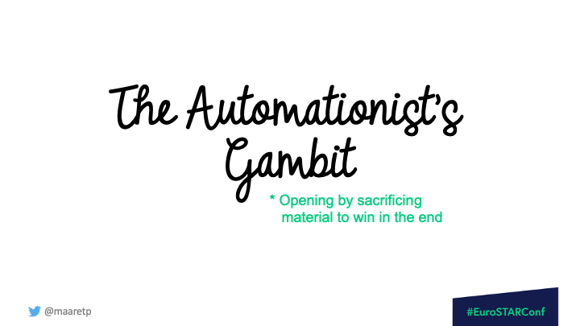

My interest in chess is superficial. My interest is in exploratory testing. And with the conference season at its peak, my timeline was also showing anti-automation takes from prominent people in testing. Talking about a dichotomy of exploratory testing and automation *is* anti-automation. Because really, the only reason these two are ever considered separate is skill - or the lack of it. Skill in testing, for the programmers. Skill in programming, for the non-programmers. Skill limits which openings for the collaborative game of testing you have available to you.

So I want to call for a new opening move for exploratory testing: **the automationist's gambit**. Learn every day about both testing and programming, and treat them as mutually supportive activities embedded in the same, growing individual - no matter how many testing years they have under their belt.

## Agency is the thing we are protecting

In exploratory testing we intertwine test design and test execution. We learn between tests in a way that changes the next test we perform, so that our testing becomes more impactful. That learning requires agency: a human connection between the two tasks, with the power to make decisions in the moment. If you split design and execution into two people's heads, you rely on extraordinary levels of collaboration to put the learning back together, and I find those levels are rare.

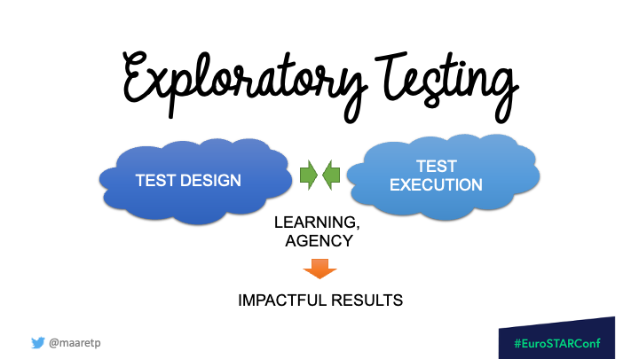

People accept that we can't split design and execution. Then they turn around and try to split the same work along a different seam - manual versus automated - as if that one were fine. It isn't. If you separate the manual and the automated, you remove agency from whoever is doing the testing, you break the learning between the activities, and it shows up in your results.

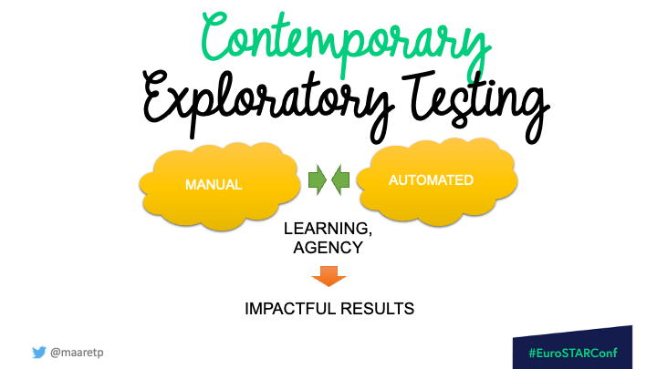

I call the version where we keep all of this together **contemporary exploratory testing**. The automationist's gambit is how you open that game.

## You can't automate well without exploring. You can't explore well without automating.

**You can't automate well without exploring.** While you create that code, you look at what goes on around you, you acquire understanding, and you report the things you consider wrong. Writing the automation is itself an act of testing.

**You can't explore well without automating.** If you don't have automation to document with, to extend your reach with, and then to throw away so that you don't have to maintain it, your reach is limited to what you can hold in your hands and your head at one time.

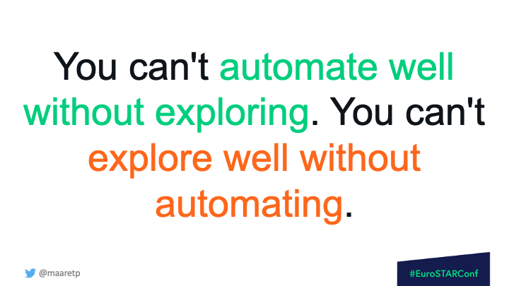

A failing test is an invitation to explore. Exploring gives you ideas of what to document in your automation, or where to reach that you could not reach by hand. Automation is a magnifying glass for the details you need to check to know what actually works and what only appears to work. Automation is the spider's web: it calls you in to see what it caught this time.

## The sacrifice

A gambit is an opening with the *appearance* of a sacrifice. In the automationist's gambit, the thing you give up is your need to warn people that automation isn't all-encompassing. Trust me: the managers already know. Presenting yourself as the anti-automation person does not help them and it does not help you. Time spent warning about test automation is time spent away from succeeding with it - that is the opportunity cost.

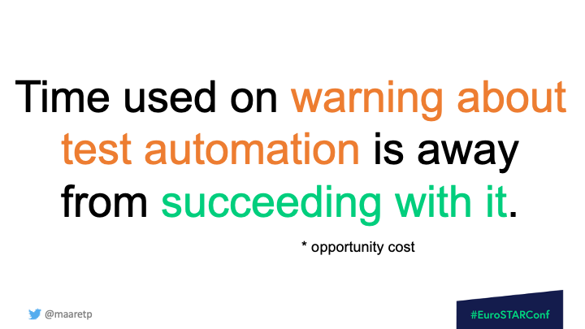

Software testing framed as a game is not a game where you beat your opponent. You win on results, together. The product - not the programmer - is the "opponent". Automation might not test everything and still be very valuable. It can be imperfect at the start. You begin small, you learn the basics, and you improve it every day.

## An example: testing E-Primer

Let me make this concrete. E-Primer is a small web app from the Exploratory Testing Academy that counts words in a piece of text and flags the ones that are discouraged in E-Prime writing - the forms of the verb "to be". I picked it because it is small enough to hold in one talk and real enough to bite back.

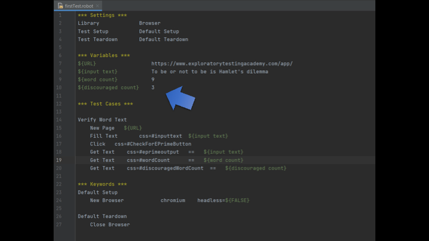

I drove it with Robot Framework and the Browser library, and I did it as a sequence of small steps, each one changing what I could see next:

- a single line that just opens the page and fails, so I see it fail
- a first real test that fills the text box, clicks, and reads back the outputs
- the same test with variables pulled out
- the same test again as a template, so one test becomes many rows of data
- a failing test that pins a bug I already found
- turning the app's own specified examples into tests
- guessing the values that are *likely* to fail rather than the tidy ones
- running across multiple browsers
- making it run in CI
- and then asking: is this automation worth keeping, or is it throwaway?

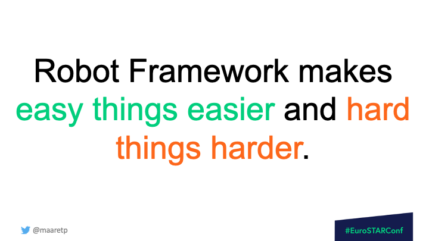

The bugs came out of that process, not out of a plan written in advance. Some of the app's own specified examples were not recognized correctly. Newlines, en-dashes and ellipsis characters threw off the word count. The text box resize was broken - that one was my bad, I had introduced it. And the browser automation tool itself crashed the browser when the input reached 32k+1 characters with spaces. I was not there to test the tool, and I was testing the tool anyway, because we are always testing everything around us.

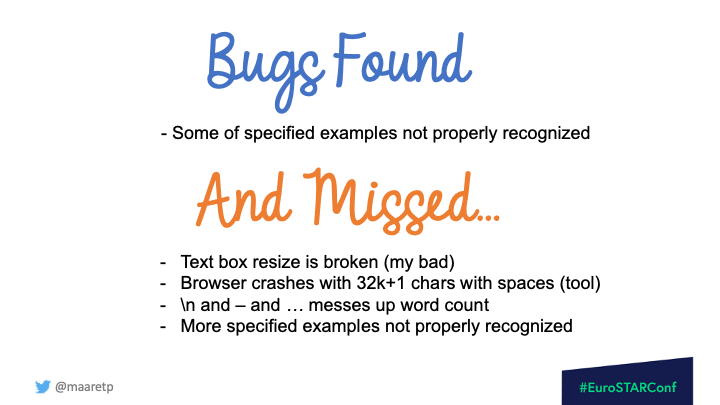

## Moving focus, and where the exploration lives

Automation in the frame of exploratory testing moves between attended and unattended work. Sometimes I sit with it. Sometimes I leave it running overnight and come back to analyze what it produced. Both directions lead to learning; the arrows point both ways.

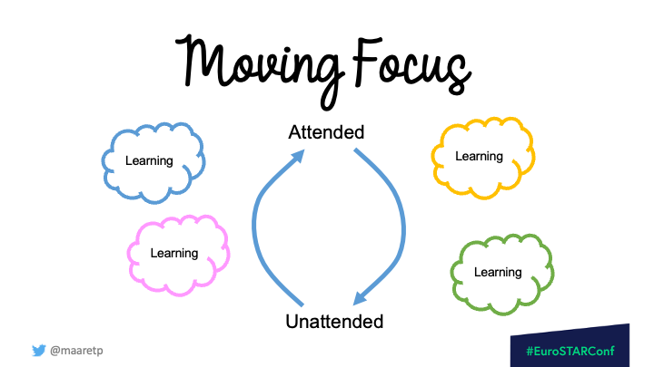

This also changes the picture people carry of the testing pyramid. The old picture puts a small cloud of "exploratory testing" as a sprinkle on top of the UI layer. The contemporary picture runs exploration down the whole side of the pyramid - unit, service and UI - because that is where the bugs are and that is where the learning is.

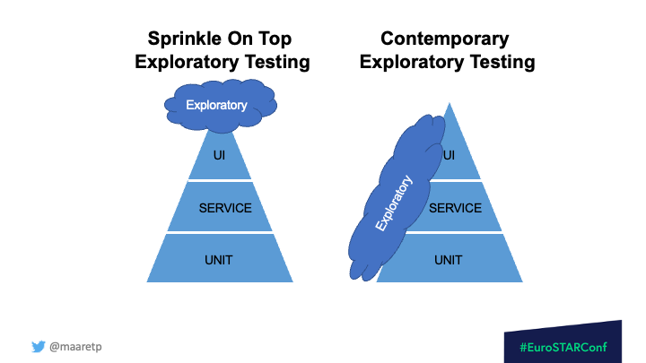

## Building the skill, together

The skills the future of the testing craft requires have already shifted. Good testing now includes exploring with automation as well as without, intertwined. So the question to ask yourself and your team is a short one: can you test, can you code, can you collaborate, can you ideate, can you learn?

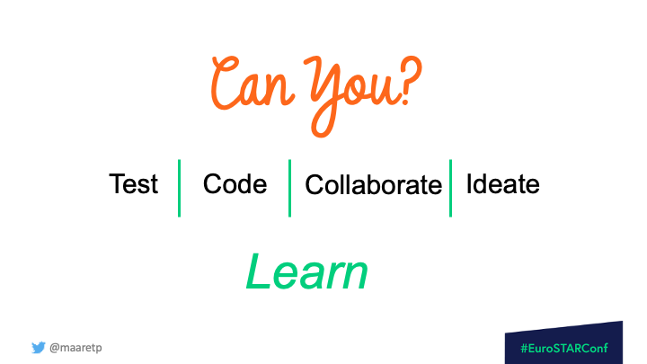

Exploring without programming is common, and it is not the only way. So I offer you the automationist's gambit as an option to consider. Test automation makes you a stronger explorer. It is available to people just starting their careers just as much as it is to seasoned professionals. Try spending the anti-automation energy on learning the skill you are missing, and see whether useful automation has a better chance of emerging. It has for me.

Doing is one thing. Doing together is another. I am all for the collaboration skill that lets us perform the automationist's gambit as a pair - stronger than either of us could be alone.

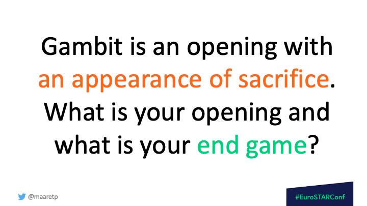

A gambit is an opening with the appearance of a sacrifice. What is your opening, and what is your end game - for testing a product, and for building a career with testing at its center?

I'm happy to connect on LinkedIn and I write my notes publicly. Come and talk to me about the openings you are trying.
