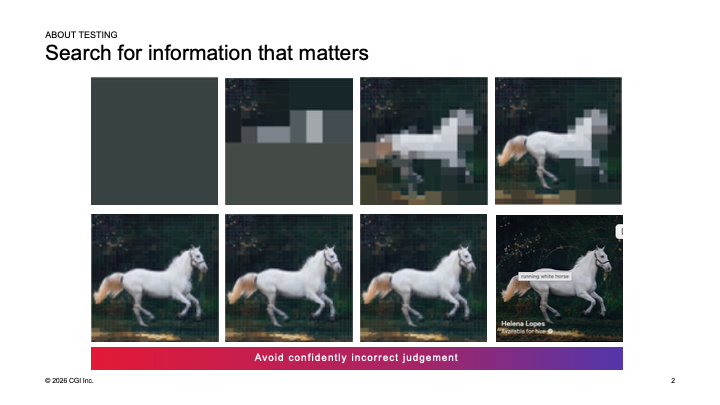
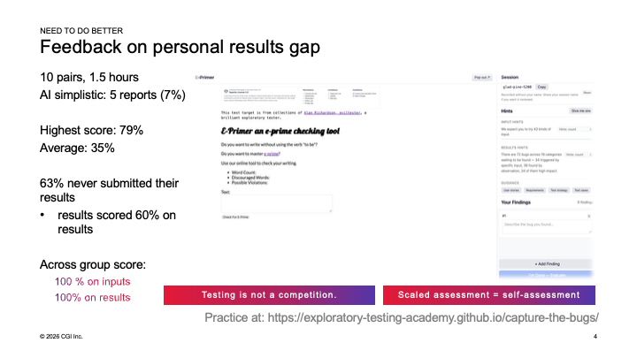
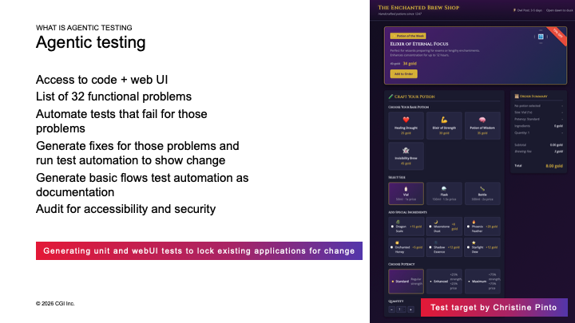
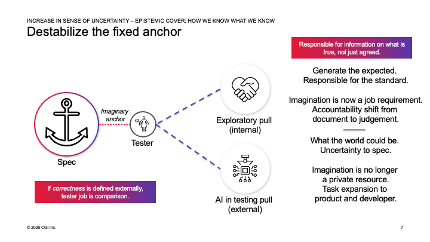
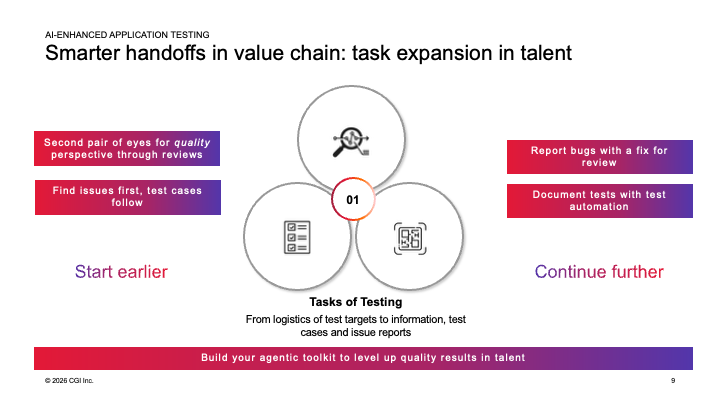
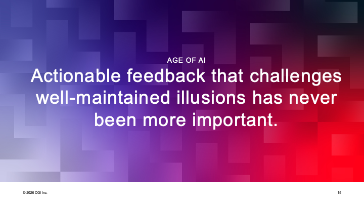

# Exploratory Testing Reimagined
### Task expansion in talent

*Presented: PractiTest Webinar, September 24th 2026*
*Keywords: exploratorytesting, agentictesting, ai, testautomation, contemporaryexploratorytesting, taskexpansion*

I called this talk *exploratory testing reimagined* because I used to call the understanding I was building *contemporary*. There was clearly an old-fashioned way of looking at exploratory testing, and "contemporary" was my word for the alternative. But even contemporary started feeling outdated. I keep having to update the number, too - I used to say exploratory testing turned 35; checking the dates again, it is now past 40. I have been trying to figure it out for pretty much my entire career, which is about 30 years, and I still find that most of us don't quite agree on what we mean when we talk about testing.

If you look at things today, exploratory testing in the age of AI is more important than it has ever been, and it is no longer a technique you lay on top of everything else, or one that only testers apply. It is the central concept for how we look at things when we are building software with the help of AI - now that we are handing some control to something else, a machine of sorts, we are actually required to explore more, not less. This is not a tester thing anymore. It is something for everyone, and for testers specifically, it is an expansion of talent.

So let me set a baseline on what testing actually is. I think of it as search for information that matters, and all testing by its nature is exploratory - we look at a system and search for whatever we don't yet know, whether that's because we changed something and broke what we knew yesterday, or because we're building something unique and never knew it in the first place. This exercise is called raster reveal, by Work Room Productions - James Lindsay, by his real name. You start with a picture that looks almost solid dark grey, and scratching it open, tile by tile, is testing.

I chose my test strategy deliberately here: scratch the top-left corner hard. I did a lot of testing there and learned almost nothing about the rest of the picture - which is exactly what happens when we choose where to focus and don't share the attention around. Along the way I could tell you there's a dog in the picture. I could claim it's a white minivan, and honestly, based on what little I'd revealed, you'd have no way to know I was wrong. Reveal a bit more and you'd start suspecting it isn't a minivan - probably an animal, maybe four legs. I could call it done right there and say it's a unicorn. That would be bad testing, but it would still be testing, because I could always choose to reveal more. Only once I get to the original source - titled, it turns out, "running white horse" - do I know for certain those are ears, not a horn. If the specification gives us ideas about what something is supposed to be, we jump to conclusions. All testing is framed around exploring because we need to avoid being confidently incorrect in our judgment. It's very easy to be wrong that way.

I've been benchmarking what this actually looks like, not on pictures of horses but on real applications. There's a to-do list app - a group of developers built it as a front-end showcase, their best work against commonly agreed specifications, implemented some twenty or thirty different times across frameworks and languages. Between the versions, the highest number of bugs anyone has ever found in it is 73 - that's the ceiling I score everyone against. As an exploratory tester, on my own, I found 62% of those. When I added AI and guided it, in a separate session, I got to 55% - a bit less, not more. I had 57 colleagues from the community do the same exercise: they found on average 13 and a half, 18%. Playwright agents testing on their own found 16%, just barely under that. New people coming into the industry - future talent - scored close to the same, a strikingly small difference given there's twenty years of experience between them and the community average. And the simplest version, AI alone with no particular instructions, found four problems: 5%.

What I take from that: we don't usually test as well as we think we do. We call ourselves testers or QA, but we're so focused on test cases or requirements that if nobody handed us the right answer - didn't already tell us it's a horse and not a unicorn - we often can't reveal it ourselves. Things are written in invisible ink, and it's our job, whatever role we're exploring from, to make that invisible ink visible. Most applications don't come with a list of 73 known problems to compare against. We usually only learn from production, over months or years, whether we tested well enough.

I've also been trying to scale this from me teaching a handful of people at a time to something people can try themselves - a small practice application, still with a real domain to reason about, at exploratory-testing-academy.github.io/capture-the-bugs. It carries 72 bugs I know of, across 19 categories, but only 24 of them I actually consider relevant - there's a lot of noise in there on purpose, because having many problems to find makes finding the right ones harder, and you can't see everything until you've fixed some of what's already broken.

In my most recent run of it, ten pairs of developers - not testers - worked on it. When we prompted AI together to report the problems, it found five things: 7%. The highest-scoring pair reached 79% of the known problems. The average was 35%, which is already higher than testers manage without AI. The strange part: 63% of the pairs never even submitted their results - though since I can see what they wrote in the app itself, I know that if I'd collected and submitted it for them, they'd have scored 60%. There's a weird discomfort around being judged that gets in the way of people sharing what they actually found. But looking at the whole group - ten pairs, twenty people - together they found 100% of the inputs and 100% of the results, with AI and their own exploring. No single pair got there alone. Testing isn't a competition, and bringing in new perspectives means people start scratching from a different corner than you would have. At scale, the assessment that actually works is self-assessment against a known baseline, not a competition against each other.

I've worked in this style for basically my whole career - my first job, 29 years ago, already had a concept of undirected, ad hoc testing that gave me the freedom to find information rather than follow a script. Here's what that has grown into. A requirement specification, if we have one, shapes what we see - and we can choose to read it on day one or hold off until day three; both are valid choices with different consequences. Test cases, the way I work, are primarily captured programmatically as test automation, and they are an *output* of exploring, not an input to it - that's actually how automation gets created, by looking at the application and figuring out what you'd like to be able to repeat. I rarely write manual test cases; I've managed to avoid it for more than twenty years, and if I ever do, it's more likely I'll have AI generate something and then not use it directly, just as notes covering the ideas I want to keep. My testing doesn't end with a report and a retest - it expands into debugging and repairing, and exploring around whatever the fix needs. My working agreements usually mean I pair with developers and explore at the unit testing level, because by some research, 87% of production problems that escape to production can actually be reproduced with a unit test. If we explored better there, we'd have had the chance to catch most of what currently escapes all the way out. And AI, for me, is external imagination that raises the bar - not a replacement for exploring, but a way to reach further with it.

When I teach, I use applications like this one - built by Christine Pinto, an AI-enabled test target with bugs deliberately vibe-coded in. On this one we found 32 functional problems, and ended up fixing all of them while testing, adding both unit-level and end-to-end automation along the way. That's the shape I'd expect this kind of work to take now.

The thing that's hardest to talk about, when I work with people moving toward this reimagined, contemporary exploratory testing, is the past experience of feeling like there was an anchor - and whether I'm the one stealing it away, through an internal pull from the testing community insisting we see more of what matters, or whether it's AI, right now, pulling everyone into more unknown territory from the outside. I think that anchor was always imaginary. It was never really there. But I have a lot of colleagues who tell me it didn't *feel* imaginary, because they could always say someone else hadn't specified how things were supposed to be done. Correctness was never really defined externally. If it was, your job was comparison. Your job is actually judgment - applying it on behalf of the people you're building for. On the exploring side, you generate the expected outcome yourself and ask whether it's reasonable. Imagination is a job requirement now, especially in the age of AI - you're not just comparing against what someone told you was intended, you're deciding what the actual result should be. And on the AI side, the spec itself gets more uncertain - parts of it are now generated - and imagination stops being a private resource. It's something you share with your team, with the people building the system alongside you. The tasks are expanding, to the product side and to the developer's side too.

My colleague Aryadevi Neelakantabhattathiri put words to what this broke open for her, doing vibe coding and then testing what got vibe-coded. The spec lives in your head, and it's treated as some kind of authoritative source, when it's really no more complete than whatever you happened to type. The code can look right - clean, technically sound - and still be wrong from a perspective you didn't check, and that's hard to verify when you didn't write it yourself. The finish line you used to have for validation is something you now have to set and agree with your team, because it no longer arrives on its own. And you end up simultaneously very close to the work and very far from it at once, which means you need a wider mix of techniques than either role alone used to require.

Here's what changes in practice once that anchor is gone. On one side, you start earlier - not shift-left in the old project-planning sense, but human-in-the-loop, continuously earlier, showing up for conversations you'd never have joined before hands-on testing began. I absolutely love visual code reviews: ask AI for what it thinks the risks are, ask for a visual, and you'll see things you were never going to catch by reading the code yourself. And instead of asking for test cases you'll later execute, just ask for the results, ask for the bug reports directly - think of test cases as an output for the *next* round of testing, not an input to the first one. On the other side, you continue further: report bugs with a pull request attached, actually fix things, and document the tests as automation, so the next person can build on what you already found rather than starting over.

Concretely, here's how I use AI while exploring. Ask it to report bugs, not to generate test cases you'll run yourself - and if you have access to the code, ask it to generate fixes too. A basic trick: if a simple prompt only surfaces a handful of problems, tell it there are more - insisting there's more information is a genuinely good way to prompt for exploratory purposes, though it still needs eyes on the actual application to confirm what it finds. We share a lot of .md files across teams now - skills files, agent files, reusable instructions - and I call those agentic information slices; talk to your colleagues and share what worked for you rather than keeping it to yourself. Take your notes and have AI ingest them into a wiki, so you get a second brain - a visual record of what you've been paying attention to, that grows more useful the longer you keep it. Fix bugs instead of only reporting them. Ask for visuals - you see things in a diagram you'd never catch reading text. And when test automation does need to get built, treat it as documentation, and as a way of fast-forwarding yourself to whatever state you actually want to explore from next.

These aren't separate from exploratory testing - they're techniques within it, the same way everyone develops their own way of slicing quality work. We've been publishing some of our slices, particularly around security and accessibility, upskilling across a larger organization on those. One of the things we learned doing that: we stopped wanting to call it testing at all. We call it software intelligence instead. Sharing that - common context, talking to colleagues, not just to the AI chatbot - turns out to be essential.

When I talk about this, I mean pairing with a real human, or ensembling a third entity into that pair - which could be the agent you've brought along. Agents aren't really thinking; they're putting things together in a reasonable way through calls back and forth. But having a real human in that mix generates ideas about where to scratch the picture that you'd never have reached on your own. Learning how the agents are actually built, and sharing that context with your team, is the essential foundation underneath all of this.

I wanted to close on this: I hate the idea that agents push us toward working more solo. Working solo, we all have blind spots - good areas of knowledge and bad ones, and we usually only discover the bad ones on the results side, too late. If agents can help level some of that up, and we still bring in an actual other human with an entirely different background and attention, we raise the overall level of the work that comes out. Now that AI is making guidance and assessment an everyday thing, don't do those assessments alone - pair up, team up. You might end up juggling an ensemble of two people and twenty agents; that's fine, that's the shape of it now. You want to get the best out of everyone, agents included, into the work you're actually doing.

So, in this age of AI, with all the slicing and the techniques and the juggling, deciding where to scratch first and how to keep scratching because there's always more in the picture - actionable feedback that challenges the well-maintained illusions that get born so easily has never been more important. And it isn't only testers' work anymore. It's everyone on the software team facing that same challenge.

Someone in the audience asked how BDD or ATDD fits into this new era - whether I'm guiding development with examples. I never leaned on it that heavily even before AI; I ran experiments trying to drive things through to code with examples and found the conversation around the examples more valuable than the artifact itself. I still think that style of documentation should keep growing alongside AI-oriented development, but I haven't found much success feeding examples straight into generation - there's a human aspect to it AI still isn't quite doing the same way. Another question, about what role the spec plays once AI is inferring its own model of behavior: write it down, agree on it, it's genuinely good practice - but once you're actually exploring the running application, you build a different model than the one on paper, and reconciling the two, with AI helping you fast-forward through the comparison, is exploring too.

This was a PractiTest webinar - thank you to Noah and the team for hosting, and to everyone who showed up with questions. I'm a director in testing services at CGI these days, thirty years into a career I still haven't managed to get bored in. Reach out on LinkedIn or Mastodon if you want to talk through where your own task list is expanding; I'd like to hear what it looks like from where you sit.
