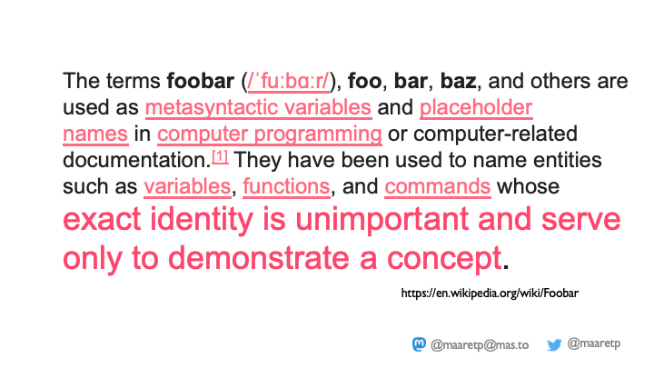
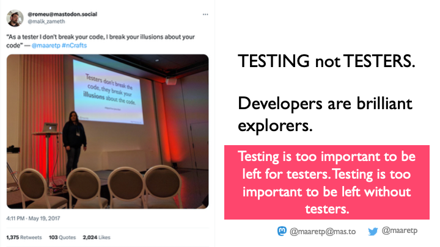
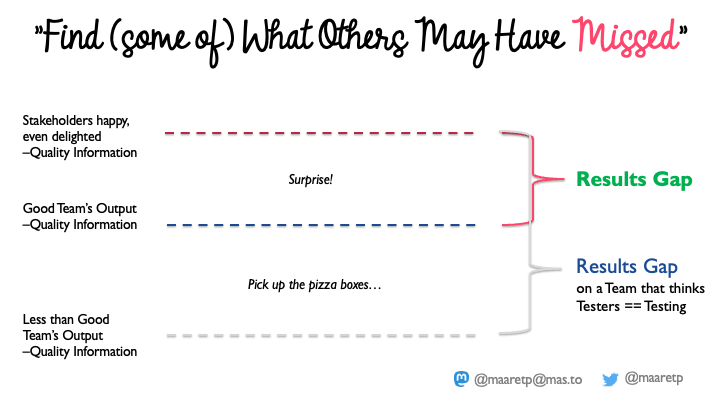
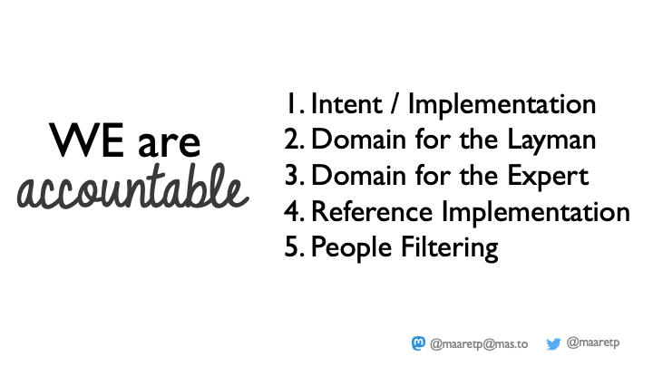
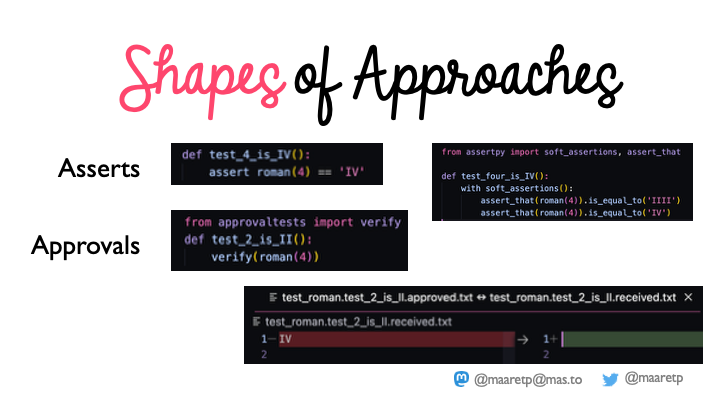
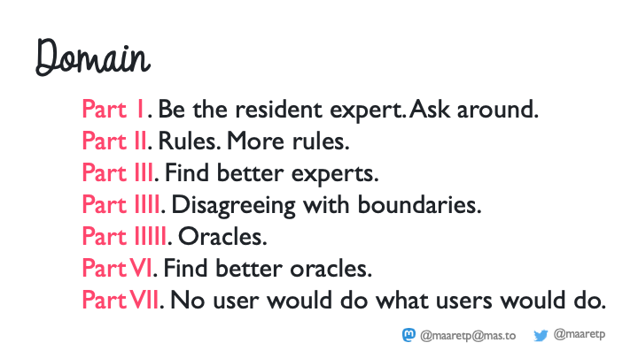
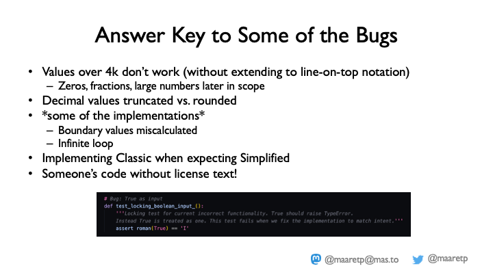
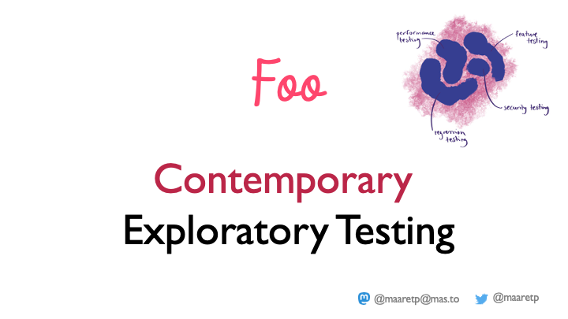
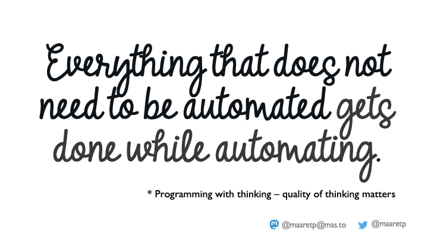
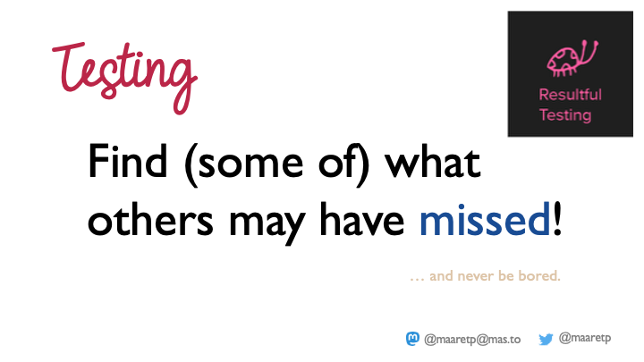

# Let's Do a Thing and Call It Foo

*Presented: NewCrafts 2023, Paris*
*Keywords: exploratorytesting, unittesting, oracles, githubcopilot, contemporaryexploratorytesting*

We are going to talk about Foo. But we're only going to talk about Foo because what I really want to talk about is testing.

I have been doing testing for 25 years. Right now I am also a manager of about 26 people. I didn't want to be a manager, and I still do the exact same things I did as a tester - I test, and I care about the bugs in the organization the same way I cared about bugs in the product before. I am a tester even when I am a manager, even when I am sometimes a developer, even when I am sometimes a business analyst.

And I find it genuinely difficult to talk about the thing I care about, because the whole field is filled with belittling, demeaning words that get in the way. Unit testing, exploratory testing, manual testing, automated testing - spoken as if they were different things. They are not different things. So instead of arguing about words, I want to give you an example.

## Why "Foo"

The example was inspired by a job interview. I was unhappy in my organization last autumn, so I went to an interview. They had me pair program with one of their developers on a little kata. During the session I taught the developer several things they did not know about their own exercise. They offered me a job. I refused - because there is no place for that kind of judgment in pairing, and I felt it in the room.

You can change things by talking about them, you can change them by your behavior, and sometimes you only find out what you were doing after you have done it and you go looking for words to describe it.

Most of you have heard the idea: if you don't know what to call the thing you are creating right now, just call it Foo. Call it anything - but call it something you hate so much that you'll want to replace it with something better. I don't like the word Foo. I think it is a bad name and I would hate to find it in my codebase. But I have written it down many times, and so have you. The point isn't the word. The point is that we don't really understand what we are doing, or what we should call it, until we have seen it in action - and that it is fine to rename it once we have a better name.

## Testing, not testers

I am always talking about testing, not only about testers. I have had many lovely developer colleagues over 25 years, and essentially all of them have been good at testing. The only times they were bad at testing were when someone told them they were too valuable and too important to spend time caring about quality.

The nagging job in my head, whatever my title, is to **find something that others may have missed**. Nobody hands me test cases, so I am not doing manual testing - and honestly, manual testing in the sense people mean it, "writing and following scripted steps and being bored", is work I have never done, not for a day. My task has been to close the gap between what a team produced and the quality we would actually be happy with.

When the team is good, closing that gap is pure joy: I say I found something interesting, and half an hour later someone is back with a test that reproduces it and a pull request that fixes it. When the team is less good, the same work can feel like picking up pizza boxes off a kids' living-room floor - "you said pepperoni, you didn't say the minced-meat one" - and those teams need someone to work with them and grow them through feedback. Same processes, different practice.

## A small example: Roman numerals

The job interview gave me Roman numerals - a kata half of any crafting audience has done. I know how to build it in TDD with my eyes closed. But I didn't want the TDD version. I wanted the "let's find something others may have missed" version.

My pair for this is GitHub Copilot. I write a comment, it guesses an implementation - it starts guessing from the moment I type `# converts numbers to roman numerals`, the same way a human pair guesses from your feedback and their own experience. I have the power to accept, and the power to start fighting with my pair.

A couple of asides from doing this talk for a year and a half. Copilot never guesses a woman's name when it fills in the author line - not once, across all the names I've collected. And I can't write code at all unless I'm in the mood, which for me means the Mermaid color theme and little stars twinkling in the editor. If you need the extra Foo, try it.

I don't want to test Copilot. My organization does not pay me to test our tools; they pay someone else for that. (Although as a manager I *am* in the position of deciding whether my team may use it - and I have told the directors that unless we find an ethical way to give back to the communities whose code trained it, I am not comfortable. It may be legal; it is not obviously ethical.) So I step back, note that I am always testing the tool anyway, and get on with getting a working Roman numerals implementation.

If I press Ctrl+Enter, Copilot gives me ten alternatives. I can review them, take the first, take the last, take a deliberately bad one because it will give me more to test. But I have a dual purpose. I have never wanted to *just* test - I want the working solution. Testing moves along with the thing we are actually trying to build. I don't set fires just to count them.

## Five layers of oracles

To be accountable for testing this, there is a minimal set of things to go through. In this version of the talk it grew to six.

**1. Developer intent, versus implementation.** Say we have a basic implementation with value errors and type errors handled and all the letters defined. Does it work? Are we done? It is hard to see the problems without seeing examples of execution. So we create tests - and there are shapes to choose from:

- asserts, collecting handpicked examples
- parametrized tests, many examples at once
- approval tests, where you don't decide the expected output in advance - you run it, look at the output, and approve it, and a later change to that output is treated as a signal
- property-based tests such as Hypothesis: describe a rule that must hold across generated inputs - for instance, "given enough numbers as input, every letter should eventually appear"

Am I automating or doing manual testing here? I am doing a lot of thinking. I call it manual testing, because this is exactly the work I have always done. Under developer intent I would also review for correctness and conciseness, work input to output, probe the rules at behavior boundaries, look at coverage, weigh sampling against wide nets, and check properties. Do all six passing tests now tell us the software works? Did you see a bug yet? Usually: no visibility.

**2. Domain, for the layman.** Nothing on that developer-intent slide is *wrong*. There are just three different domains hiding on it. On a clock tower, four is `IIII`, not `IV` - on a luxury clock you are expected to see `IIII`. If nobody asked "are we building this for a luxury clock?", you may have built the wrong thing. And `IIIII` for five? That is the tombstone domain, where fifty is `XXXXX`.

**3. Domain, for the expert.** As a tester I go looking for an authoritative source. My product owner is not it - he is as human and as wrong as the rest of us, and arguing with him kindly is part of my job description. I found a good Roman numerals reference site and, reading the specification, learned that 4999 is not the maximum. It is just where we always end our katas because it is simpler. Above that you need a bar-over-the-letter notation (or parentheses if you have no font for it), and the references tell you how. We are still working the small kata and already reaching past the end criteria we always stop at.

**4. Reference implementation.** There are programmatically accessible oracles to compare against - a browser page, and Excel. My laziness is well played when I can walk every number through a generated file and do the looking there. I like Playwright for driving the web these days; I also like Selenium, and I sit on the Selenium project leadership committee, so showing you Playwright on stage is me doing a bad job of promoting Selenium - but you can do these simple things with either. It is not a tool problem we are solving. Excel, by the way, introduces *five* kinds of Roman numerals. Nobody asked me whether I wanted classic or simplified. Since you didn't ask, I would now like the better one, at the same fixed price.

I generate the references with a little Playwright and whatever Excel library I found first while googling - `xls`, not the more modern `xlsx`, because there was an easier sample and I did not care about the perfect implementation. I cared about the perfect information. I usually use approval tests for this comparison style: generate into files, compare files, get fast feedback instead of waiting 5-20 minutes to regenerate every number. These are not optimized for speed and I would not keep them in CI. They taught me something now, and not all tests are meant to be kept forever.

**5. People filtering.** Testers by profession tend to start here; developers tend to want to finish here. Whatever Copilot proposed, we will want to do something deliberate with the inputs and the error messages.

**6. Interesting side effects.** On the flight over I was reading Sarah Drasner's *Engineering Management for the Rest of Us*, which opens with a very developer-flavored line: "People are not pure functions; they have all sorts of interesting side effects." Neither are pure functions, if you grow the boundary of what might fail - we have had planes crash because of entertainment systems. The environment is a domain too: dependencies, interruptions in software and hardware, and people.

## We are accountable

With Copilot-style tools writing more of the code, we are more accountable than ever for asking these questions - and we have to craft new questions each time, appropriate to that context and those people. There is nothing I think of as more of a worst practice than forcing a team to sit for half an hour writing down acceptance criteria everyone already agreed on, just because someone decided the artifact must exist. Everything is something we can question. It may be useful now; it may also be something to look at later.

The bugs are there - values above 4000 that don't work without the extended notation, boundary values miscalculated, an infinite loop, a Classic implementation where Simplified was expected, someone's code pasted in without its license. I care less about listing them today than about what we just did.

## Foo is contemporary exploratory testing

We have been doing Foo. Foo looks different on different applications, codebases, languages and people. I call it **contemporary exploratory testing**.

It is founded on the exploratory testing mindset I have held for 25 years, but it is contemporary because it is not "manual" - I was hand-crafting code, and you would probably call that automation. I just choose to call it manual. A majority of the bugs we can find at the unit-testing level; where we don't, we are not trying hard enough at collaboration, and we need to try harder. We want the traditional artifact-driven styles and the in-the-moment performance style, at every level and layer, looking at different people's intent - and not only intent, but impact.

I believe now that everything that does not need to be automated can get done *while* automating - programming with thinking, where the quality of thinking matters. But when you hire a promising new tester, if you make them learn automation first, you make them a junior programmer. They could be a brilliant tester in half a year if they were allowed to focus on the information first. In 25 years they will have time to learn programming - it comes later. Give them a chance to learn the one thing your team needs right now.

So that is the call to action: go back to your work and find something that others may have missed. It is not testers, it is testing, and it is all of us.

The solution sample for this exercise - Roman numerals, exploratory unit testing, the whole checklist - is on GitHub: [exploratory-testing-academy/do-a-thing-and-call-it-foo-solution](https://github.com/exploratory-testing-academy/do-a-thing-and-call-it-foo-solution). Thank you to everyone who has paired and ensembled through it with me.
