# A Practitioner's Guide to Contemporary Exploratory Testing

*Published: Aug 30th 2026*
*Keywords: exploratorytesting, contemporaryexploratorytesting, testautomation, wholeteam

This is a write-up of a keynote I delivered at Axiom Summit in 2022. It is one of my favourite deliveries of the material I have grown around contemporary exploratory testing, and turning it into an article lets the words live on even after the recording is buried somewhere on YouTube.

I have been doing exploratory testing pretty much my entire career. Twenty-five years ago, in my first job as a tester, I was given test cases. But those test cases were not the only thing I was given. I was also given a very flexible budget and an assignment: go find any of the bugs that matter, anything you can find, please raise it, and let's have a conversation about it. From that point on, no matter what instruction someone else wrote down for me, providing those results was always my responsibility.

Working through various companies over these years, I keep noticing that we have conversations about exploratory testing as something we add on top of everything else. For me it was something completely different. In this talk I want to give you the ideas that led me to think of it as a separate thing, the changes that thinking is enabling in my current organization now that we frame testing more widely in these terms, and the results we are seeing.

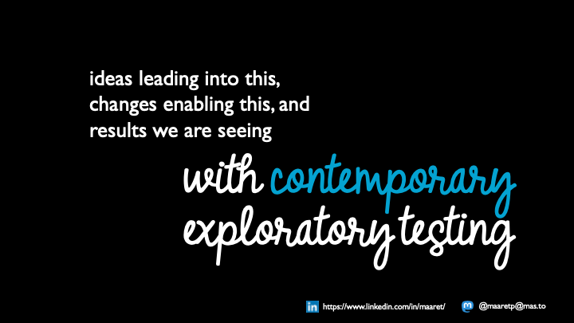

So there are three threads here, and I will weave between them. The ideas that lead into contemporary exploratory testing. The changes in practice that it enables once a team accepts the framing. And the results, because none of this is worth doing if the testing does not come out better at the other end.

The word *contemporary* in the title is doing real work. I added it on purpose, and by the end of this you should know why.

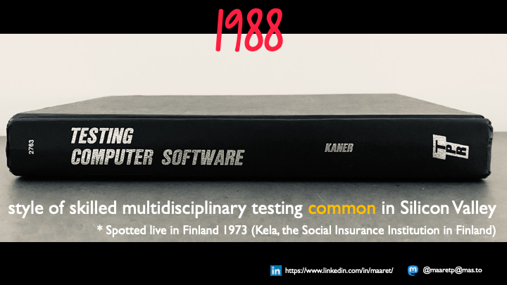

I do not want to give you a long history lesson, but I want to remind you where this whole idea started. In 1988, *Testing Computer Software* was published. I never read the first edition; the second edition is the one I started my career with, and I have read that one twenty or thirty times by now. It is a great book about techniques and about thinking in detail about how you approach testing. It is not a book about exploratory testing. It is a book about testing computer software. But somewhere in it, for the very first time, it mentions this concept of exploratory testing, and it introduces it as a style of skilled, multidisciplinary testing that considers legal, financial, business, human and technical aspects all at once, and requires us to go for the results. The book then points out that this style was already common among the Silicon Valley businesses that were making real money with software.

Even back then there was a divide. Product companies did the thing that enabled successful software businesses. Contracting companies produced safe, pre-written, plan-oriented ways of working. We needed a name for the more agile style, well before agile was a thing, and we called it exploratory testing.

I have lived in Finland pretty much my whole life, and I remember meeting a nowadays-retired colleague — a grand old lady of Finnish software from my perspective — who started in software and testing in 1973 at Kela, the Finnish Social Insurance Institution. She said that from the day they founded the first testing unit there, with the first computer available in Finland, they were doing this style of testing. In Finland we never had the extra money to throw at documentation we did not find valuable, or artwork produced just because a process asked for it. Being a small country with limited resources, cost-awareness was something we were more or less born with. So while Cem Kaner introduced the term, this is a very natural way of thinking about testing. And the term matters, because it lets us find other people who think the same way and share a context.

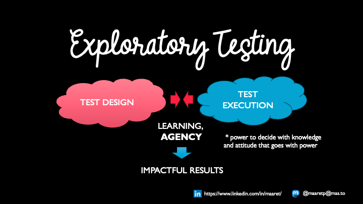

When we started looking, as a community, at what this 1988 thing actually was, meeting in peer conferences and examining our work together, the big realization was this: the essential part of exploratory testing is that we do not separate test design and test execution.

When we keep those two separate — one done six months before the other, or six hours before the other, and in agile the cycles just keep getting shorter — and especially when we separate them by *person*, so that one designer hands test cases to a different executor, we take away the learning that could happen between the two activities. We insert a handoff. We take away agency: the power to decide what to do with what you just learned, and the attitude of responsibility toward impactful results that goes with that power.

Not having that separation is the key to exploratory testing. Turn the camera around and look at all the things we label — security testing, regression testing, performance testing, specific named techniques — and ask where exploratory testing sits among them. For me it is the glue. It is the thing that helps us recognize that all these approaches exist, some of which we already know and some of which we are learning right now in a conference talk, and then works out how each of them could help us produce the results we are expected to produce.

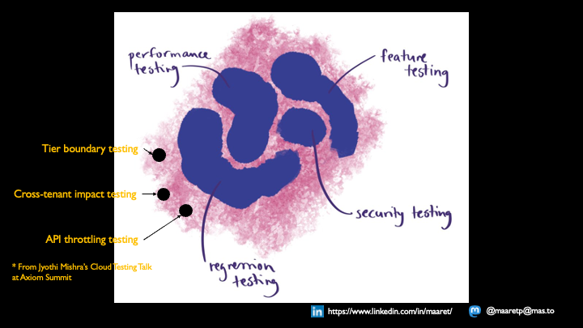

Earlier today Jyothi Mishra gave a cloud testing talk full of specific techniques — tier boundary testing, cross-tenant impact testing, API throttling testing — sitting alongside the more familiar performance, feature, security and regression testing. That is exactly the kind of picture I mean. There is an open-ended, growing set of approaches out there. Exploratory testing is not one more blob in that picture. It is the perspective from which you decide which of those blobs you need for this application, in this business, against these risks, right now.

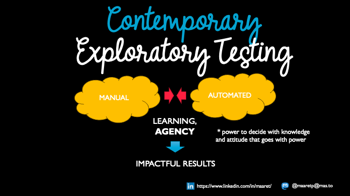

Here is the contemporary part. Looking at teams over the last five years in particular, I have come to see that the same separation we used to make between test design and test execution in 1988 is now happening between *manual testing* and *automated testing* — and for the exact same reasons. We split the work by people. We have exploratory testers who do not automate, and separately we have automation people. And we lose the learning and the agency, because now someone is automating somebody else's test cases without really knowing why they exist.

You cannot write automation without exploring the application. And you cannot do a really good job on the so-called manual side without having automation available to you when you are working in short cycles. So contemporary exploratory testing explicitly includes automation. You might call it automated testing — but automated testing in the same sense that programming an application is: you have to think about what you are building as you build it, you are designing the system as you create it, and some of it you just end up doing by hand because you have not yet gotten around to scripting it. It is the same as any programming-oriented activity we do to create applications.

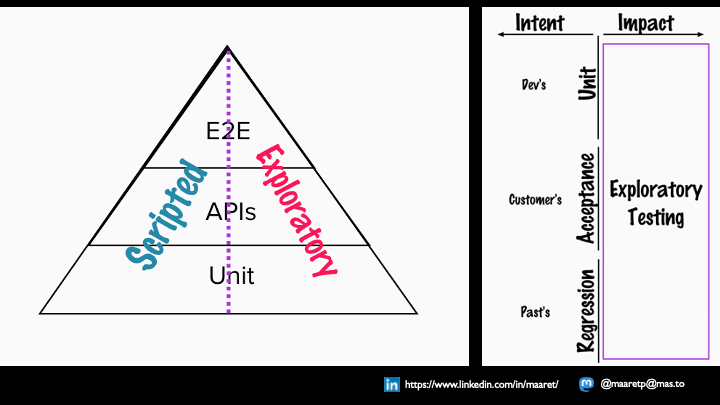

I have been trying to draw pictures of what has to change in how we talk about testing so we can have better conversations about this. The first one is the test automation pyramid. We keep saying there are unit-level scripts, API scripts and end-to-end scripts — but those scripts are created from the exploratory perspective. The first time we run a new API test we make a choice: keep it as written, or refactor it, or change its values so we leave behind a different default than the one our developers first suggested. Getting variety into the data and variety into the actions is driven by the learning perspective, and we do that at every level of the pyramid. Sometimes it even makes sense to automate something and then throw it away.

The second picture is intent versus impact. In the wider world we have learned that it does not matter what you intended if the impact is different; you apologize for the impact you had, not for the intent you did not have. Same thing here. Developers' intent gets documented in unit tests. The customer intent we understand gets documented in acceptance tests. The intentions we used to have are the focus of our regression tests. But whether we were *right* about all of that intent — the impact — is what actually matters, and that is where exploratory testing sits.

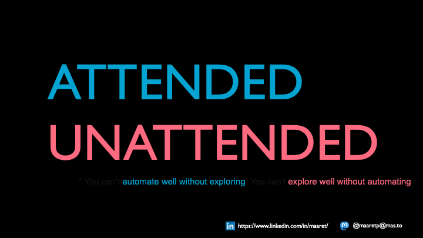

Because of all this I prefer talking about *attended* and *unattended* testing rather than manual and automated. I want a way to test while I am paying attention to something else. I might be building the next unattended test while the tests I built earlier give me useful — not perfect, but useful — results. And I might be *called to attend* because an unattended test failed, like a spiderweb twitching: come here, look at this.

What I do when I get that call is exploratory. Why is this test failing now? Often it is because the software changed in a way nobody remembered to tell me about — one of the golden gems of keeping automation close is that it surfaces the changes people forget to mention. Or it is telling me that an intention we held in the past no longer holds. And whether it is me who gets called or someone else on the team, I love that we can share that knowledge and share the calling-in-to-attend. That is whole-team test automation.

You cannot automate well without exploring. You cannot explore well without automating.

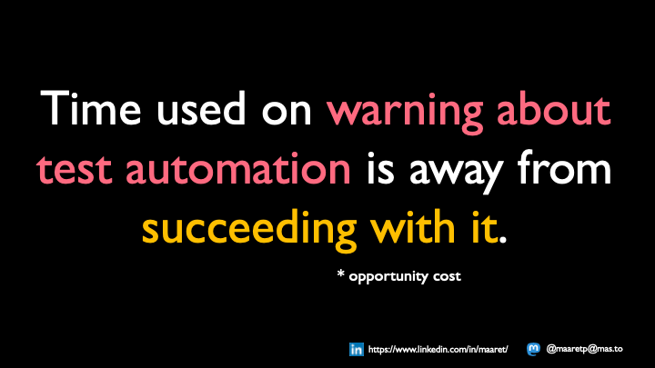

This has also changed how I think about the time we spend. When we keep saying "automation is not perfect," that moment of time is a moment we did not spend on something else. It is worth addressing the fears people have about learning many new things at once. But it is often more useful to remind all of us, myself included, that over twenty-five years I have had a great many days where I could have learned one small thing about automation, and in the last five years I have spent my time a little differently and grown a lot in this area.

Dorothy mentioned today that she can read code but does not really write code. Reading code, noticing a typo in one of the strings, and going in to fix it — that *is* changing code, and it is part of the work the team needs done. So maybe we should spend our time finding the small steps we *can* take rather than dwelling on the steps we cannot take yet. Every new day in your career is a chance to add to the set of steps you are capable of. You do not have to do it all in one go.

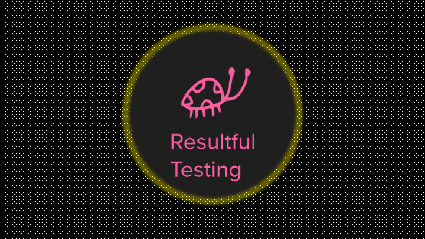

All of this sums up to a single thing I care about: the testing needs to be *resultful*. When I first started using that word, I got corrected on Twitter — *restful* testing is a different thing, and my typo was close enough to be genuinely confusing. I am not talking about APIs. I am talking about the fact that in testing we are given the assignment of finding something others may have missed.

If we had a nice, short, readable list of all the bugs we needed to find, we would not need testing. We do have enormous global catalogues of bug ideas, far more than anyone can read. What we do not have is the short list for *this* application. So our job is to take that invisible answer sheet of bugs and make it visible, in some system, or better yet in test automation that documents the bug so it does not come back. You might choose to fix a bug and capture the situation in automation rather than write up an elaborate separate report. That is a use-of-time choice too.

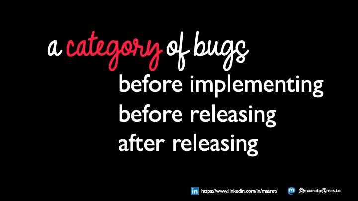

So how does this change practice in the teams I work with? It starts with recognizing that bugs come in categories by *when* we can catch them.

Some we can find before implementing, which means taking our time to read, ask questions and clarify the claims before we start building. Some, no matter our best efforts, escape even our own eyes until we use the application to test the application — the running software as our external imagination, making us more creative about what might still be wrong. My most recent measurement of my own capability, after twenty-five years of practice and my best effort in a BDD style, is roughly 75% found before implementing and 25% still only found by testing.

And that is only the bugs I catch before releasing. I think of every single task we put into production as having a tail: we can go back to production, look at monitoring and telemetry, and turn what we learn into improvement ideas for the next cycle. Any source of valuable information is available to us.

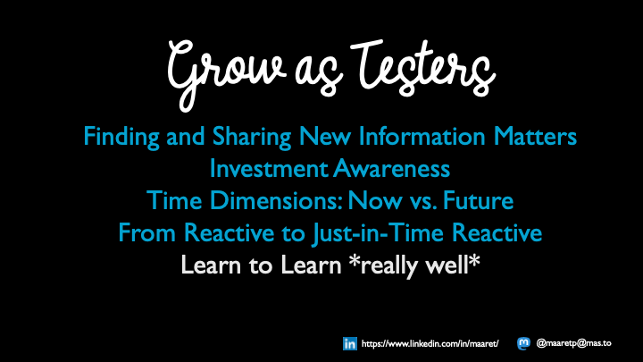

This means we have to grow as testers.

We need to be more aware of what information matters, because not all information is of equal value, and there is a time dimension — some things matter now, some for the future, and we are always balancing across time frames. We need investment awareness: a mind map, test case documentation, better requirements text, more automation — these are all choices about where we invest, and every working day is us investing time in *something*.

I spend a couple of hours most Friday afternoons looking at a white wall, thinking about what might be coming around the corner, what I know now, what I do not know, and how I would find it out. That reflection is how I build the skill of becoming just-in-time reactive — reactive to the point where it can feel almost magical that a test environment is ready exactly when a feature needs it, because someone realized months earlier that the hardware takes a while to arrive. If you do not notice that time dimension, you can end up always looking a little late.

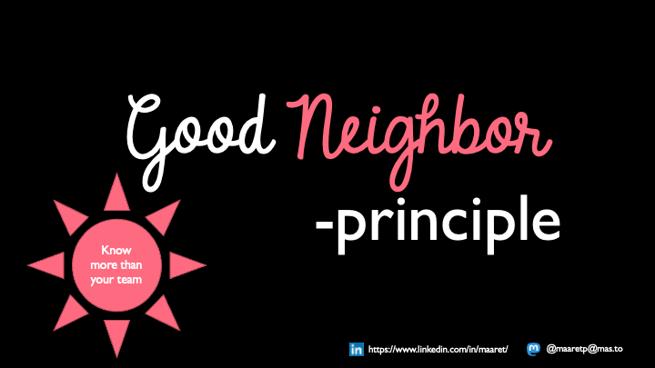

Another thing we need to grow: being better neighbours. In agile teams I often have colleagues who are intensely focused on our own team, but it is rarely just our team building the system. I do not have to do the other teams' work — but testing is frequently where two teams actually come together. Both may work fine in isolation; testing the two neighbours together still has to happen, and it is an easy place to land in disagreements about who should do it.

Just this week I had a conversation where team A built component A, team B built component B, there was an agreement about how A-plus-B testing would be shared between them — and still someone expected a team C, because "end-to-end testing must belong to some other team." Having the good-neighbour conversation proactively saves you from the version where the problem is found by "team C" — which, as I learned on Twitter, is often the customer — and then handed to you as your problem anyway.

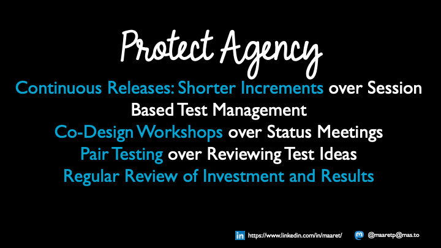

I am in a dual role: a tester, and also a kind of test manager and facilitator of improvement. So here is some of that from the management side, all of it aimed at protecting agency and making space for results.

My main go-to move is to make the releases shorter. It is almost a signature move by now: I join an organization that releases once or twice a year, and I turn it into monthly, then weekly, then daily, and if they let me stay long enough, into releasing whenever something is ready. It works even in hard cases — my previous organization shipped to nearly two million users on their *personal* computers, not a central server, and distributed continuous releases are a different challenge but entirely possible and worthwhile. Smaller changes make it far easier to start from a working baseline, look at what changed, and reason about the testing that change needs.

Instead of status meetings I run sessions where we co-design or co-test; ensemble testing is my absolute go-to. If I am worried about how someone is testing, I would rather pair test with them than review their list of test ideas — though I often let people write their ideas into a mind map first, because different people need different time to get into the right headspace for an activity. And I regularly review the time we spent against the results we got.

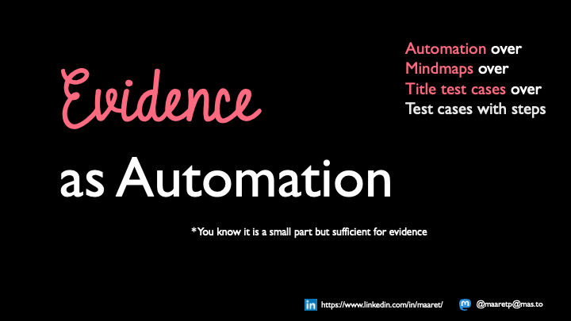

On evidence: my current organization has strong history around tests being documented a particular way. The easy way to change that culture has been to reframe it — whenever we need to document, we can document the evidence *as automation*.

So the ordering I work by: asked to write detailed step-by-step test cases, I would rather write title-level test cases. Rather than title-level test cases, I would rather draw mind maps. And once the team has the capability built up, I would rather build automation over those mind maps almost any day. It is not this-or-that; it is being aware that the group you work with shapes the choice. This also shapes recruiting: new testers who join the projects I work with are writing automation and becoming contemporary exploratory testers from day one.

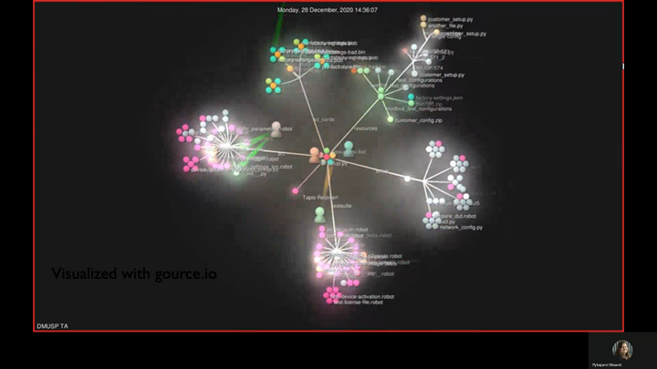

Here is what success looks like to me when automation-as-documentation is the question. This is a gource.io visualization of about a year in a team where test automation used to be the work of one person or a pair of specialists. Every little figure moving around is a team member contributing. It is not that all the work moved into test automation — it is that a lot of work happens there now, spread across many areas, with the structures shifting and growing over time. And because it is there, you can rerun what a colleague tested, and if the documentation is unclear you can still go and ask them, and if that does not resolve it you can change things yourself.

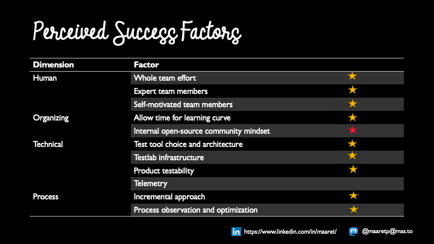

In a research project with my previous employer we tried to name the success factors for this style from the automation perspective, across human, organizing, technical and process dimensions. The stars mark where a factor showed up in my previous project and in my current organization.

There is one — telemetry — that we did with my previous employer and do not do yet in my current work, though I believe that is just a matter of time. The one I want to point at is the internal open-source community mindset. I have managed to move from "testers and automation specialists contribute to automation" to "the whole team contributes." I still need to move from whole-team to *all-neighbours*, and that gets harder as scale grows. I did it with my previous organization across three business lines sharing automation as documentation for one product line. My current organization will need a few more years.

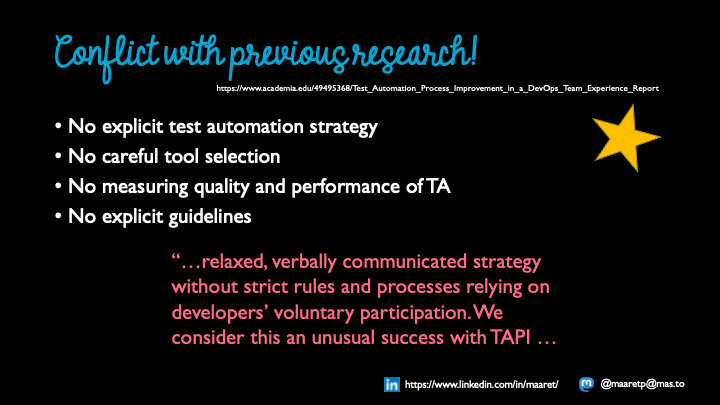

Some of this conflicts with the research literature. In the traditional, plan-driven approach to test automation you would expect an explicit test automation strategy document, careful tool selection, measurement of the quality and performance of the automation, and explicit guidelines. In our experience report, there was no strategy document you could find — we had ideas, we could draw them, and they were roughly the same across people. No careful tool selection: we added tools like Lego bricks and took them away again if we did not like them, because failing toward action beats being stuck in speculation. We were not measuring the quality and performance of the automation; we were measuring the quality and performance of the *product*, and talking openly about how the team felt. The paper calls this "a relaxed, verbally communicated strategy without strict rules and processes, relying on developers' voluntary participation," and considers it an unusual success.

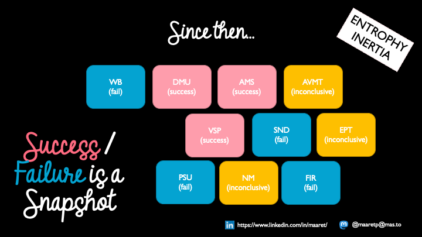

Success and failure is always a snapshot. Two years into my current organization, these are the teams I have worked with. By my own criteria I think I have succeeded with three. Three are on the verge — maybe successful, but I would still question it. And some did not get here yet.

There is a lot of work to do against *entropy* — things get messy if nobody cleans them up — and a lot of work against *inertia* — nothing moves unless someone applies force. You need that mindset in several team members to carry things forward.

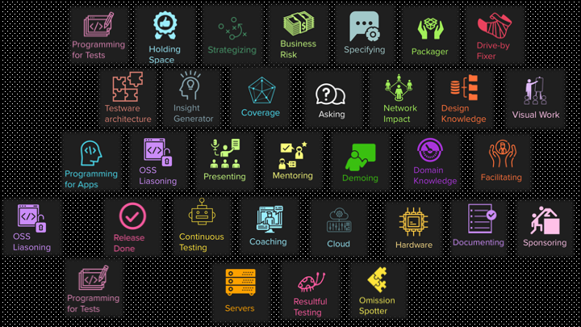

One Friday afternoon, instead of my white wall, I drew these: little badges with names for the different ways people contribute. I have seen people be genuinely, valuably different in this space. Someone is great at strategizing. Someone else always gives the clearest, easiest-to-follow demo, showing the positive side without hiding the risks that need addressing. I do not have all of these skills — I have some — and my appreciation for my colleagues is precisely that they have the others. There is no single profile we are hiring for in a contemporary exploratory tester. It is about bringing something the local team is missing.

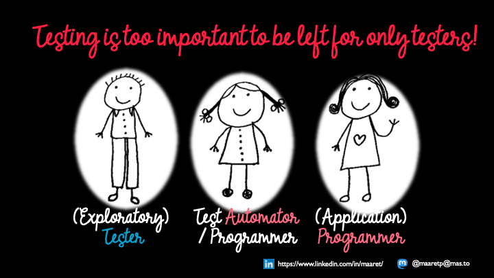

When I talk about this I try not to say "testers" too much. I try to say whole teams, and I try to remember — it is still sometimes hard for me — that in many teams the programmers are the best testers. That does not make the other testers less valuable. There is so much valuable testing work to share that everyone needs to pitch in. Testing is too important to be left for only testers.

I believe very strongly that everyone can test. But getting to *resultful* testing is like saying everyone can sing. Anyone who has been to karaoke — especially in Finland — knows some people are a bit better at it, and a few could be put on a big paid stage. If someone wants to get good at singing, or good at testing, we all have the human foundation to start building the skill, one step at a time.

As long as we remember we are not after just *any* result. Even a broken clock gives you the right time twice a day. As testers we are expected to be more productive and more to the point than that, whatever role we are testing from. So pay attention to your use of time and to your results.

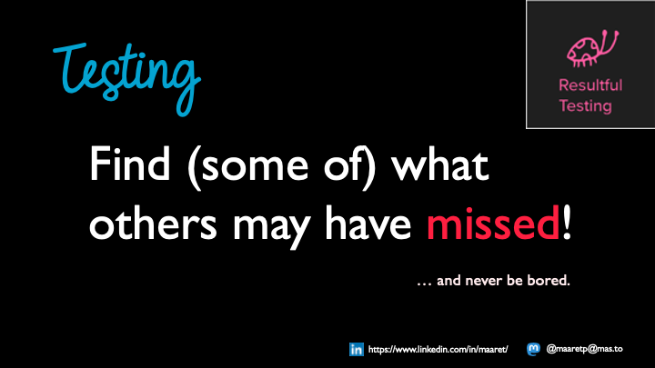

My favourite way to put it these days: testing is about going and finding some of what others may have missed, and we do not know what we are supposed to find until we find it.

For me that has a corollary. In twenty-five years I do not think I have been bored yet. When I am bored, I change something. So if you notice you are bored, it is probably a sign that you could be learning a small new skill, trying to do something differently — and that there are other people who can pitch in on the important things you are doing right now to make you the space to never be bored. We are not alone in this.

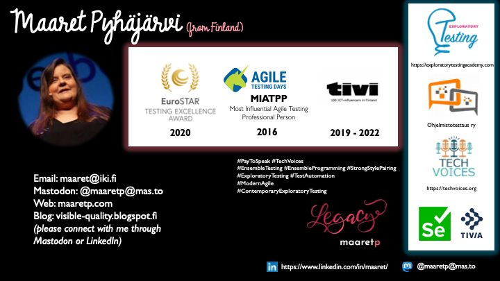

I enjoy connecting with people and I like a good conversation. You may have noticed I like my work, and I like talking about the themes around it. Please get in touch — through Mastodon or LinkedIn — and let's figure out together how we explore our way into contemporary exploratory testing.
