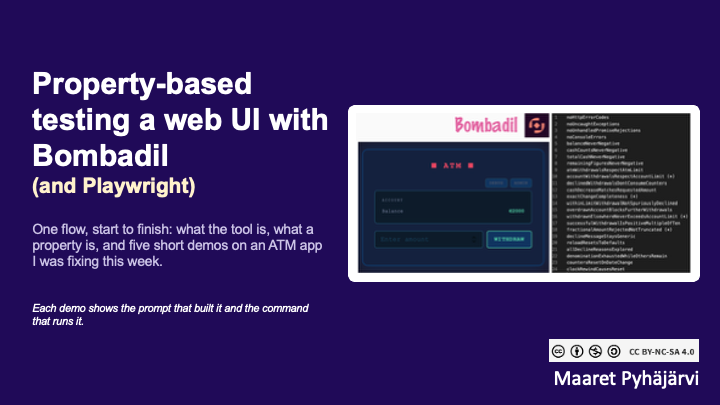
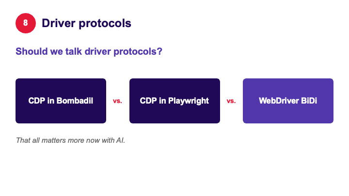
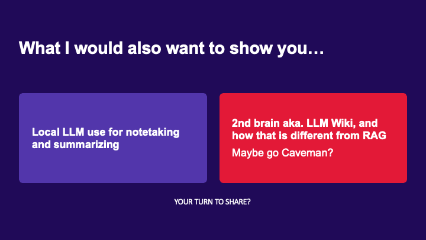

# Property-based Testing a Web UI with Bombadil (and Playwright)
### The tool is not the magic, the properties are

*Presented: CGI Testing Community, October 2026 (talk number 600)*
*Keywords: propertybasedtesting, testautomation, exploratorytesting, ai, bombadil, playwright*

We had something else planned for this community session, and when that got cancelled, I decided to steal the space for something very fresh and very exciting for me. Two things, really. This is talk number 600 that I am delivering - yes, I am counting. And everything in it is something I did within one week, because I needed to teach specification-based testing to a group of developers and wanted to build a bridge into it for a longer session. Along the way I felt this is something everyone should know: how the test automation of today could work, or should work, what we have struggled with, and what we have solved over the last ten years.



You can tell from the style of the slides that my original idea was not to show slides at all. I had a lovely script I was comfortable with. But we live in the age of AI, so you give the script you are happy with to an AI and say "make it visual". That is what I did, with no manual edits whatsoever on the presentation. I built the talk and the demo for a one-time delivery. I was not planning to become the educator of all of this - I am hoping someone in the audience volunteers for that.

So we will talk about Bombadil and Playwright, except that really we will be talking about properties. What is a property, and how does property-based testing work?


About a month ago I mentioned on one of our channels that there is a new tool in the house, called [Bombadil](https://antithesishq.github.io/bombadil/index.html). It is not that Bombadil is somehow unique and exceptional. What they did nicely is wrap together running a web UI, generating clicks on it, adding logic on what you would click, and this idea of property-based testing.

The tool runs in a loop. It figures out where you are, what you can click, and what you can write into the different fields. It lets you take control over that: these fields take numbers, these take text, these are the kinds of numbers you would write. Then it generates scenarios for you by clicking different things in different order. Wherever it ends up, whatever it ends up clicking, it is always checking the properties - the things that are always true. That is a different way of thinking. You are not handcrafting which things get clicked. You let the clicking happen, you can direct it to a degree, and the essential part is the properties.


Cem Kaner talked about properties ten, fifteen years ago - it has already been a while. He made an observation about the properties he was asking testers to design back then: testers at large were unable to define them. We could not, for the life of us, figure out what these things are that should always hold true. All of us can say "obviously I don't want to see big visible error messages". What we struggled with was going into the business rules. On a banking application, the balance can never be negative. If you get declined, the money can't vanish. You can never go above whatever limits have been set. We did not have the vocabulary or the skills to define those.

And these expressions are super essential in test automation, because they are the assertions - the checks we need to automate. Instead of handcrafting every single thing we look at around the user interface, we need a way of saying things that are more reusable. That is what property-based testing is about.


There are three things I keep apart when I reason about this. Authoring of the test automation nowadays happens with AI. I did not write any of the code for this talk myself. Execution is not AI. It is the property-based testing tool, the walker that walks around the web user interface - or it could be a tester who has decided which buttons to click because those are the end-to-end flows users have expressed. And properties live in the space of oracles: how can you tell whether things work or not? Property-based testing tools intertwine execution and oracles, but you can take the properties and push them into other tools you already have.

Authoring with AI is not the same as running agentic testing. What comes out is deterministic generated tests, and fewer tokens are harmed by knowing the difference.


For the demo I started with a prompt. I told GitHub Copilot that I have a project called atm that I was fixing on Tuesday that week, and that I wanted Monday's version in one folder and Thursday's version in another, so I could show my colleagues the difference. Before the fixes, after the fixes. The [ATM simulator](https://qe-at-cgi-fi.github.io/atm/) is a single page with an admin panel and a debug panel that give you a bit more control, and I had genuinely done my best to create a simulation that was not full of bugs. I did not want it failing all the time.


Then I prompted for the most basic property-based tests I could think of, with the default properties. These are things that should be true for all systems. No HTTP error codes, so no big visible error messages. No uncaught exceptions - don't let errors happen under the hood where users just don't see them. No unhandled promise rejections - don't expect something to happen that never comes back; alert on that. No errors in the console. Four ways of saying "no error messages".

I also said I want to run these from the command line by saying `demo Monday` or `demo Thursday` - make my wish come true, like magic. When I ran it on stage I typed `demo monday` with a small letter. AI had already decided for me that I would not remember capital letters while demoing, and handled it.


For 60 seconds it clicks everything. I ran it headless; had I prompted for it, I could have watched, and it is kind of hypnotic to see what it writes and pay attention to the numbers. The Monday version, supposedly the more broken one, passed. So does Thursday. Whether you believe me or not, you can install these on your own machine and play with them.

Both pass because we only tested for visible or hidden error messages. This does not notice if the ATM rules are broken, because I had no properties like that.

Also, the AI was not happy with what first got generated. In every single field the tool was writing the letter "d", one or many times. I don't know where the d comes from - not from the tool's name, at least. Then it realized there has to be a generator that creates numbers, because this is very clearly a thing of numbers, and fixed that for the demo version. Not complicated to set up, and I recommend you try it yourselves.


Then to the actually interesting part: teaching the spec the domain. You can ask AI to use Playwright CLI, go figure out what the application has, and figure out the properties. That is agentic exploratory testing, specifically for properties, on the user interface. If you have access to the codebase, there is also an Antithesis skill called research that runs an analysis over it. Somebody created a quite essential, nice property-based testing helper skill, and when that ran, it gave me helpers, state extractors, action generators and properties.

I did not have to do the thing Cem Kaner said testers could not make sense of. AI can make sense of it in a very lovely way. Then our job is to decipher: it is called this - do we understand what this is?

A property, once the extractors exist, is short:

```typescript
export const accountWithdrawalsRespectAccountLimit = always(
  () =>
    accountWithdrawnHere.current + accountWithdrawnElsewhere.current <=
    accountLimit.current,
);

export const withdrawnElsewhereNeverExceedsAccountLimit = always(
  () => accountWithdrawnElsewhere.current <= accountLimit.current,
);
```


I had run the research skill earlier that week, so there was already a scratchbook with the reasoning on what the properties should be. It added 20 more properties on top of the four defaults. And for demoing I did not want to say `demo Monday` anymore. I wanted to say `magic Monday` and `magic Thursday`.

In the list of properties, some carry an asterisk. Those were broken on Monday, and I did not know until Tuesday, when I tested this application with property-based testing for the first time. It found actual real problems I needed to fix before using the application to teach analysis of higher quality software. Maybe not high quality, because it is a simulator, but a lot better.

`magic Thursday` is the same story: 60 seconds of doing things that came out of that research skill. Some are properties, some are generators. If I did not like that it writes really long numbers into the user interface, I could guide it toward more realistic ones.


With `magic Monday` we do not need the 60 seconds. It gets to "you are breaking your business rules" very quickly, with two violations. I can guess what they mean from the names. If withdrawing money elsewhere lets you exceed the account limit, that is a bad problem in an ATM. If the account limit is not respected, that is a bad problem too. All I had to do was generate tests, because I had a tool able to walk the user interface - or the APIs, both are included - and able to express what I expected as properties. This is how we should be doing test automation.

To be fair to Monday's me: the Thursday version holds for the 60-second demos, but on a 30-minute run it still usually found the one problem I had not figured out how to fix. I have tried fixing it since, by showing the fixing agent the logs - they are very readable for a computer - but I have not had the 30 minutes to run it again.

I was not happy to stop there, even with four really relevant problems found on a simulated ATM. I wanted to show that this is not something only Bombadil can do. Bombadil is not the magic. The tester thinking about the properties, the things that should always be true - that is the magic. You can take the properties into your existing test automation, be it Robot Framework, Playwright or some API tool. It is basically a code plug-in.


So I created `magic playwright Monday` and `magic playwright Thursday`. If you read the prompt, you can see I accidentally told AI I want to say "magic playwright Tuesday", because I had already confused my days. Like magic, it understood me, and it did not make me feel stupid the way colleagues can when I say the wrong day while knowing exactly which day I meant. Working this way can feel joyful because you avoid some hard conversations and bad feelings. Then again, the bad feelings are how we built those relationships. When I tell colleagues I already knew, they eventually learn they do not have to correct every single typo.

Thursday passes all the steps. I had not even tried this while preparing - that is how much I nowadays trust AI with these basic things. Monday fails on a particular property after five steps. I could take the very same properties, almost automatically, into whatever format of test automation I already had. It put 13 of them there, and for demo purposes I decided not to struggle with the rest, even though I believe asking in the right way gets all of them into Playwright scenarios.

To summarize the demos: you should be testing with properties. You should be testing with automation. You should be exploring while automation is your tool. This is very much manual thinking work. AI and the code help you do some of it, and you turn it into actual automation by putting it in a pipeline where it runs again and again. Human in the loop, looking at results that are mostly green, is what we want. Human *as* the loop, running the automation, is not automation by current understanding.



There is one thing to understand behind choosing these tools. If you choose Bombadil, you drive your browser with the Chrome DevTools Protocol, and the only browser Bombadil's version of CDP drives is Chrome. It is a single-browser thing you are testing. If you care about business rules, that may still be a smart move.

Playwright also uses the Chrome DevTools Protocol, but they went around the browser limitation. They build their own version of Safari - WebKit, the name I kept forgetting on stage - which is just the engine, not the real Safari. There is a similar version of Firefox made for testing purposes. That is good enough to be better than just Chrome, but it is not the real browser.

If you need the real browser, the same idea of properties works with WebDriver BiDi, which runs real, specific versions of browsers. You might know this as Selenium, but WebDriver BiDi is a protocol that Selenium has reference implementations for. Whether you pick Selenium or another tool in that family affects which browsers you can cover. Be aware of this, and make it a design decision in your testing.


I could not stop at "I found four relevant problems I thought I didn't have". I had to try this on real-size applications. I did the very same steps on PrestaShop, an open source e-commerce platform, and found hundreds of real problems. I confirmed a couple of them. Generating API-related properties against their admin API surfaced some pretty bad bugs. So now I feel guilty and responsible, and I need to find time to talk to the people who created PrestaShop and offer fixes. That experience worked like a charm.

Dynamics 365 Finance and Operations, one of the platform products we use, was an awful experience - the tool and the system I was testing were in conflict. I said so on social media, and the developer of the tool was already messaging me: please talk to us, give us the scenario, and we will fix the tool. Apparently saying out loud that you were not able to test something gets the developer to come to you and offer to fix it. So I inherited more work for myself, which I can of course also opt out of.



My take from all of this: I hope you start thinking in terms of properties, and identifying them for your own systems. And getting excited about a new thing and showing what you were able to do with it, with AI, is not that complicated. This was not a huge effort. It was a series of a few prompts, and I showed up as soon as I saw it connected with something I wanted to do.

There is more I have been geeking on in the last couple of weeks that did not fit into 30 minutes: local LLMs for note-taking and summarizing, LLM wikis as a second brain, Caveman. All of those need someone to show them. That is an opening for the next year of our community. We don't need a leader to step up. Maybe you should be the one going Caveman, so that I don't have to.

Everything from the demo - both versions of the ATM, the specifications, the scratchbook of property reasoning, the Playwright test and the prompts that built them - is in [QE-at-CGI-FI/properties-demo](https://github.com/QE-at-CGI-FI/properties-demo). The recording is on [YouTube](https://www.youtube.com/watch?v=ZjoN2_FDG8Q).
