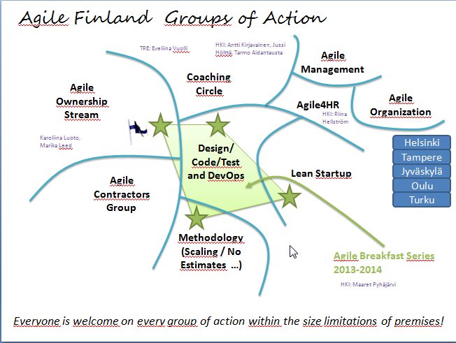

# Agile Finland, it's THAT time of year again

*Published 2014-05-29*  
*Source: <https://visible-quality.blogspot.com/2014/05/agile-finland-its-that-time-of-year.html>*

---

About a year ago, I volunteered to join Agile Finland Executive Committee. It's been an interesting year for me, one in which we've done plenty of things and started more that will continue into the future. A new executive committee will be chosen in Annual Meeting next week (finally), and while the style of opening may give the impression, I'm not going anywhere.  
  
Recently, I've come to know people who volunteer to join the Executive committee for 2014-2015 season in addition to me: Hannu Kokko, Olli Pietikäinen, Jussi Markula, Vasco Duarte and Martin von Weissenberg. This means there's already one more that the executive committee can accommodate according to our rules, and I voluntarily step down to be a spare member - eligible for full membership in meetings when any of the others is away, and always being there. As the meeting has not been held, it is still possible things will turn out to be different, just like last year. I showed up just moments into the voting, volunteered and kicked out someone who had been preplanned into the committee.  
  
The time of year leaves me thinking about what I'd like to see Agile Finland be. The ideas are most certainly influenced by others, but this is not intended as a shared statement from people but a personal view to open discussions.

  

### Agile Finland should be more professional, run 'like a business'

Agile Finland community is about content. To run Agile Finland, there's much more than just content, there's all sorts of administrivia, financial considerations and considerations of what we can do as a non-profit. I'd like to see that more of the stuff that happens in Agile Finland could be considered paid work for someone, starting with the hope of hiring a 'secretary' and continuing with the idea that Agile Finland could actually own a company or collaborate closely with a company. Organizing conferences would be more sustainable if only the content part would be volunteer work. Organizing regular events similarly.   
  
We need to look at models of how non-profits are organized from the bigger non-profits.   
  
This also means, to me, that our events should be profiled to professional, career-advancing stuff. Not something that happens only in evenings and on your own free time. Social aspects are important too. Unconferences, peer conferences and the sorts are social. But they are not freetime activities.  
  

### Agile Finland should celebrate and support skills/personalities diversity

I think Agile Development is the way of the future - people emphasis. I joined with a concern that has not been resolved: Agile teams seem to be leaving non-coding testers out. Again and again I hear of some enlightened customers who buy agile development teams from one contractor and add testers from another. But I hear more stories of customers buying just agile development team and not realizing they may be missing something relevant. I love the fact that there's teams doing really great without testers, the fact that developers in agile have learned to test. But I find it sad that there's still a feeling of excludedness for those who identify as 'testers'. Someone I talked with summed it well: testers were struggling with respect 10 years ago and it got better. Agile feels like it's starting all over again.   
  
When I look at Agile Finland events and participants, I get a feeling that something has changed there too. When it all started, a lot of the stuff was about practicing our skills of development (coding dojos in particular). Now we have very little technical content, and very few active developers in the ranks. Most of our contents are about team work, people stuff, methodologies and practices. And coaching, that seems to be the core of it all.  
  
I did a little picture of interest groups I could identify already existing within Agile Finland as I see it. I'd like to find a way to create action for different interest groups without creating walls on which groups you belong to - we're all in it together and just choose to spend time in different way.   
  

I'd like to see more people identify with Agile Finland and agile as the way to do valuable software. While others may find it important to reach out to ones outside development, I'd like to make sure we don't lose out on the ones who are in development. I hope we could have both.  
  
What it comes to testers, I find that many of my colleagues in test won't join as enthusiastically as I did. Also, doing as much on testing as I want to keep the skills growing and new people joining into the great work of testing, Agile Finland alone does not feel sufficient. Thus I've started Ohjelmistotestaus ry - Software Testing Finland -non-profit, that works with skills-oriented testing, a topic that should be close to Agile Finland as well. Knowing testing, growing testing and building bridges to testing is still my calling.

### And the others...

On the upcoming season, I want to run a trial on agile development from 'creating together' point of view with 1st graders - small children. I've actually already agreed on piloting this with a local school. The idea emerged from the fact that I feel we lose girls in particular at a very young age from the software professions. To me, it seems some of it is peer pressure and some of it is the idea that "code" is the central element. I'd like to focus on people and I don't mind that we together transfer ideas into code. Ideas are the key. So Agile Finland will have a new audience, the future of the profession in kids.  
  
Similarly, we need to reach out more towards the students. I think Turku Agile Day has been the most energetic of the agile conferences in Finland, and I attribute a lot of that to the collaboration with students. We should have more of them, early on, learning with the more senior ones on creating great contents.  
  
And surely, we should also seek to infiltrate the places that don't yet realize agile has answers to their concerns - the very traditional non-profits. Practical examples, real cases and the discussion about them could perhaps teach us all something. Turning non-agile to agile is just not my thing outside the actual work at companies. Selling Agile is someone else's high priority.
