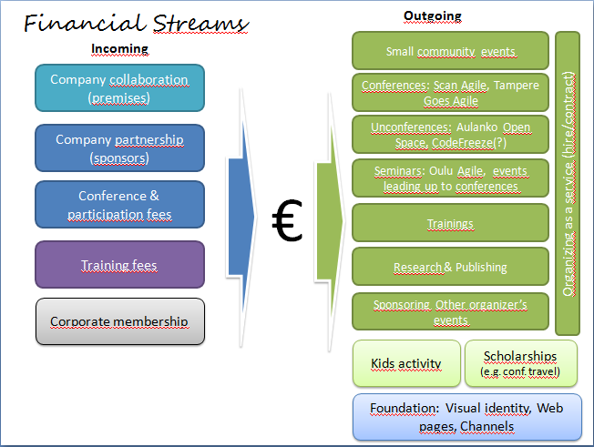

# Agile Finland in a year - my individual view

*Published 2014-06-05*  
*Source: <https://visible-quality.blogspot.com/2014/06/agile-finland-in-year-my-individual-view.html>*

---

Agile Finland non-profit had the annual meeting yesterday. From a personal perspective, I feel there's again an inspiring twist that could not quite be foreseen, just like last year. Last year the twist was that I showed up and volunteered at the meeting, just moments before the executive committee selection. That works great to get a lot of votes. This year I had been driving the formation of the new executive committee, people could have expected I volunteer to be the chairman and that I would at least be available as executive committee member. It turned out I was not. With the active recruiting of new executive committee members being so successful, we had more people than could fit in, and I made room by not making myself available officially. Unofficially, I'm as available as ever and believe that Agile Finland has come to a point in which I or anyone else no longer needs to be "in" to be included actively. So I will be hanging out with  the executive committee without being a member.  
  
In Annual Fannual, Agile Finland did not show a "plan of action" for the upcoming season. Some participants made a comments on this, justifiably. Would be nice to know what will happen next year - still would be. I find personally that it's very hard to make a plan for a group of people that has not yet been selected, but we could have done a little better just making the community members individual commitments visible. Because, that's what we have, a community of volunteers that do things if they feel they want to - we cannot really drive things by deciding something will be done, unless the individuals choose to see those suggested priorities as their priorities. I find it unlikely that we would be "following a backlog", but it's more about seeing where individuals' energies lead us - together.  
  
Now that I'm  not in the board, I'm more free than ever to tell where Agile Finland should be heading. That's what this post is about. And I suggest other individuals will create their own views, publish them and we discuss - perhaps getting a common view that we can then better communicate back to the community.  
  
If things go as I'd like them to go, Agile Finland in a year:  
  
1) Runs three significant conferences: Tampere Goes Agile 2014 in autumn, Scan Agile 2015 in Spring and an unconference-type of a conference with a name not yet known. Since I have a great group around Tampere Goes Agile, Vasco Duarte has his heart set on Scan Agile and Aki Salmi is already actively thinking about an unconference, this is very likely thing to happen.  
  
2) Runs seminar/event -series in major cities: Oulu, Tampere ... perhaps Turku too?  
Oulu will see a full-day agile/cloud -seminar as collaboration of Agile Finland and EIT ICT Labs, and Agile Finland is already preparing schedule for an agile sauna late in the year in the Oulu region. Testing cell is also live and kicking in Oulu, there's one session on Security Testing in June (identified as testausOSY event) and a practice oriented session siding the Oulu Agile Seminar. I will also make sure we get one more session for the springtime 2015 in Oulu.  
  
Tampere will have Tampere Goes Agile, but it also has a very lively Coaching circle going on - ask Eveliina Vuolli more on that one. Testing cell is also active in the area, with an event in planning for 4.9 - around a meeting of Tampere Goes Agile organizers. My intention is to get TGA organizing to a level where there would be again local leadership with good support from Agile Finland so that new volunteers for making it happen would have things set up for a good start of TGA 2015.   
  
3) Runs events that are not location-based. Yes, webinars. I want to see us experiment on these and see where the experiment takes us. What drives me to this is that I want to practice delivering webinars, and while doing what I want to do (learn), I'm very happy to help others with that as well. I would want to see a mix of English and Finnish presentations, and perhaps this could also be a way of showing the great stuff we have in Finland outside Finland - when the language is English.   
  
4) Owns a for-profit (company). This may be surprising to some, but very much something I'm driving towards. Agile Finland would want to organize stuff that is real business, not just "non-profit". Real business in the sense that it advances the goals of the non-profit to have absolutely brilliant selection of courses available that are not available in Finland, in all major cities as of now. The for-profit part of non-profits should be set in a company that is fully owned by Agile Finland. The company would pay taxes like all good companies do - non-profits don't exist to go around taxes, but to advance things that companies don't and to create opportunities for us all - individuals and companies in the community.  If my dream world would become real, this
would employ someone as a ceo and/or event organizer and pay actual
salary. And enable individuals to use the organizing services paid for to make their ideas for the community a reality easier!  
  
5) Has several well-run cells, where some are local and some are built around themes. The context driven non-profit we set up can be seen as a testing cell, since there's so much in common. And we learn better ways to work in these small units of cells, allowing autonomy and support from Agile Finland.  
  
6) Has run a pilot with my local elementary school on a computer club for kids that emphasizes the diverse viewpoints into creating software, not just learning to program. I hope to make people see that making software is fun and really relevant, but that the core of it is in ideas and collaboration. And that there's nothing wrong with girls/boys coding, not coding, whatever but not remaining distant from such an important trend. Create, not just consume. I also hope to deliver a few evening / weekend things within Agile Finland, as I've already talked to many mom's of smart kids who would like to contribute themselves too. There's no official say that Agile Finland will support me on this or identify it as something Agile Finland does, but I will do my pilot with the local school anyway.   
  
7) Has established first connections for professionals to volunteer as speakers on agile / craftmanship themes of various sorts for vocational schools and universities in Finland. We need to make the teachers life in finding great case presenters and inspiring speakers just a little easier. On testing and on other topics.   
  
8) Collaborates with major student non-profit organizations in IT-area, at least in Helsinki and Tampere. At least the one that I find my non-profit home - Tietokilta, Data Processing Guild. Students bring such energy to organizing our conferences if they are in as full members organizing, I think that is a key to why Turku Agile Day is so great.    
  
9) Runs a regular coding-oriented cell where we can practice our craft from that angle. Make sure agile does not turn into facilitators and customers silo, but keep the core of development included as well. A friend of mine noted, that Agile used to be the only crowd that encouraged developers to grow in their skills and see the world differently, practice coding. I would hate to see that go away, even if I'd love to see us emphasize the other existing communities in that area. I know there's great activity for security and for devops stuff, and there must be more than I'm aware of.  
  
10) Solves the financial puzzle in such a way that there's enough money to always say yes to events that attract people and bring them together without enforcing "find sponsors" rule. I want to see that we can help with the sponsors so that people could focus on brilliant contents and sharing their lessons learned. There's ways of financing that are tied together with my point number 4. But there's also the idea of corporate membership that I would like to see prepared for action by next Annual Fannual.   
  

  
11) Runs regular commercial top-notch trainers courses in Finland, on different locations with both international and local teachers. Gets known as a channel to good stuff, and in particular creates good stuff the companies don't yet create. And in particular, on locations other than Helsinki.   
  
Note that my view of Agile Finland does not have the most common aspect of "selling agile to people who don't yet get it". I want to see us focus on being so excellent in every other way that people will get drawn in. Create pull, not push. And I think the stuff Karoliina Luoto and Marika Leeds facilitate on Agile Ownership stream is a great example of that power.   
  
Now that I've shared my ideas, I hope it enables people to talk about where we agree and disagree. And perhaps, help me clarify and change my ideas so that we build an ecosystem of agile, that makes companies extinct that make testing awful by leaving it to the end, under impossible circumstances.  I think Agile ideas are the best thing that ever happened to testing. Agile managed to deliver messages on illusion of speed, fixing loads of bugs creating more that testers have tried to say for ages with less success. And it creates a need for smart and fun exploratory testing, where you are actually required to do more than execute checks - you explore the product in ways where "before implementation" and "after implementation" get mixed up in short cycles. So, there's always a testing idea in there for me.
