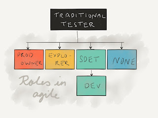

# Where do Testers Go With Agile

*Published 2015-08-14, updated 2016-08-02*  
*Source: <https://visible-quality.blogspot.com/2015/08/where-do-testers-go-with-agile.html>*

---

Last week at Agile 2015, I participate in a Stalwarts session with Elisabeth Hendrickson. Stalwarts is a fishbowl discussion, and one of the topics was to talk a bit about the visions of where current testers go with agile, in particular in the context of how things are set up at Pivotal Cloud Foundry.  
  
Elisabeth described the ratios at Pivotal being 3 explorers amongst 150 developers. But in the session she did not address what she talked about after, that a lot of the traditional testers have actually found their niche in being great product owners prepping up the stories for the teams to develop, and there's quite a number of people in those roles.  
  
Throughout the session, I was sketching a little picture to think about where do testers go with agile. Here's how I see it.  
  

  
Some of us that have been testers before agile and in atypical agile teams (not quite there yet on e.g. teaming up and collaborating, but already releasing much more often that ever before) don't program. What we don't do today isn't saying we can't start doing it tomorrow, if that is the route we find interest in. It looks like we might have four directions, and none of them is called "tester" in this picture.  
  
**Some of us go away**  
Let's start with the hard part. Some of us will no longer be working with software. This portion is more about attitudes and wants, and inability to find the right ecological box to fit in. People ending up here might be people pushing for traditional manual scripted test cases - commodity testing. While building up e.g. automation and developer attitudes in agile-aspiring teams, there might be an appearance of need for a lot of this, but as the team learns and reflects, this is the work that I'm hoping that will go away. If this is the only thing you deliver, you will end up finding other line of work. Perhaps in support. Perhaps elsewhere in organisations. Or a different line of work that does not require you to think for yourself as much as creating software in any roles around it does.  
  
**Many of us will become programmers**  
I believe many of us will become programmers. Some of us are that already in addition to testing.  
  
If we're new to testing, the risk is with focusing the attention. I believe it takes years and years to learn to be good at testing. It takes just as long to learn to be good at programming. And while there's some shared microskills, the two skillsets have a very different focus on what to learn and how to think about the system we're building.  
  
If we've been around a while and are keen on shaping up our skills on the programming side, the door is wide open. We may be senior testers, but we start of as junior programmers. When might first focus only on using programming as a tool to automate things in the testing domain, becoming software development engineers in test. And eventually I believe that those choosing this track will not stop growing but should actively build on their skills to become full-blown developers, handling both the domain of test but also domain of the application. There's so much power in not splitting the work as soon as our skills allow for that. Test automation is coding. Get good at it. But why stop there?  
  
I believe this is a majority route. This is the safe route. But only if you intend to become good. You do not need to be great today, but every day you learn through reflection on individual and team levels. A piece at a time. But only if you find this interesting and motivating. There's no reason you shouldn't, the great programmers excel in testing and expressing their intent, and transforming that to code and it's a fun thing to do. Especially when you add the pair / mob programming aspects where you're never alone with your attempts to learn more.  
  
Becoming a programmer does not mean testing skill isn't relevant. It is. But it means learning to see testing problems as insights you can harness for automation as much as possible.  
  
**Few of us will become explorers**  
The world of deep exploratory testing is needed, but it's a specialty skill helping others in these types of tasks instead of doing it for them. It's more of a deep skill with idea of continuous work to transfer it.  
  
Explorers will also learn to automate. First they perhaps learn to automate with a developer, pairing up. But for working closely with technical teams, a level of technical understanding will be required. It might manifest as writing particular kinds of scripts to support exploration, or being able to come up with ideas of that others can pick up and run with - with you.  
  
There won't be as many explorers as there are traditional testers.  
  
**Many of us will become product owners**  
There's a lot of skills a traditional tester may have built that will be invaluable in the role of a product owner. With splitting responsibilities scrum-like, a team will need someone available for them full time, so there would be one of these for a team of two pizza boxes.  
  
The testers who will not code or work with technical details are more likely to end up as product owners. Product owners prep the user stories, work out how the product is supposed to be with the technical team and customer representatives. Many testers who build ideas about products will excel in this role.  
  
Product owners don't only define, but they heavily participate in learning through use. Product owners are business-oriented explorers.  
  

#### My tester identity, where's that?

Personally I don't feel very excited with the idea of not identifying as a tester anymore. I'm still working on how I would feel about the idea of being a programmer. Tester identity for me means that I'm fast at learning new products and features, putting different abstraction layers of information together to see what works and what doesn't. It also means I can find other people with similar interests.  
  
It just might be that to network, I would no longer seek testers, but people enthusiastic about testing. Whatever changes will take time. And probably I too will end up being one of the frogs who with slow change don't actually even notice which new skills I've been picking up and which old ones I've been deepening to help my teams do a better job.
