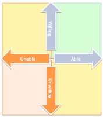

# From unwilling/unable to willing/able

*Published 2016-04-04, updated 2018-12-26 · Labels: Agile*  
*Source: <https://visible-quality.blogspot.com/2016/04/ive-been-having-discussions-about.html>*

---

I've been having discussions about teaching and coaching as part of being coached and as part of mentoring that I think of as form of coaching.  With this post, I wanted to share the a model that helps me make some sense in to the world.  

**Situational leadership or something of that sort**  
  
Many years back, I read a post somewhere on the idea of which seems to map to a concept of situational leadership (picked up the word from googling what I remember - the dimension labels). When working with people at different places on the map, you do things differently.  
  

  
For people who are unable and unwilling, the help they need is career coaching, disciplinary actions, detailed delegated tasks, well-run meetings, making decisions for them, focusing extra effort on testing as a feedback mechanism, encouraging good behavior (working code over lengthy designs, prototyping and unit testing, small stories and tasks, team shared responsibility) and playing with peer and manager pressure to get the person out of the place they're in.  
  
When you're at the point of unable but willing, you're really in a fruitful place to learn. The help needed could be highlighting successes, identifying learning potential and steps, assisting with difficulties, and checking on status and feelings. Great things to do close to the work is helping people take tasks through delegation, giving guidance is new types of decisions, giving feedback, encouraging teaching others to learn from each other.  
  
When you are at the point of able and unwilling, the help that is needed is attitude coaching, selling options as opportunities, and focusing on responsibilities as employee. This is a time to step back and let the person plan more, still enforcing small stories and tasks, with focus on personal accountability and deadlines.  
  
We'd love to see people who are both willing and able, and whatever we do when they are not one or neither, is to help them get to a point where they are both. At this point, people still appreciate highlighting and rewarding successes (and being reminded that failing is learning, and when learning, that is a success!). Encouragement could be directed towards cross-training the others and continuing to learn, offering advice on decision making (but making sure the decisions are done by the people, not given from management). And even with people in this stage, there's often stuff outside the team that needs attention, be it to highlight the successes of these people as internal marketing, or removing roadblocks in cross-departmental work.  
  
People who are unwilling are hard to work with. While unwilling and unable, these two might be connected: hard to be willing to do things you fail at doing. However, some of the trickiest problems I get to deal with are about lost motivation. When you've been put in a weird place for long enough, you start thinking the cave you're in is what the world looks like. You might not like it, but you know of nothing else.  
  
I find that sending people outside is critical. Quoting a friend who chose to stay anonymous:  
> An average person at a conference is above an average worker at a company. Insight of the day.
>
> — Maaret Pyhäjärvi (@maaretp) [March 30, 2016](https://twitter.com/maaretp/status/715286537265614849)

Go out to find a way to be willing and able. You need to see outside your cave.
